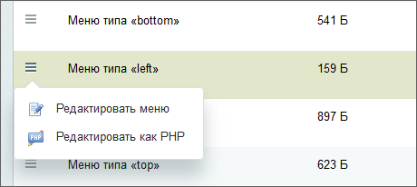

# Расширенный режим настройки меню

**Навигация**
- [← Оглавление курса](index.md)
- [← Предыдущий: 1932 — Загрузка и поиск файлов](lesson_1932.md)
- [Следующий: 22372 — Виды шаблонизации →](lesson_22372.md)

Официальная страница урока: https://dev.1c-bitrix.ru/learning/course/index.php?COURSE_ID=35&LESSON_ID=2018

### Дополнительные возможности настроек. Видеоурок

При ограничении доступа к разделу пользователю остаётся виден пункт меню, и это не всегда хорошо. Сокрытие пункта меню в зависимости от различных условий производится только в Административном разделе. Делается это и в рамках логической, и в рамках физической структуры. Ниже будет описан

			пример с ограничением доступа по пользователям

                    По аналогичному принципу можно ограничить доступ к пунктам меню по другим типам условий.

		 (как самый частый вариант). 

### Пример ограничения доступа к разделу с сокрытием пункта меню

В этом примере разберем ограничение по пользователям. Для такого ограничения доступа:

- Перейдите в Административной части в раздел, в котором нам нужно скрыть нужный пункт меню.
- Найдите в списке файлов файл нужного меню: **Меню типа "****"**. В колонке действий выберите
  			Редактировать меню
                      
  		. Откроется форма редактирования меню в упрощенном режиме. В упрощенном режиме с меню можно делать все то, что мы делали с меню в
  			публичной части
                       Разработка эффективного, то есть заметного, красивого, понятного и логичного меню - важнейшая задача контент-менеджера.
  "1С-Битрикс: Управление сайтом" позволяет быстро создавать и редактировать различные варианты меню.
  [Подробнее ...](/learning/course/index.php?COURSE_ID=34&LESSON_ID=10239)
  		: создавать пункты, редактировать их, удалять и менять порядок.
- Щелкните кнопкой мыши на пункте **Расширенный режим** на контекстной панели формы редактирования меню. Форма перейдет в расширенный режим:
  
  **Примечание:** Подробное описание полей формы можно посмотреть на странице
  			пользовательской документации
  						[Описание компонента «Редактирование меню» в пользовательской документации.](http://dev.1c-bitrix.ru/user_help/detail.php?ID=62942)
  		.
- В поле **Тип условия** выберите **Для групп пользователей**. Форма перезагрузится, и откроются поля ограничения доступа по пользовательским группам.
- Выберите группу пользователей. Ограничение доступа работает по разрешительному принципу. Иными словами, пункт меню будет виден для тех групп, которые выбраны в этом поле.

**Примечание**: Если скрыть только пункт меню, но не запретить доступ к разделу, то обычный пользователь сможет попасть в этот раздел, если он знает его url-адрес.

### Документация по теме

- [Редактирование меню](https://dev.1c-bitrix.ru/user_help/content/fileman/fileman/fileman_menu_edit.php)
