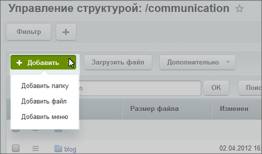
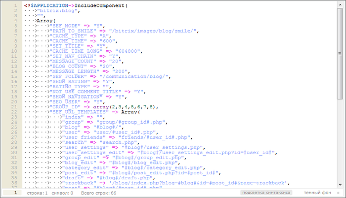
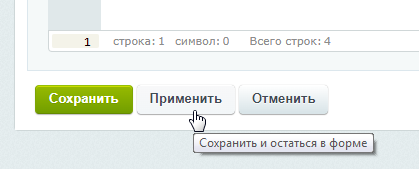
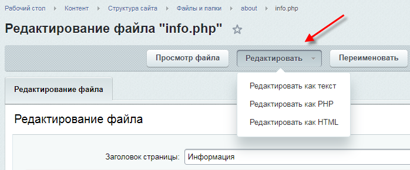
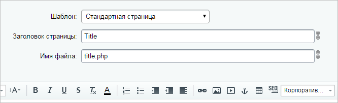
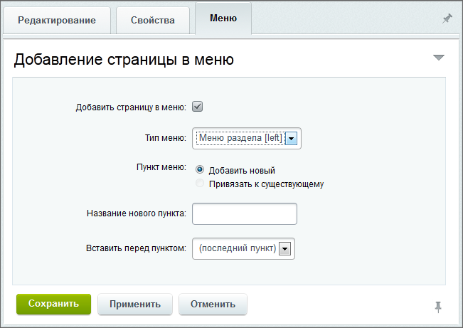
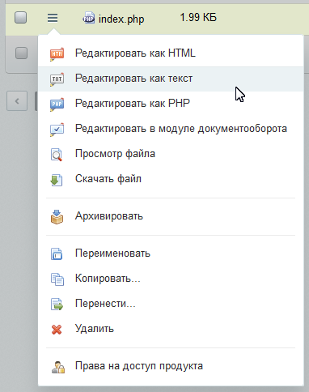

# Создание и редактирование новых страниц и разделов

**Навигация**
- [← Оглавление курса](index.md)
- [← Предыдущий: 5010 — Настройка главного модуля](lesson_5010.md)
- [Следующий: 1929 — Управление свойствами страниц и разделов →](lesson_1929.md)

Официальная страница урока: https://dev.1c-bitrix.ru/learning/course/index.php?COURSE_ID=35&LESSON_ID=2021

### Работаем со структурой

Создание и редактирование страниц или разделов доступно как с

			Публичной

                    Создавать страницу лучше сразу в том разделе, где она должна "жить". Перенести неверно созданную страницу можно, но зачем лишние действия?

[Подробнее ...](http://dev.1c-bitrix.ru/learning/course/index.php?COURSE_ID=34&LESSON_ID=1911)

		, так и с Административной части.

### Создание

Создание

			раздела

                     

		 и

			страницы

                     

		 в Административной части выполняется в рамках

			либо логической, либо физической структуры

                    Выбор типа структуры в плане создания не имеет значения. Тип структуры важен только в плане удобства просмотра.

		.  На контекстной панели воспользуйтесь кнопкой **Добавить** и выберите какой элемент будет добавлен:

Откроются формы для создания новой папки или файла.

 

**Примечание**: При создании файла откроется тот **вид редактора**, который задан в настройках модуля

			Управление структурой

                     

		: 

- Текстовый редактор
- Редактирование PHP скрипта
- Визуальный HTML редактор

Для режимов правки файлов **Редактировать как текст** и **Редактировать как PHP** доступен

			режим редактирования кода

                    Для его включения необходимо в настройках модуля **Управление структурой** (Настройки &gt; Настройки продукта &gt; Настройки модулей &gt; Управление структурой) отметить опцию **Использовать редактор кода с подсветкой синтаксиса**.

		 с нумерацией строк и

			подсветкой синтаксиса

                    

		.

Для перехода между типами редактора нажмите кнопку

			Применить

                     

		, чтобы сохранить внесённые изменения и остаться в форме редактирования, а затем кнопку

			Редактировать

                     

		, и выберите нужный тип редактора.

При выборе режима **Визуальный HTML редактор** состав полей аналогичен составу в Публичном разделе, но разбит на закладки:

- Закладка **Редактирование**.
  			Выбирается шаблон страницы, указывается ее заголовок и название для файла
                      
  		, в котором данная страница будет сохранена.
  По умолчанию **Имя файла** формируется автоматически из поля **Заголовок страницы**. Если кликнуть по иконке , то автоматическое формирование файла отключится, и имя файла можно будет ввести
  			вручную
  
  		. При ручном вводе допускается кириллица, но запрещены спецсимволы: **\ / ? * &lt; &gt; " '**.
  Визуальный HTML редактор выглядит так:
  
  1 - панель инструментов визуального редактора.
  2 - панель переключения режимов редактирования.
  3 - рабочая область.
  4 - панель компонентов и
  			сниппетов
  **Сниппет** – это заранее подготовленный фрагмент текста или кода, этакие заготовки. Предположим, что вам каждый день приходится вставлять на страницы сайта одну и ту же таблицу или форму. Вы можете сохранить эту таблицу в сниппетах и затем простым перетаскиванием размещать её в нужном месте.
  		. Панель может быть скрыта. Раскройте её нажатием на
  			стрелочку
                      
  		 в правой части формы.
  5 - панель отображения свойств объектов.
- На закладке **Свойства** указываются свойства страницы, например, значения
  			мета-тегов
  **Мета-теги** – необязательные атрибуты, размещённые в заголовке страницы, которые могут содержать её описание, ключевые слова к ней, информацию об авторе, управляющие команды для браузера и поисковых роботов, и прочую служебную информацию, не предназначенную для посетителей.
  		: ключевые слова (**keywords**) и описание (**description**) страницы. Свойства, заданные в полях этой формы, будут использованы только для редактируемой страницы.
- На закладке **Меню** можно добавить пункт в меню текущего раздела сайта (т.е. раздела, в котором создается страница), ссылающийся на созданную страницу.
  

### Редактирование и удаление

Чтобы перейти из Публичного раздела к редактированию текущей страницы (раздела) в **Административном разделе**, выберите в меню **Изменить страницу** пункт **В панели управления**.

В самом **Административном разделе** переход к редактированию или удалению страницы и раздела осуществляется из

			Менеджера файлов

                    

		.

### Документация по теме

- [Создание новой папки (документация)](http://dev.1c-bitrix.ru/user_help/content/fileman/fileman/fileman_newfolder.php)
- [Создание и редактирование файла (документация)](http://dev.1c-bitrix.ru/user_help/content/fileman/fileman/fileman_file_edit.php)
