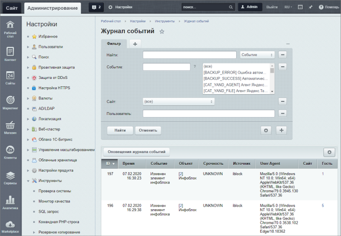
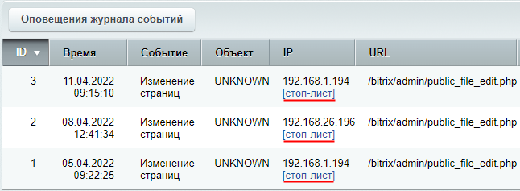

# Журнал событий

**Навигация**
- [← Оглавление курса](index.md)
- [← Предыдущий: 2032 — Проверка и оптимизация БД](lesson_2032.md)
- [Следующий: 13104 — Оповещения журнала событий →](lesson_13104.md)

Официальная страница урока: https://dev.1c-bitrix.ru/learning/course/index.php?COURSE_ID=35&LESSON_ID=2034

Отслеживаем, что происходит на сайте в журнале событий.

 

### Работа с журналом

На странице **Журнал событий** (Настройки &gt; Инструменты &gt; Журнал событий) вы можете просмотреть события сайта.

**Примечание:** Детальное описание значений полей журнала событий смотрите на странице [пользовательской документации](http://dev.1c-bitrix.ru/user_help/settings/utilities/event_log/event_log.php).

Фильтр позволяет быстро найти в списке нужные события. Работу с фильтром такого типа вы изучали в курсе [Контент-менеджер](https://dev.1c-bitrix.ru/learning/course/index.php?COURSE_ID=34&LESSON_ID=3872).

Ссылка

			[стоп-лист]

                    

		 в таблице Журнала событий ведет на страницу Аналитика &gt; Посетители &gt; Стоп-лист. Там вы сможете добавить в список тех пользователей, которым запрещено выполнять те или иные действия на сайте. Подробнее о **стоп-листе** описано в отдельном [уроке](lesson_2675.md).

Также доступна возможность настройки **оповещений** о наступлении событий на сайте. О работе с оповещениями описано в следующем уроке.

### Какие события записываются в журнал?

Вы можете самостоятельно определить события, которые нужно записывать в журнал. Это можно сделать в настройках:

- главного модуля на закладке **Журнал событий** (Настройки &gt; Настройки продукта &gt; Настройки модулей &gt; Главный модуль),
  **Примечание**: Обратите внимание на поле
  			Сколько дней хранить события
                      
  		. По умолчанию установлен срок хранения 7 дней. По истечении этого срока события из журнала будут удалены.
- модуля **Инфоблоки** (Настройки &gt; Настройки продукта &gt; Настройки модулей &gt; Информационные блоки),
- модуля **Форум** (Настройки &gt; Настройки продукта &gt; Настройки модулей &gt; Форум),
- модуля **Облачные хранилища** (Настройки &gt; Настройки продукта &gt; Настройки модулей &gt; Облачные хранилища),
- модуля **Управление структурой** (Настройки &gt; Настройки продукта &gt; Настройки модулей &gt; Управление структурой),
- конкретного **Информационного блока** (Контент &gt; Инфоблоки &gt; Типы инфоблоков &gt; конкретный инфоблок),

**Примечание**: Ряд модулей, например **Контроллер**, **Проактивная защита**, **Техподдержка** и другие ведут собственные журналы.

### Дополнительно

- [Как добавить свой элемент в журнал событий](https://dev.1c-bitrix.ru/community/webdev/group/78/blog/add-your-item-to-the-event-log/) (блог)
