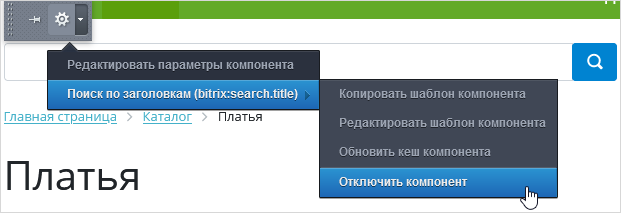
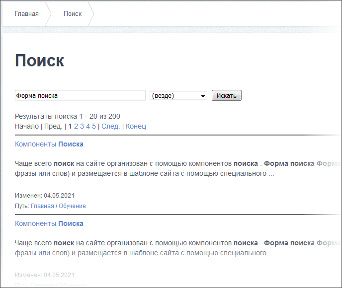
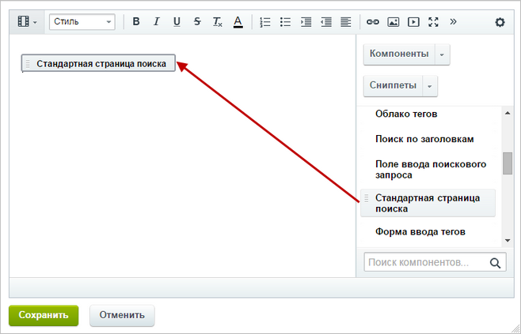
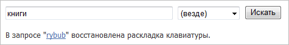
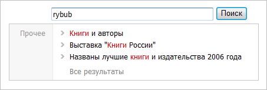
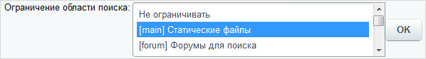
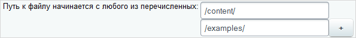
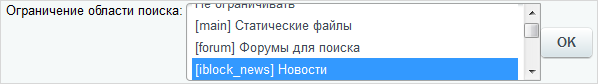

# Компоненты Поиска

**Навигация**
- [← Оглавление курса](index.md)
- [← Предыдущий: 2335 — Настройки инфоблока для корректного поиска элементов](lesson_2335.md)
- [Следующий: 5935 — Ручная настройка поиска Sphinx →](lesson_5935.md)

Официальная страница урока: https://dev.1c-bitrix.ru/learning/course/index.php?COURSE_ID=35&LESSON_ID=2047

Рассмотрим, какие [компоненты](https://dev.1c-bitrix.ru/user_help/components/sluzhebnie/search/index.php) используются для реализации поиска по сайту.

### Видеоурок

### Форма ввода поискового запроса

Форма ввода поискового запроса создается с помощью компонента

			Форма поиска

                    Компонент служит для вывода формы поиска.

 

						[Описание компонента «Форма поиска» в пользовательской документации.](http://dev.1c-bitrix.ru/user_help/detail.php?ID=63421)

		 или

			Поиск по заголовкам

						[Описание компонента «Поиск по заголовкам» в пользовательской документации.](http://dev.1c-bitrix.ru/user_help/detail.php?ID=254463)

		.

Внешний вид и место размещения формы ввода зависят от выбранного компонента, его шаблона и шаблона дизайна сайта. Форма может выглядеть так:

или так:

После нажатия посетителем кнопки **Поиск**, система выполнит поиск информации и перенаправит посетителя на **страницу результатов поиска**.

Компонент **Форма поиска** по сравнению с компонентом **Поиск по заголовкам** выполняет более полный поиск. Компонент **Поиск по заголовкам** создан для реализации быстрого поиска только по заголовкам элементов сайта.

Если у вас появится необходимость скрыть форму поиска на сайта, то включите

			режим Правки

                    
Режим **Правка** - специальный режим работы "1С-Битрикс: Управление сайтом", в котором происходит изменение информации на сайте.

[Подробнее...](/learning/course/index.php?COURSE_ID=34&LESSON_ID=1832)

		 и 

			отключите компонент

                    

		.

### Страница результатов поиска

 

На странице выдачи результатов поиска отображается непосредственно найденная информация:

Как правило, страница результатов поиска создается с помощью компонента

			Стандартная страница поиска

                    Компонент служит для создания страницы поиска.

 

						[Описание компонента «Стандартная страница поиска» в пользовательской документации.](http://dev.1c-bitrix.ru/user_help/detail.php?ID=63419)

		. Данный компонент может быть

			размещен

                    

		 на любой странице сайта при ее создании или редактировании с помощью визуального HTML-редактора. Поле для ввода поискового запроса отображается в том случае, если это определено настройками компонента.

Параметры компонента **Стандартная страница поиска** позволяют необходимым для вас образом настроить не только внешний вид страницы поиска, но и условия поиска информации (смотрите примеры ниже).

Кроме того, компонент поддерживает показ облака тегов. Конечно, данная возможность уже утратила свою популярность, но может быть полезна на сайтах с тегированным контентом.

**Примечание:** показ облака тегов доступен только для шаблонов компонента **tags** и **clear**.

Компоненты модуля **Поиск** поддерживают автоматическое определение раскладки клавиатуры. Нет необходимости набирать заново

			текст

                    

		, система сама определит раскладку клавиатуры

			для введенного слова

                    

		.

### Примеры настройки компонента Стандартная страница поиска

1. Чтобы поиск информации осуществлялся только на статических страницах сайта, нужно в группе свойств **Источник данных** в поле **Ограничение области поиска** выбрать **Статические файлы** и нажать кнопку **OK**:
  
  После выполнения данных действий в группе свойств **Источник данных** будет добавлено дополнительное поле **Путь к файлу начинается с любого из перечисленных**, позволяющее ограничить перечень каталогов и файлов сайта, в которых будет осуществляться поиск с помощью данного компонента. Например:
  
    Можно задать ограничения по поиску динамической информации. Например, на сайте есть страница **Новости магазина**, содержащая список новостей интернет-магазина (информационный блок **Новости магазина**, тип **Новости**). Предположим, необходимо, чтобы посетители могли осуществлять поиск информации среди новостей.
  Для решения поставленной задачи нужно выполнить следующие действия:
  - разместить на странице с новостями компонент **Стандартная страница поиска**;
  - настроить данный компонент следующим образом:
    в группе свойств **Источник данных** в поле **Ограничение области поиска** выбрать тип информационного блока и нажать кнопку **OК**:
    
    После этого в группе свойств будет добавлено дополнительное поле **Искать в информационных блоках типа *&lt;тип_инфоблока&gt;***. В данном поле нужно указать информационный блок, элементы которого (в данном случае новости) выводятся на странице **Новости магазина**:
    
