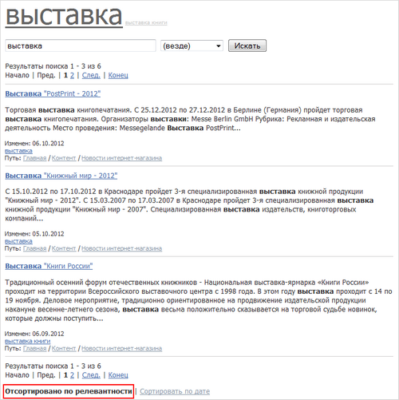
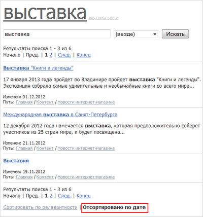
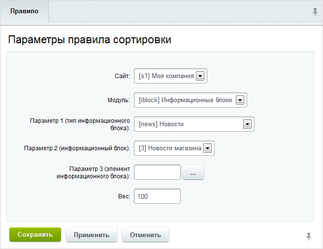

# Правила сортировки

**Навигация**
- [← Оглавление курса](index.md)
- [← Предыдущий: 2048 — Индексация](lesson_2048.md)
- [Следующий: 2056 — Морфологический поиск →](lesson_2056.md)

Официальная страница урока: https://dev.1c-bitrix.ru/learning/course/index.php?COURSE_ID=35&LESSON_ID=2053

### Как происходит поиск?

Пользователь вводит поисковый запрос и после нажатия кнопки **Поиск** система отбирает из поискового индекса страницы, соответствующие запросу. Перед показом пользователю результаты поиска сортируются по следующим параметрам:

- **по релевантности** - степень релевантности документа поисковому запросу определяется исходя из наличия на странице слов, участвующих в поиске, и их удаленности друг от друга;
- **по дате изменения** (последнего обновления) страницы.

Пользователь сам выбирает режим сортировки на странице с результатами поиска с помощью ссылок в конце списка найденных документов:

			Сортировать по релевантности

                    

		 или

			Сортировать по дате

                    

		.

Вместе с тем, очень часто требуется при выводе результатов поиска отдать предпочтение документам той или иной тематики. Например, может потребоваться «поднять» в результатах поиска товары, которые требуют скорейшего сбыта. Такие цели достигаются с помощью специального механизма: желаемым страницам задается требуемый

			**вес** (**ранг**, **page rank**)

                    PageRank («пэйдж-ранк»; от англ . page rank  – ранжирование веб-страниц или ранг Пейджа) – один из алгоритмов ссылочного ранжирования. Алгоритм применяется к коллекции документов, связанных гиперссылками (таких, как веб-страницы из всемирной паутины), и назначает каждому из них некоторое численное значение, измеряющее его «важность» или «авторитетность» среди остальных документов.

[Подробнее](https://ru.wikipedia.org/wiki/PageRank)...

		. При отображении результатов поиска, страницы, соответствующие заданным правилам сортировки, будут отображены в самом начале списка, в соответствии с весами, указанными в правилах.

### Фиксированный вес

Фиксированный вес может быть присвоен:

- **статическим файлам** (требует указания
  			полного пути
                      Например: https://dev.1c-bitrix.ru/docs/php.php
  		 к таким файлам);
- **информационным блокам** (дополнительно могут быть указаны *тип информационных блоков*, *информационный блок* и *элемент*, которым следует отдать предпочтение);
- **форумам** (могут быть указаны *форум*, *тема выбранного форума* и *сообщение*).
- **блогам** (должен быть указан *ID блога*).
- **обучению** (могут быть указаны *ID курса* или *главы/урока*, причем перед идентификатором для курса приписывается **C**, а для глав/урока - **U** (например, C5 или U278)).
- **социальной сети** (могут быть указаны *ID группы* или *ID пользователя*).

### Управление сортировкой

Управление правилами сортировки осуществляется на странице **Список правил сортировки** (Настройки &gt; Поиск &gt; Правила сортировки):

Назначение или изменение правил сортировки делится на два этапа:

- **Первый этап**: управление правилами сортировки - создание, правка или удаление правил.
  В
  			форме создания/редактирования правила
                      
  		 выберите модуль, для элемента которого будет настроено правило сортировки.
  Кроме того, укажите **вес** (ранг) правила. Документы, соответствующие критериям правила, будут расположены в списке результатов поиска в соответствии с рангом сортировки. Чем больше значение веса, тем выше в списке будет отображен документ.
  Например: статический файл с весом в 1000 будет показан в результатах поиска выше чем элемент инфоблока с весом в 500, который в свою очередь будет выше темы форума с рангом в 100.

  - для статических файлов можно указать приоритет для конкретного файла;
  - для информационных блоков можно указать приоритет для типа инфоблоков, отдельного инфоблока и
    			элемента инфоблока
                        **Примечание:** при заполнении полей параметров можно остановиться на любом уровне. Например, можно при настройке правил для информационного блока указать только тип и сам инфоблок. Или даже на типе инфоблока.
    		;
  - для модуля форумов можно создать правило для форума, темы на форуме или отдельного сообщения.
- **Второй этап**: обновление поискового индекса для вступления новых правил в силу.
  Обновление поискового индекса выполняется по кнопке
  			Обновить
                      
  		. По окончании процедуры обновления индекса будет выведено
  			сообщение
                      
  		 о ее результатах.
  **Примечание:** обновление индекса нужно выполнять после любого действия с правилами: создания, редактирования и удаления.

### Документация по теме

- [Создание и редактирование правила сортировки результатов поиска](http://dev.1c-bitrix.ru/user_help/settings/search/search_customrank_edit.php)
- [Правила сортировки результатов поиска](https://dev.1c-bitrix.ru/user_help/settings/search/search_customrank_admin.php)
