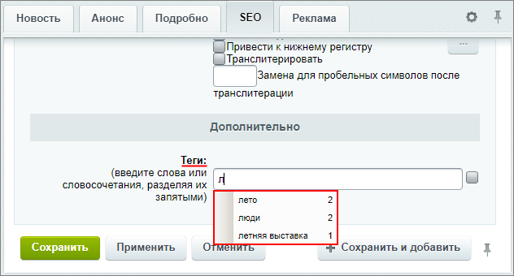
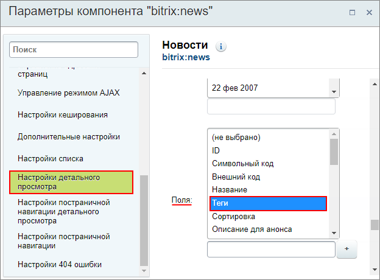
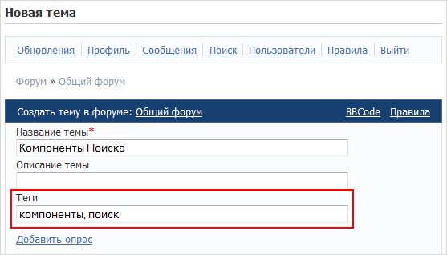
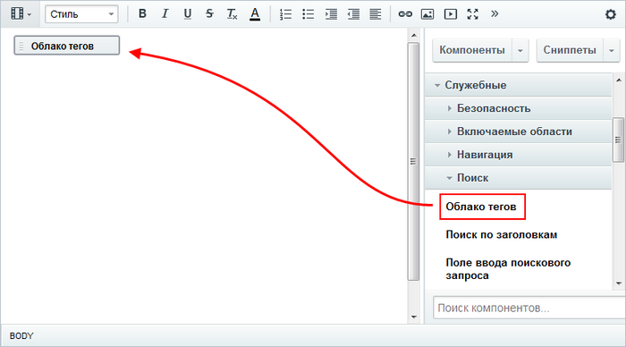
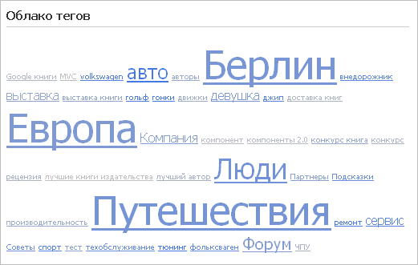
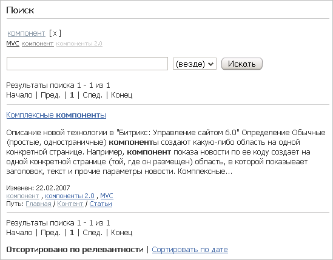

# Облако тегов

**Навигация**
- [← Оглавление курса](index.md)
- [← Предыдущий: 2057 — Логические операторы](lesson_2057.md)
- [Следующий: 2173 — Полезные советы →](lesson_2173.md)

Официальная страница урока: https://dev.1c-bitrix.ru/learning/course/index.php?COURSE_ID=35&LESSON_ID=2067

### Индексирование по тегам

Благодаря возможностям модуля **Поиск** индексирование происходит не только по тексту, но и по тегам, если они, конечно, указаны.

Достаточно часто удобно использовать поочередно оба поисковых механизма. Например: отобрать страницы по нужному тегу, а затем выполнить поиск с помощью поискового индекса.

> **Теги** - это темы информационного сообщения. Под информационным сообщением понимается многое: элемент инфоблока, сообщение в форуме или блоге, теги фотографий и так далее.

 

На данный момент ввод тегов возможен в статических страницах, элементах информационных блоков, в блогах, форумах и страницах Wiki. Формат ввода тегов: через запятую и пробел.

### Добавление тегов к материалам сайта

 

В качестве примера рассмотрим добавление тегов для элемента инфоблока. Для этого перейдем на закладку **SEO** формы редактирования элемента инфоблока и внизу в секции **Дополнительно** найдем параметр **Теги** (в настройках инфоблока должен быть включен функционал тегов на закладке **Поля**):

 

При вводе первых букв тега в поле ввода, система подскажет существующие теги, которые уже есть в продукте, с сортировкой по частоте использования или по имени (при установленном флажке правее поля ввода параметра **Теги**). Такая возможность позволяет пользователям выбирать сходные теги и допускать меньше ошибок, что обеспечивает лучший поиск по тегам.

Для элементов инфоблока можно настроить показ тегов в публичной части. Для этого необходимо открыть настройки компонента, которым выведена информация из инфоблока, и отметить вывод поля **Теги** (доступно для списка элементов и

			страницы детального просмотра

                    Пример настроек в комплексном компоненте **Новости**:

		).

 

Кроме того, имеется возможность создавать теги из публичной части сайта. Например, при создании

			новой темы

                    

		 на форуме.

Таким образом, за счет расширения функционала модуля поиска, реализован полноценный механизм индексации материалов сайта по тегам.

### Как разместить облако тегов на сайте?

> **Облако тегов** - это визуальное представление списка ярлыков (или категорий). Частота упоминаний, ссылок в Интернете с определенного сайта, терминов, имен отображается на специальной странице в виде изображения этих слов в формате гиперссылок. Размер тега тем больше, чем выше релевантность данного слова (термина, имени), то есть чем больше размер, тем больше документов на сайте связано этим тегом. Цвет тега говорит о том, как давно этот тег был использован в документах последний раз.

 

Для реализации механизма поиска по тегам в модуле **Поиск** имеются компоненты:

			Облако тегов

						[Описание компонента «Облако тегов» в пользовательской документации.](http://dev.1c-bitrix.ru/user_help/detail.php?ID=63418)

		,

			Форма ввода тегов

						[Описание компонента «Форма ввода тегов» в пользовательской документации.](http://dev.1c-bitrix.ru/user_help/detail.php?ID=63420)

		  и

			Стандартная страница поиска

                    Компонент служит для создания страницы поиска.

 

						[Описание компонента «Стандартная страница поиска» в пользовательской документации.](http://dev.1c-bitrix.ru/user_help/detail.php?ID=63419)

		 (для компонента добавлен шаблон **tags** с поддержкой облака тегов).

Рассмотрим на примере, как разместить облако тегов на сайте

- Создайте новую страницу и разместите компонент
  			Облако тегов
                      
  		.
- Выполните настройки компонента и сохраните страницу.

 

Для просмотра результата перейдите в публичный раздел:

 

**Примечание:** предварительно должны быть настроены теги к материалам сайта, в противном случае страница будет пустой.

Воспользуйтесь какой-нибудь ссылкой, например, **компонент**. По ссылке откроется

			страница поиска

                    

		, для создания которой использовался компонент **Стандартная страница поиска** с шаблоном **tags**.

На этой странице облако тегов перестраивается, выводятся только те теги, которые соответствуют результатам поиска по первому тегу. Если вы используете строку поиска, то это также приводит к перестроению облака на основании результатов.
