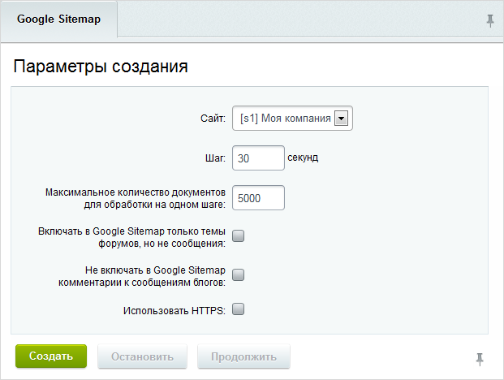
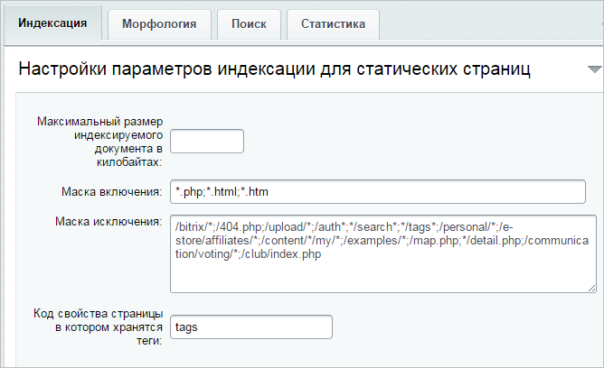
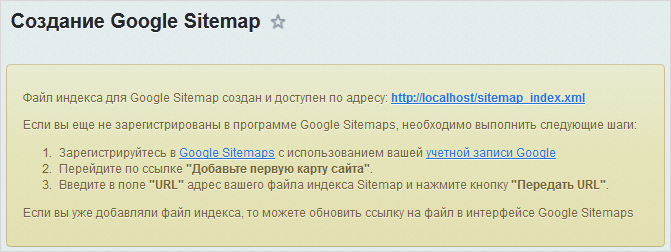

# Google Sitemap

**Навигация**
- [← Оглавление курса](index.md)
- [← Предыдущий: 2056 — Морфологический поиск](lesson_2056.md)
- [Следующий: 2185 — Статистика →](lesson_2185.md)

Официальная страница урока: https://dev.1c-bitrix.ru/learning/course/index.php?COURSE_ID=35&LESSON_ID=2068

### Инструмент Google Sitemap

> **Google Sitemap** - простой инструмент управления доставкой информации о страницах сайта в базу данных поисковой системы **Google**.

**Примечание:** данный инструмент устарел в рамках модуля **Поиск**. Ему на смену пришел модуль

			Поисковая оптимизация

                    Модуль **Поисковая оптимизация** анализирует техническое исполнение сайта, отображает параметры, влияющие на оптимизацию, и дает рекомендации по улучшению этих параметров.
[Подробнее...](https://dev.1c-bitrix.ru/learning/course/index.php?COURSE_ID=41&LESSON_ID=2095&LESSON_PATH=3911.7257.2095)

		

Инструмент **Google Sitemap** оставлен в системе для совместимости и на случай отсутствия установленного модуля **Поисковая оптимизация**.

Применение **Google Sitemap** особенно важно для динамических сайтов, страницы которых генерируются автоматически, поскольку это гарантирует наличие информации обо всех страницах сайта в базе данных **Google**. В файл попадает только контент с правами на чтение для всех пользователей.

Инструмент **Google Sitemap** позволяет получить гарантию того, что:

 

- поисковая система Google проиндексирует все имеющиеся в этом файле страницы вашего сайта
- Google будет регулярно сканировать этот файл на наличие новых страниц для индексации.

В результате:

- Уменьшение нагрузки на сайт за счет более быстрого нахождения и добавления страниц сайта в индекс Google и более быстрого нахождения Google’ом изменившихся страниц.
- Более быстрое попадание сайта в результаты поисковой выдачи Google.
- Более полное индексирование сайта поисковой системой. Часто определенное количество страниц сайта не индексируется, хотя ссылки, ведущие на них, корректно распознаются поисковыми роботами. Причина – расположение ссылок на эти страницы в глубине сайта, т.е. поисковый робот просто не доходит до них и, соответственно, не находит эти страницы.

**Примечание:** использование **Google Sitemap** не дает преимущества при ранжировании в этой поисковой системе. Кроме того, формат **Google Sitemap** поддерживается многими поисковыми системами, в частности, Yandex’ом.

### Создание Google Sitemap

Файлы **Google Sitemap** по своей сути являются XML-файлами, однако создание их вручную крайне трудоемко и требует много времени. Быстро создать карту и передать ее **Google** помогает форма **Создание Google Sitemap** (Настройки &gt; Поиск &gt; Google Sitemap):

**Внимание!** При создании файлов Google Sitemap все файлы вида **sitemap_*.xml**, расположенные в корневой папке выбранного сайта, будут перезаписаны.

Параметры формы интуитивно понятны. Обратим внимание лишь на следующие:

- **Максимальное количество документов для обработки на одном шаге** - чтобы нагрузка на сервер не была велика, укажите максимальное количество документов для обработки на одном шаге.
- **Включать в Google Sitemap только темы форумов, но не сообщения** - если отметить, то при создании в карту будут писаться только первые сообщения темы форума с датой модификации, равной последнему добавленному в тему сообщению.

**Примечание:** для правильного формирования **sitemap.xml** в настройках модуля **Поиск** необходимо указать, какие файлы не должны индексироваться: поле

			Маска исключения

                    

		.

После генерации файл индекса для **Google Sitemap** будет доступен для

			скачивания

                    

		 на локальный компьютер. Адреса файлов в сообщении выведены в виде гиперссылок. То есть, файлы можно открыть в другой закладке браузера, не загружая файлы на локальный компьютер.

### Обратите внимание

Инструмент при создании файла не использует все возможности **Google Sitemap**. В частности не используются теги **changefreq** и **priority**. После создания файла **Google Sitemap** вы можете открыть его для редактирования и вручную добавить указанные теги с параметрами.

- Тег **Change frequency** – говорит о том, как часто обновляется веб-страница. Возможные значения: **never**, **weekly**, **daily**, **hourly**, **monthly**, **yearly**.
- Тег **Рriority** – устанавливает приоритет, который Google назначит для конкретной веб-страницы в ранжировании страниц вашего сайта. Возможные значения: **0.0** (низший приоритет), **1.0** (высший приоритет), **0.5** (средний приоритет).

### Документация по теме

- [Google Sitemap](https://dev.1c-bitrix.ru/user_help/settings/search/search_sitemap.php)
