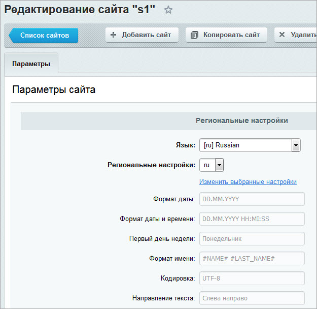
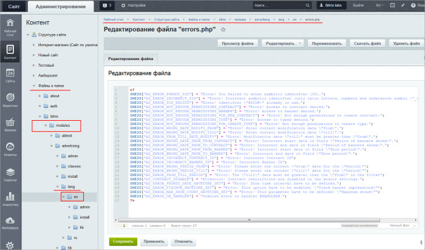

# Языки интерфейса

**Навигация**
- [← Оглавление курса](index.md)
- [← Предыдущий: 11799 — Добавление пункта меню в административный раздел](lesson_11799.md)
- [Следующий: 2071 — Управление языками →](lesson_2071.md)

Официальная страница урока: https://dev.1c-bitrix.ru/learning/course/index.php?COURSE_ID=35&LESSON_ID=2070

### Многоязычный интерфейс

*Bitrix Framework* поддерживает работу с многоязычным интерфейсом в административном разделе сайта. В административной части это позволяет выводить служебные сообщения (например, сообщения об ошибках), отображать сообщения форм и таблиц на различных языках.

**Примечание**: Русский, английский и немецкие языки не ставятся через систему обновлений. Для использования их в административной части необходимо установить соответствующие дистрибутивы.

В публичном разделе сайта служебные сообщения системы, а также

			текстовые сообщения визуальных компонентов

                    

		 отображаются в соответствии с языком сайта. Язык указывается для каждого сайта на странице настроек (Настройки &gt; Настройки продукта &gt; Сайты &gt; Список сайтов):

### Как реализуется многоязычный интерфейс административного раздела?

Для каждого модуля системы создается набор специальных языковых файлов. Они хранятся в папках с названиями соответствующих языков. В файлах содержатся переводы фраз, используемых в интерфейсе, на эти языки.

 

По умолчанию в системе используются русский и английский языки.

			Выбор текущего языка

                    

		 административного раздела сайта осуществляется на административной панели.

**Важно!** Количество языков, используемых в системе, не зависит от количества сайтов, работающих под управлением системы.

Список языков интерфейса, доступных

			для штатной установки

                    Многоязычный интерфейс административного раздела реализуется за счет использования языковых файлов.

[Подробнее ...](lesson_2072.md)

		 в продуктах *«1С-Битрикс: Управление сайтом»* и коробочной версии *«Битрикс24»*:

- украинский
- испанский (Латинская Америка)
- португальский (Бразилия)
- французский (Канада)
- польский
