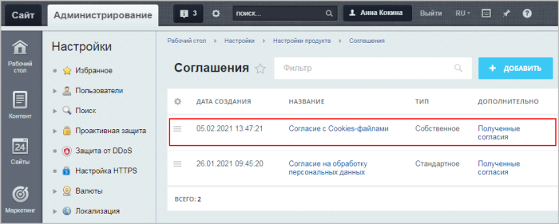

# Cookies в Битрикс

**Навигация**
- [← Оглавление курса](index.md)
- [← Предыдущий: 8407 — Согласие в собственных компонентах](lesson_8407.md)
- [Следующий: 12796 — Проверьте себя →](lesson_12796.md)

Официальная страница урока: https://dev.1c-bitrix.ru/learning/course/index.php?COURSE_ID=35&LESSON_ID=21538

### Что такое cookie

Как и подавляющее большинство сайтов и приложений, сайты на *1С-Битрикс* используют cookies для работы внутренних механизмов и упрощения взаимодействия с пользователем.

> **Cookie** - это текстовая строка информации, которую веб-сервер передает в браузер посетителя сайта и которая сохраняется в файле на устройстве посетителя сайта. Как правило, используется для определения уникальности посетителя, времени его последнего визита, личных настроек, уникального идентификатора корзины покупок и т.д.

Каждый файл cookie уникален и включает в себя название сайта, который его создал, и единственную в своем роде последовательность из цифр и букв.

Параметры cookies задаются в

			настройках

                    
Настройка cookies выполняется во вкладке **Настройки** (секция **Куки**).

[Подробнее](https://dev.1c-bitrix.ru/user_help/settings/settings/settings.php)...

		 **Главного модуля** (Настройки &gt; Настройки продукта &gt; Настройки модулей &gt; Главный модуль).

**Cookies передаются по следующему алгоритму:**

1. Пользователь в своём браузере вводит URL-адрес сайта;
2. Браузер отправляет соответствующий запрос на сайт;
3. Браузер ищет на устройстве пользователя файл cookie этого сайта;
4. Если cookie присутствует, он отправляется вместе с URL-адресом на сервер сайта. Если файл не найден, то cookie не отправляется;
5. Когда сервер сайта получает данные cookie, он может их использовать. При отсутствии cookie сервер идентифицирует пользователя как нового посетителя.

### Уведомление об использовании на сайте сookie

Согласно закону [ФЗ-152](http://www.consultant.ru/document/cons_doc_LAW_61801/) "О персональных данных", пользователь должен дать согласие на обработку своих персональных данных или же отказаться от неё. К персональным данным относятся не только привычные ФИО, телефоны, почта и прочее, но и аналитические – идентификатор устройства, ip-адрес, файлы cookie и др.

Важно, чтобы посетитель Вашего сайта был уведомлен, что его персональная информация собирается посредством cookies, а также мог этим управлять (согласиться/не согласиться на передачу такой информации). За негласный сбор пользовательских данных и cookie контролирующие государственные органы могут привлекать владельцев сайтов к административной, уголовной, гражданско-правовой и иной ответственности, предусмотренной действующим законодательством.

Текст такого уведомления (соглашения) можно добавить и отредактировать на странице **Соглашения** (Настройки &gt; Настройки продукта &gt; Соглашения):

**Примечание**: Подробнее о создании и работе с Соглашениями читайте

			в уроке.

                    
Соглашение - текст, который должен прочитать пользователь и согласиться с ним. В дистрибутиве есть стандартный вариант соглашения, но у администратора всегда есть возможность создать свой текст соглашения. Для этого на странице **Соглашения** воспользуйтесь кнопкой **Добавить** и заполните открывшуюся форму

[Подробнее](lesson_6636.md)...

Для вывода соглашения можно использовать компонент

			Запрос согласия пользователя

                     Компонент позволяет выполнить требования ФЗ-152. Может использоваться как самостоятельно, так и [включённым в другие компоненты](lesson_8407.md).

 

						[Описание компонента «Запрос согласия пользователя» в пользовательской документации.](http://dev.1c-bitrix.ru/user_help/detail.php?ID=6465485)

		, либо же

			добавить согласие в собственные компоненты.

                    
- Как добавить секцию "Согласие пользователя" в настройки компонента;

- Как вывести соглашение в публичной части сайта.

[Подробнее](lesson_8407.md)...

### Дополнительно о работе с сookie

Ниже приведены ссылки на уроки разных курсов, которые будут полезны при работе с сookie в разных областях:

| \|  \| **Урок** \| **Рассматриваемый вопрос** \| \| --- \| --- \| --- \| \| Сбор данных \| [Сбор данных](https://dev.1c-bitrix.ru/learning/course/index.php?COURSE_ID=38&LESSON_ID=2485) \| Пример: какие данные собирает система в интернет-магазине \| \| [Принципы сбора статистики](https://dev.1c-bitrix.ru/learning/course/index.php?COURSE_ID=139&LESSON_ID=3265) \| Как модуль **Веб-аналитика** собирает данные о посетителях сайта \|  \| \| Получение и защита \| [Немного теории: уязвимости](lesson_3023.md) \| Какие существуют атаки на клиентов веб-приложения, связанные с похищением cookie \| \| [Шифрованные cookies](https://dev.1c-bitrix.ru/learning/course/index.php?COURSE_ID=43&LESSON_ID=14036) \| Как отправлять данные пользователю, не раскрывая содержимое и не позволяя изменять данные внутри \|  \| \| [Теория. Приложения и контекст](https://dev.1c-bitrix.ru/learning/course/index.php?COURSE_ID=43&LESSON_ID=3511) \| Как получить значение cookie \|  \| \| Авторизация \| [Технология переноса посетителей между сайтами](https://dev.1c-bitrix.ru/learning/course/index.php?COURSE_ID=103&LESSON_ID=285) \| Для чего нужно переносить cookie и как это сделать с помощью технологии **UserMultiSiteTransfer** \| \| [Авторизация при поддоменности на разных установках](https://dev.1c-bitrix.ru/learning/course/index.php?COURSE_ID=103&LESSON_ID=20670) \| Как решить проблемы с авторизацией, вызванные дублированием переменной **PHPSESSID** в cookie \|  \| \| [Теория. Структура файлов](https://dev.1c-bitrix.ru/learning/course/index.php?COURSE_ID=43&LESSON_ID=3515) \| Какой файл используется главным модулем для переноса cookie посетителя на дополнительные домены различных сайтов \|  \| \| Композитный сайт \| [Частая перезапись кеша и обработка ошибок](https://dev.1c-bitrix.ru/learning/course/index.php?COURSE_ID=39&LESSON_ID=3129) \| Как решить проблему частой перезаписи кеша, вызванную наличием в теге  блока php, который проверяет специальный cookie \| \| [Отладка](https://dev.1c-bitrix.ru/learning/course/index.php?COURSE_ID=39&CHAPTER_ID=08625) \| Способы отладки ошибок, связанных с cookie при использовании технологии **Композитный сайт** \|  \| \| [Типовые случаи](https://dev.1c-bitrix.ru/learning/course/index.php?COURSE_ID=39&LESSON_ID=3253) \| Влияние служебной cookie **_NCC** (No Composite Cache) на отображение страниц при использовании технологии **Композитный сайт** \|  \| \| [Условия работы композитного кеша](https://dev.1c-bitrix.ru/learning/course/index.php?COURSE_ID=37&LESSON_ID=3085) \| Cookies, при которых NGINX не использует технологию **Композитный сайт** \|  \| \| Дополнительные примеры \| [Аффилиаты](https://dev.1c-bitrix.ru/learning/course/index.php?COURSE_ID=42&LESSON_ID=12433) \| Как настроить работу с аффилиатами (ID аффилиата сохраняется в файлах cookie) \| \| [Создание собственных счетчиков и атрибутов](https://dev.1c-bitrix.ru/learning/course/index.php?COURSE_ID=41&LESSON_ID=9039) \| Как настроить отображение новых атрибутов для пользователя, который уже заходил на сайт (т.е. контекст для него уже установлен без этих атрибутов) \|  \| |
| --- |
