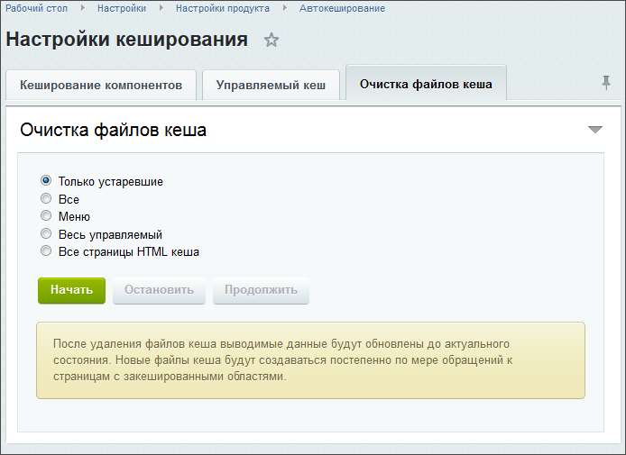

# Очистка файлов кеша

**Навигация**
- [← Оглавление курса](index.md)
- [← Предыдущий: 7079 — HTML кеш](lesson_7079.md)
- [Следующий: 4469 — Сжатие css и js файлов →](lesson_4469.md)

Официальная страница урока: https://dev.1c-bitrix.ru/learning/course/index.php?COURSE_ID=35&LESSON_ID=2164

### Очистка файлов кеша

**Внимание!** Не рекомендуется ручная очистка файлов кеша в папке `/bitrix/managed_cache/`.

Закладка **Очистка файлов кеша** (Настройки &gt; Настройки продукта &gt; Автокеширование) используется для удаления файлов кеша, содержащих устаревшую или сбойную информацию:



- **Только устаревшие** - Файлы, время жизни которых закончилось;
- **Все** - Все файлы кеша;
- **Меню** - Меню может быть закешировано, если происходят проверки доступа к различным пунктам меню, разделам. Данный пункт позволяет очистить этот кеш;
- **Весь управляемый** - Все файлы раздела `/bitrix/managed_cache/`;
- **Все страницы HTML кеша** - Удаление страниц HTML кеша.

После удаления файлов кеша выводимые данные будут обновлены до актуального состояния. Новые файлы кеша будут создаваться постепенно по мере обращений к страницам с закешированными областями.

### Если растет папка /bitrix/cache/

В данной папке находятся файлы не управляемого кэша. Иногда при создании файлов кэша им присваиваются такие права, которые являются недостаточными для последующего изменения или удаления этих файлов процессом веб-сервера. Это приводит к росту объема этой папки.

При назначении прав на файлы и папки используются значения констант
`BX_FILE_PERMISSIONS` и `BX_DIR_PERMISSIONS` из `/bitrix/php_interface/dbconn.php`, но часто срабатывает маска прав на сервере и чтобы избежать этого, необходимо прописать в этом же скрипте:

```
umask(000);
@umask(~BX_DIR_PERMISSIONS);
```
