# Как подключить облачное хранилище Yandex Object Storage

**Навигация**
- [← Оглавление курса](index.md)
- [← Предыдущий: 3102 — Создание подключения](lesson_3102.md)
- [Следующий: 30294 — Как подключить облачное хранилище Selectel →](lesson_30294.md)

Официальная страница урока: https://dev.1c-bitrix.ru/learning/course/index.php?COURSE_ID=35&LESSON_ID=22022

Рассмотрим подробнее

			процесс подключения облачного хранилища

                    
Модуль **Облачные хранилища** позволяет перенести хранение файлов разных модулей в облачные хранилища. Например, можно настроить, что изображения, загружаемые посетителями сайта в блог, будут автоматически сохраняться в "облаке".

[Подробнее](lesson_3102.md)...

		 на примере

			Yandex Object Storage

                    
Сервис **Yandex Object Storage** — это универсальное масштабируемое решение для хранения данных. Оно подходит как для высоконагруженных сервисов, которым требуется надежный и быстрый доступ к данным, так и для проектов с невысокими требованиями к инфраструктуре хранения.

[Подробнее](https://cloud.yandex.ru/ru/services/storage)...

		.

 

### Действия на стороне Yandex Object Storage

Прежде всего необходимо зарегистрироваться на сайте сервиса [Yandex Object Storage](https://cloud.yandex.ru/ru/).

1. Создайте
  			сервисный аккаунт
  **Сервисный аккаунт** — аккаунт, от имени которого программы могут управлять ресурсами в Yandex.Cloud.
  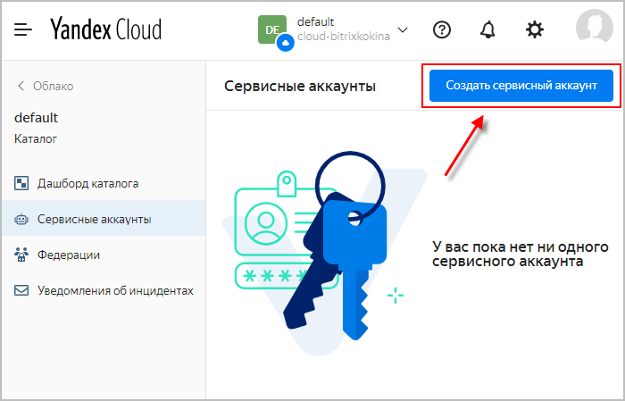
  [Подробнее](https://cloud.yandex.ru/ru/docs/iam/concepts/users/service-accounts)...
  		 согласно
  			инструкции
  **Перед началом работ:**
  На странице биллинга убедитесь, что у вас подключен платежный аккаунт и он находится в статусе `ACTIVE` или `TRIAL_ACTIVE`. Если платежного аккаунта нет, создайте его.
  [Подробнее](https://cloud.yandex.ru/ru/docs/iam/quickstart-sa)...
  		:
  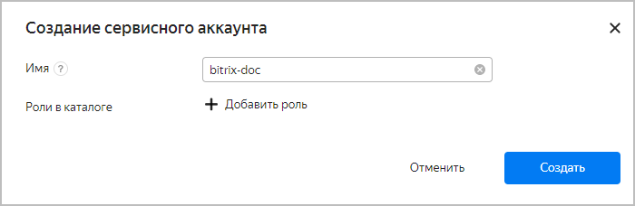

  - Укажите имя аккаунта.
    **Примечание**: Имя нового аккаунта может содержать строчные буквы латинского алфавита, цифры и дефисы. Первый символ должен быть буквой. Последний символ не должен быть дефисом. Допустимая длина — от 3 до 63 символов.
  - При желании можно задать
    			роль
    **Роль** — это набор разрешений, который определяет допустимые операции с ресурсами в Yandex.Cloud.
    [Подробнее](https://cloud.yandex.ru/ru/docs/iam/concepts/access-control/roles)...
    		 (не обязательно).
2. Далее необходимо создать ключ доступа. Кликните по созданному
  			сервисному аккаунту
  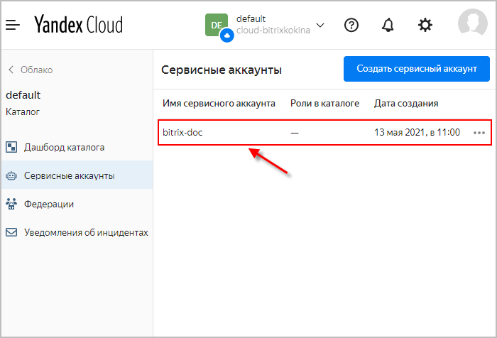
  		  и нажмите кнопку
  			Создать новый ключ
  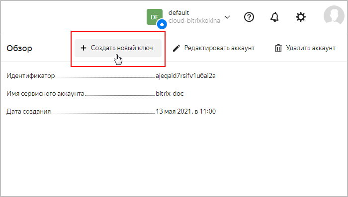
  		, выберите пункт
  			Создать статический ключ доступа.
  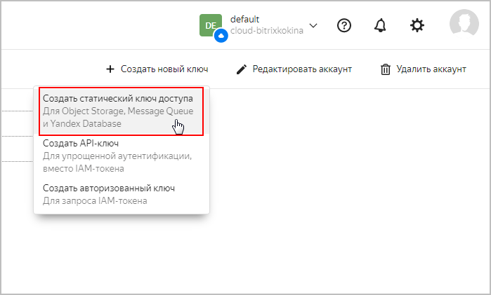
  Добавьте
  			описание
  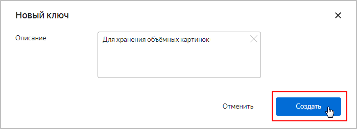
  		 и нажмите кнопку **Создать**. В открывшемся окне отобразятся сгенерированные идентификатор ключа (**Ключ доступа**) и секретный ключ:
  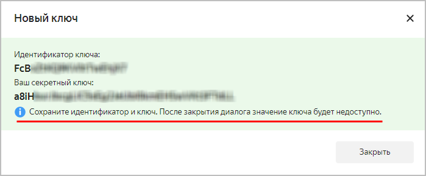
  **Важно!** Необходимо сохранить идентификатор и ключ. После закрытия диалога значение ключа будет недоступно.
3. Теперь осталось создать контейнер (
  			бакет
  Логическая сущность, которая помогает организовать хранение объектов.
  [Подробнее](https://cloud.yandex.ru/ru/docs/storage/concepts/bucket)...
  		).
  В дашборде нужного каталога выберите сервис **Object Storage**:
  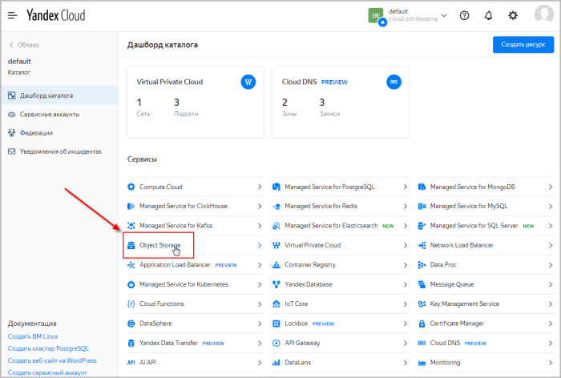
  Нажмите кнопку
  			Создать бакет
  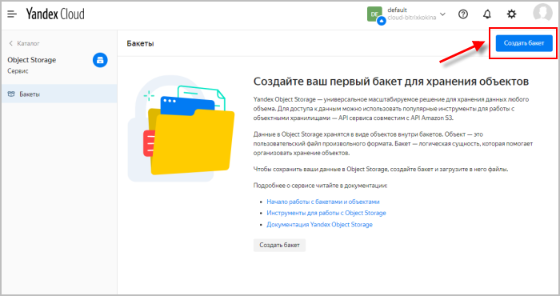
  		 и заполните
  			поля открывшейся формы.
  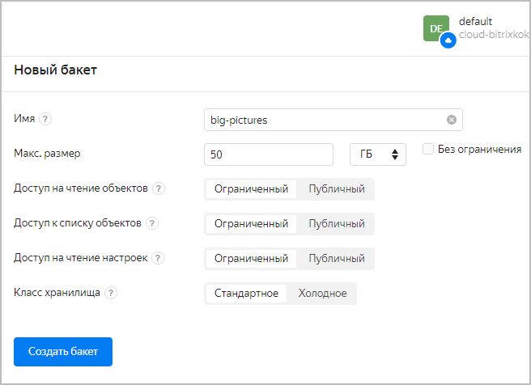
  [Подробнее о настройках бакета](https://cloud.yandex.ru/ru/docs/storage/concepts/bucket#bucket-settings)...
  Далее нужно привязать созданный бакет к сервисному аккаунту. В списке действий (иконка-троеточие справа от названия бакета) выберите пункт
  			ACL бакета.
  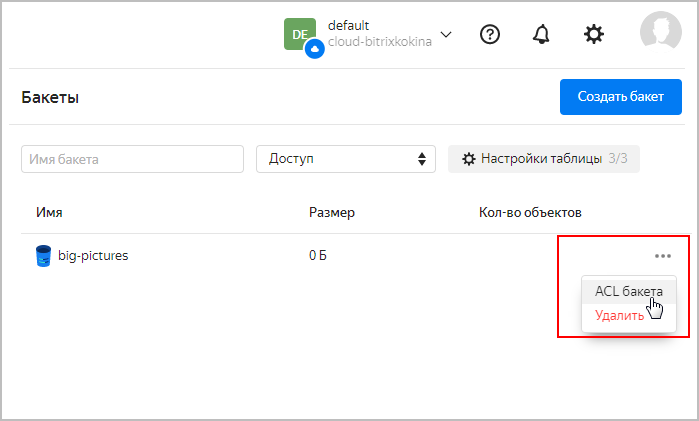
  Откорректируйте настройки:
  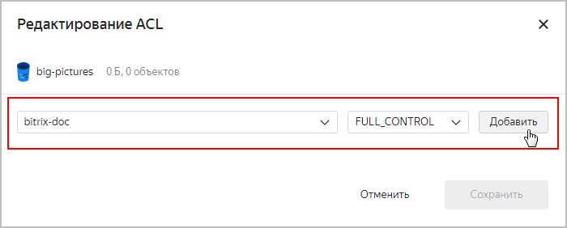

  - В качестве пользователя выберите созданный ранее **сервисный аккаунт**;
  - В уровне доступа укажите **FULL_CONTROL**;
  - Нажмите кнопку **Добавить**, а затем
    			сохраните изменения
    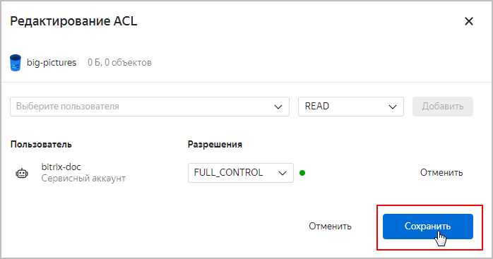
    		.

### Действия на стороне сайта

1. Добавьте новое подключение на странице **Облачные хранилища** (Настройки &gt; Облачные хранилища). Откроется форма вида:
  
  **Важно!** Поле "Каноническое имя домена" не нужно заполнять. Оно предназначено для разработчиков и служит для налаживания более
  			эффективной
  Сеть доставки (и дистрибуции) содержимого (англ. Content Delivery Network или Content Distribution Network, CDN) — географически распределённая сетевая инфраструктура, позволяющая оптимизировать доставку и дистрибуцию содержимого конечным пользователям в сети Интернет. Использование контент-провайдерами CDN способствует увеличению скорости загрузки интернет-пользователями аудио-, видео-, программного, игрового и других видов цифрового содержимого в точках присутствия сети CDN.
  [Подробнее](https://ru.wikipedia.org/wiki/Content_Delivery_Network)...
  		  раздачи контента клиентам. Требуются дополнительные сторонние настройки и соответствующие навыки.

  - **Провайдер** - выберите из списка **Yandex Object Storage**;
  - **Регион** - устанавливается автоматически;
  - **Ключ доступа** и **Секретный ключ** - укажите идентификатор ключа сервисного аккаунта на **Yandex Object Storage** и секретный ключ;
  - **Контейнер** - пропишите название созданного ранее бакета;
  - **Только для чтения** - при отмеченной опции новые файлы будут сохраняться не в контейнере, а на хостинге с проектом.
2. Перейдите во вкладку **Правила** и задайте условия, по которым будет происходить отбор файлов для загрузки в облачное хранилище:
  
3. Нажмите кнопку **Сохранить**. Новый контейнер появится в списке на странице **Облачные хранилища** (Настройки &gt; Облачные хранилища):
  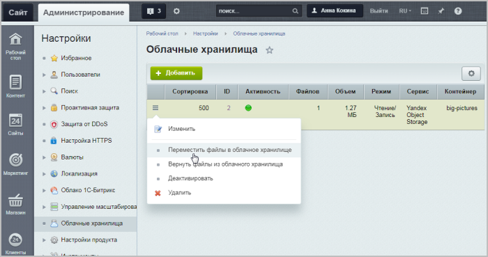
  Перенесите уже имеющиеся на сайте файлы в облачное хранилище с помощью одноименного пункта меню.
  **Примечание**: По окончанию процедуры переноса файлов будет выведено
  			сообщение о результате.
  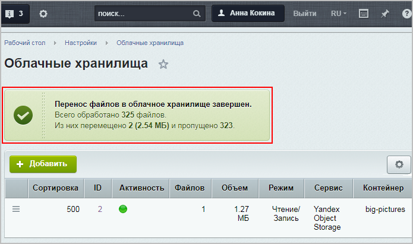
  		  В случае неудачного подключения на странице будет выведен текст ошибки (текст выдается сервисом облачного хранения файлов).
  Новые загружаемые файлы будут автоматически проверяться на соответствие правилу и сохраняться в облачное хранилище. Ссылки на файлы будут также автоматически формироваться с учетом их расположения в облачном хранилище.
