# Пассивный шаблон

**Навигация**
- [← Оглавление курса](index.md)
- [← Предыдущий: 22372 — Виды шаблонизации](lesson_22372.md)
- [Следующий: 22376 — Активный шаблон →](lesson_22376.md)

Официальная страница урока: https://dev.1c-bitrix.ru/learning/course/index.php?COURSE_ID=35&LESSON_ID=22374

**Пассивный шаблон** - это простой файл, который хранит контент, вставляемый на вновь создаваемую страницу. Принцип работы такой же как со сниппетами. Отличие лишь в том, что Контент-менеджер сможет создавать новую страницу сразу по определенному шаблону.

 

### Создание шаблона

Шаблоны страниц хранятся в шаблоне сайта по пути: 

`/bitrix/templates/[ваш_шаблон]/page_templates/_имя_шаблона_.php`

Если у вашего шаблона сайта отсутствует папка **page_templates**, вы можете просто создать её.

Создание нового шаблона требуется достаточно редко. Самый простой вариант - скопировать и отредактировать штатный шаблон страницы

			standard

                    Размещен в папке шаблона сайта **.default**.

		.

Общий алгоритм создания пассивного шаблона c нуля несложен:

- Продумайте шаблон страницы. Это может быть комплекс из html-кода, текста, изображений, таблиц, компонентов и php-кода;
- Создайте
                      Создание раздела и страницы в Административной части выполняется в рамках либо логической либо физической структуры.
  [Подробнее ...](lesson_2021.md)
  		 в папке `/bitrix/templates/[ваш_шаблон]/page_templates/` новый файл (например, **new.php**);
- В создаваемом файле разместите код своего шаблона;
- Сохраните файл и проверьте наличие в нём вызова файлов **header.php** и **footer.php**. Вызовы файлов **header.php** и **footer.php** -
  			обязательны!
                      Вызов файлов **header.php** и **footer.php** - это PHP-код в начале и конце примера. Если вы не понимаете где начинается и заканчивается PHP-код, то обратитесь к специалистам.
  		 в таком файле. После сохранения шаблона они должны подставиться автоматически в код страницы;

Простой пример содержимого созданного файла:

```
<?
require($_SERVER["DOCUMENT_ROOT"]."/bitrix/header.php");
$APPLICATION->SetTitle("Title");
?>

<p>Контент-менеджер! Наполни страницу содержанием!</p>

<?require($_SERVER["DOCUMENT_ROOT"]."/bitrix/footer.php");?>
```

Текст в примере выше, что между вызовами **header.php** и **footer.php**, изменяйте под ваши задачи в любое время.

 

Более сложный практический пример приведен далее в этом уроке в табе **Пример создания шаблона**.

### Подключение шаблона

Новый шаблон нужно добавить в меню создания страницы, чтобы Контент-менеджер мог легко им воспользоваться.

Список доступных шаблонов страниц и редактируемых областей создается с помощью файла

			**.content.php**

                    Если файл `.content.php` не существует, создайте его
с помощью кнопки меню **Добавить файл**:
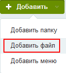

		. Этот файл размещен в той же папке `/page_templates/` соответствующего шаблона сайта, что и файл с шаблоном страницы.

Указанный файл содержит массив соответствий файлов пассивных шаблонов страниц и включаемых областей их названиям для

			представления в списке

                    Дополнительно задаются значения сортировки названий шаблонов страниц в выпадающем списке.

		. В этом файле требуется добавить строку с  новым файлом шаблона: `$TEMPLATE["new.php"] = Array("name"=>"Новый шаблон", "sort"=>4);`, где в квадратных скобках указано имя файла шаблона **new.php**, а в кавычках после name - название шаблона **Новый шаблон**.

Общее содержимое файла может выглядеть так:

 

```
<?
if(!defined("B_PROLOG_INCLUDED") || B_PROLOG_INCLUDED!==true)die();
$TEMPLATE["standard.php"] = Array("name"=>"Стандартная страница", "sort"=>1);
$TEMPLATE["page_inc.php"] = Array("name"=>"Включаемая область страницы", "sort"=>2);
$TEMPLATE["sect_inc.php"] = Array("name"=>"Включаемая область раздела", "sort"=>3);
$TEMPLATE["new.php"] = Array("name"=>"Новый шаблон", "sort"=>4);
?>
```

 
	

После этих действий контент-менеджер получит возможность использовать новый шаблон при создании страниц из панели управления:

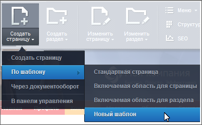

### Языковые файлы

Используйте языковые файлы для шаблонов, если сайт использует несколько языков.

В этом случае запись в **.content.php** будет иметь вид:

```
$TEMPLATE["new.php"] = Array("name"=>GetMessage("new"), "sort"=>4);
```

, где вместо названия используется метод `GetMessage("new")`. По слову **new** будет выполнен поиск названия шаблона в языковом файле.

Файлы с языковыми сообщениями хранятся в папке **lang** шаблона сайта `/bitrix/templates/[ваш_шаблон]/lang/`. Папка содержит

			подпапки с названиями языков

                    Например, **en** и **ru**:
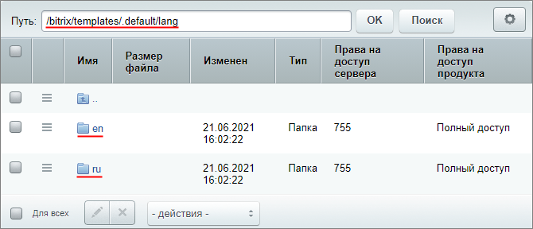

		.

На примере шаблона .default и русского языка, файл с языковыми сообщениями лежит по пути: `/bitrix/templates/.default/lang/ru/page_templates/.content.php`. Для создания названия нового шаблона на русском языке добавляется новая, аналогичная существующим, запись: `$MESS['new'] = "Новый шаблон";`:

```
<?
$MESS['standart'] = "Стандартная страница";
$MESS['new'] = "Новый шаблон";
$MESS['page_inc'] = "Включаемая область для страницы";
$MESS['sect_inc'] = "Включаемая область для раздела";
?>
```

Таким же образом добавляется строка для английского языка в файле `/bitrix/templates/.default/lang/en/page_templates/.content.php` с английским названием `$MESS['new'] = "New template";`.

### Пример создания шаблона

**Задача:** Контент-менеджеру периодически требуется создавать страницу с важным объявлением для клиентов. Структура объявления всегда одинаковая: есть заголовок, разделительные линии, таблица с постоянным изображением и форма обратной связи для клиентов.

Упростим работу Контент-менеджера, создав пассивный шаблон такой страницы (*после видеоролика есть текстовое описание*):

1. В папке page_templates шаблона сайта .default (`/bitrix/templates/.default/page_templates`)
  			добавим
                      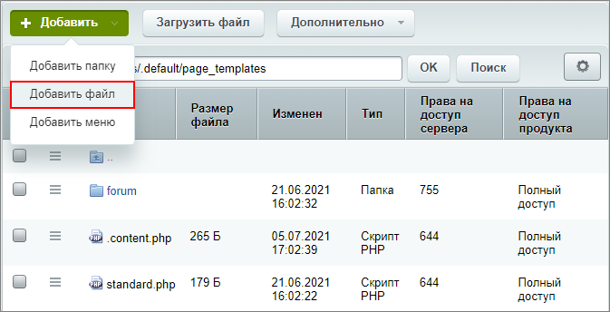
  		 новый файл
  			announcement.php
                      
  		 с
  			кодом шаблона
                      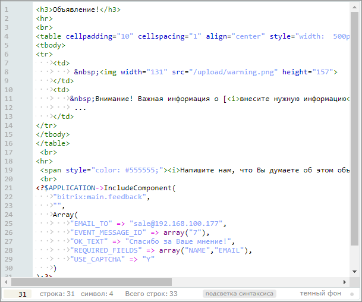
  		 страницы;
2. Сохраним файл и проверим его содержимое, открыв на
  			редактирование как PHP
                      
  		. Убедимся, что добавилось подключение файлов **header.php** и **footer.php**.
  ## Как выглядит содержимое созданного файла после сохранения
  ```
  <?
  require($_SERVER["DOCUMENT_ROOT"]."/bitrix/header.php");
  $APPLICATION->SetTitle("Title");
  ?>
  <h3>Объявление!</h3>
  <hr>
  <br>
  <table cellpadding="10" cellspacing="1" align="center" style="width: 500px;">
  <tbody>
  <tr>
  	<td>
  		  
  	</td>
  	<td>
  		 Внимание! Важная информация о [<i>внесите нужную информацию</i>].<br>
  		 ...
  	</td>
  </tr>
  </tbody>
  </table>
   <br>
  <hr>
   <span style="color: #555555;"><i>Напишите нам, что Вы думаете об этом объявлении. Для этого воспользуйтесь формой обратной связи. Спасибо!</i></span><br>
   <br>
  <?$APPLICATION->IncludeComponent(
  	"bitrix:main.feedback",
  	"",
  	Array(
  		"EMAIL_TO" => "sale@192.168.100.177",
  		"EVENT_MESSAGE_ID" => array("7"),
  		"OK_TEXT" => "Спасибо за Ваше мнение!",
  		"REQUIRED_FIELDS" => array("NAME","EMAIL"),
  		"USE_CAPTCHA" => "Y"
  	)
  );?>
  <?require($_SERVER["DOCUMENT_ROOT"]."/bitrix/footer.php");?>
  ```
3. Шаблон готов. Добавим его в меню. Откроем в режиме PHP файл .content.php. Добавим строку:
  ```
  $TEMPLATE["announcement.php"] = Array("name"=>GetMessage("announcement"), "sort"=>2);
  ```
  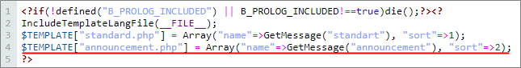
4. Наш сайт использует два языка: русский и английский. Добавим языковые сообщения для обоих языков, чтобы шаблон корректно отображался в меню на любом языке:

  - Для русского языка (**RU**) перейдем по пути `/bitrix/templates/.default/lang/ru/page_templates` и в файле `.content.php` добавим строку:
    ```
    $MESS['announcement'] = "Важное объявление";
    ```
    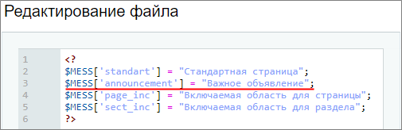
  - Для английского языка (**EN**) перейдем по пути `/bitrix/templates/.default/lang/en/page_templates` и в файле `.content.php` добавим строку:
    ```
    $MESS ['announcement'] = "Important announcement";
    ```
    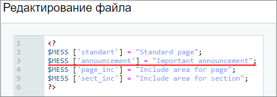
5. Проверим наш шаблон в меню. Откроем публичный раздел и меню шаблонов в панели управления. Увидим новый шаблон как для русского языка:
  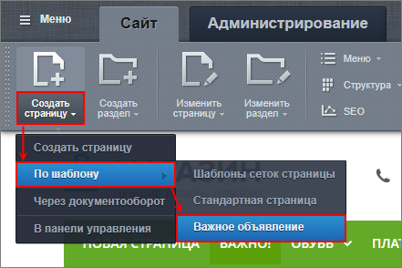
  Так и для английского:
  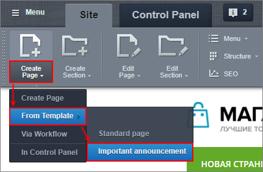
6. При создании новой страницы по этому шаблону, Контент-менеджеру откроется визуальный редактор с предустановленной информацией из нашего шаблона:
  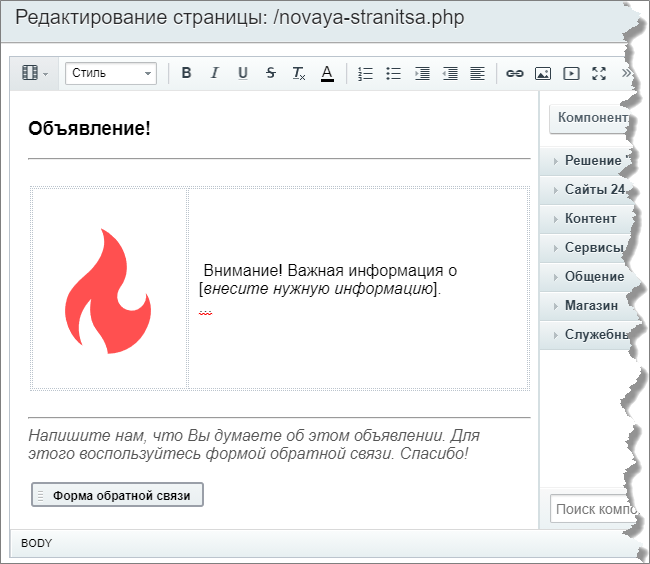
