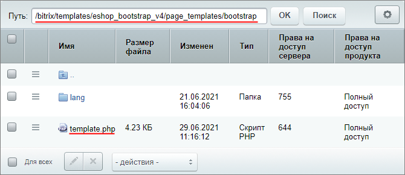
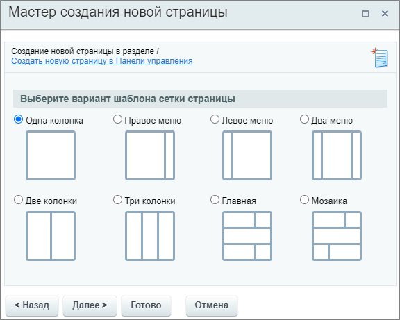
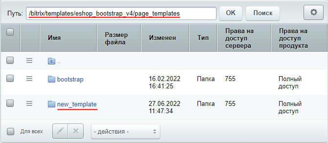
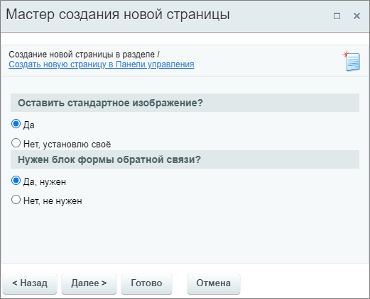

# Активный шаблон

**Навигация**
- [← Оглавление курса](index.md)
- [← Предыдущий: 22374 — Пассивный шаблон](lesson_22374.md)
- [Следующий: 9115 — Настройки модуля Управление структурой →](lesson_9115.md)

Официальная страница урока: https://dev.1c-bitrix.ru/learning/course/index.php?COURSE_ID=35&LESSON_ID=22376

В системе возможно использование активных шаблонов. **Активный шаблон** - это шаблон, который при создании страницы запрашивает дополнительные данные прямо в мастере создания страницы.

 

**Важно!** Этот урок является ознакомительным. Написание логики работы активного шаблона рассмотрено в уроке не будет, т.к. требует навыков программирования на PHP. Мы изучим только структуру файлов шаблона, как подключить его в меню и работать с языковыми файлами. А также посмотрим простой пример создания шаблона с несложной логикой на основе существующего штатного шаблона.

Если Вы всё же решили попробовать создать свой активный шаблон, то имейте ввиду, что при наличии ошибок в шаблоне, публичная часть сайта перестанет работать и отобразит

			ошибку

                    Для поиска ошибки можно включить режим отладки `'debug' => true` в файле `/bitrix/.settings.php`

		.

### Активный шаблон

Понять, что такое активный шаблон и как он устроен проще всего на примере. В шаблонах штатной установки дистрибутива *"1С-Битрикс: Управление сайтом"* есть два таких примера:

- `\bitrix\templates\.default\page_templates\forum` в шаблоне **.default**;
- `\bitrix\templates\eshop_bootstrap_v4\page_templates\bootstrap` в шаблоне **eshop_bootstrap_v4**.

Рассмотрим подробнее шаблон **bootstrap**. В папке содержится файл **template.php** непосредственно с логикой шаблона и папка **lang** с файлами языковых сообщений.



## Содержимое файла шаблона template.php

```
<?
if(!defined("B_PROLOG_INCLUDED") || B_PROLOG_INCLUDED !== true)
	die();

CPageTemplate::IncludeLangFile(__FILE__);

class CBootstrapPageTemplate
{
	function GetDescription()
	{
		return array(
			"name" => GetMessage("bt_wizard_name"),
			"description" => GetMessage("bt_wizard_title"),
			"modules" => array("bitrix.eshop"),
		);
	}

	function GetFormHtml()
	{
		$s = '
<tr class="section">
	<td colspan="4">'.GetMessage("BT_TYPE").'</td>
</tr>
';
		$s .= '
<tr>
	<td style="vertical-align: top; padding-top:10px">
		<input type="radio" name="BT_COL" value="1" id="BT_COL_1" checked>
		<label for="BT_COL_1">'.GetMessage("BT_COL_1").'</label><br>
		<br>
	</td>
	<td style="padding-top:10px">
		<input type="radio" name="BT_COL" value="2_1" id="BT_COL_2_1">
		<label for="BT_COL_2_1">'.GetMessage("BT_COL_2_1").'</label><br>
		<br>
	</td>
	<td style="padding-top:10px">
		<input type="radio" name="BT_COL" value="1_2" id="BT_COL_1_2">
		<label for="BT_COL_1_2">'.GetMessage("BT_COL_1_2").'</label><br>
		<br>
	</td>
	<td style="padding-top:10px">
		<input type="radio" name="BT_COL" value="1_2_1" id="BT_COL_1_2_1">
		<label for="BT_COL_1_2_1">'.GetMessage("BT_COL_1_2_1").'</label><br>
		<br>
	</td>
</tr>
<tr>
	<td style="padding-top:20px">
		<input type="radio" name="BT_COL" value="1_1" id="BT_COL_1_1">
		<label for="BT_COL_1_1">'.GetMessage("BT_COL_1_1").'</label><br>
		<br>
	</td>
	<td style="padding-top:20px">
		<input type="radio" name="BT_COL" value="1_1_1" id="BT_COL_1_1_1">
		<label for="BT_COL_1_1_1">'.GetMessage("BT_COL_1_1_1").'</label><br>
		<br>
	</td>
	<td style="padding-top:20px">
		<input type="radio" name="BT_COL" value="5" id="BT_COL_5">
		<label for="BT_COL_5">'.GetMessage("BT_COL_5").'</label><br>
		<br>
	</td>
	<td style="padding-top:20px">
		<input type="radio" name="BT_COL" value="4" id="BT_COL_4">
		<label for="BT_COL_4">'.GetMessage("BT_COL_4").'</label><br>
		
	</td>
</tr>
';
		return $s;
	}

	function GetContent($arParams)
	{
		$gridHtml = '
<div class="row">';

		if (isset($_POST['BT_COL']))
		{
			switch ($_POST['BT_COL'])
			{
				case '1':
				{
					$gridHtml.= '
	<div class="col-xs-12"></div>';
					break;
				}
				case '2_1':
				{
					$gridHtml.= '
	<div class="col-sm-8"></div>
	<div class="col-sm-4"></div>';
					break;
				}
				case '1_2':
				{
					$gridHtml.= '
	<div class="col-sm-4"></div>
	<div class="col-sm-8"></div>';
					break;
				}
				case '1_2_1':
				{
					$gridHtml.= '
	<div class="col-sm-3"></div>
	<div class="col-sm-6"></div>
	<div class="col-sm-3"></div>';
					break;
				}
				case '1_1':
				{
					$gridHtml.= '
	<div class="col-sm-6"></div>
	<div class="col-sm-6"></div>';
					break;
				}
				case '1_1_1':
				{
					$gridHtml.= '
	<div class="col-sm-4"></div>
	<div class="col-sm-4"></div>
	<div class="col-sm-4"></div>';
					break;
				}
				case '5':
				{
					$gridHtml.= '
	<div class="col-sm-8"></div>
	<div class="col-sm-4"></div>
</div>
<div class="row">
	<div class="col-xs-12"></div>
</div>
<div class="row">
	<div class="col-sm-8"></div>
	<div class="col-sm-4"></div>';
					break;
				}
				case '4':
				{
					$gridHtml.= '
	<div class="col-sm-8"></div>
	<div class="col-sm-4"></div>
</div>
<div class="row">
	<div class="col-xs-4"></div>
	<div class="col-xs-8"></div>';
					break;
				}
			}
		}
		$gridHtml.= '
</div>
';

		$s = '<?require($_SERVER["DOCUMENT_ROOT"]."/bitrix/header.php");?>';
		$s.= $gridHtml;
		$s.= '<?require($_SERVER["DOCUMENT_ROOT"]."/bitrix/footer.php");?>';
		return $s;
	}
}

$pageTemplate = new CBootstrapPageTemplate;
?>
```

Результатом работы этого шаблона является выбор сетки создаваемой страницы в мастере создания. В зависимости от того, какой вариант будет выбран, Контент-менеджер получит соответствующий результат в визуальном редакторе:



**Примечание:** Создать свой активный шаблон можно по примеру вышеуказанных штатных шаблонов.

### Подключение шаблона и языковые файлы

Для добавления шаблона в меню, не требуется никаких дополнительных действий (как например внесение записи в .content.php для пассивного шаблона). Достаточно создать папку и файл шаблона. Названия и подписи можно указать прямо в шаблоне или с помощью файла с языковыми сообщениями.

В отличие от пассивных шаблонов, папка **lang** c языковыми фразами для активного шаблона расположена внутри папки шаблона.

Например для шаблона **bootstrap** путь к файлу с русскими языковыми фразами такой: `/bitrix/templates/eshop_bootstrap_v4/page_templates/bootstrap/lang/ru/template.php`

```

<?
$MESS ['bt_wizard_name'] = "Шаблоны сеток страницы";
$MESS ['bt_wizard_title'] = "Раздел с шаблоном сетки";
$MESS ['BT_TYPE'] = "Выберите вариант шаблона сетки страницы";
$MESS ['BT_COL_1'] = "Одна колонка";
$MESS ['BT_COL_2_1'] = "Правое меню";
$MESS ['BT_COL_1_2'] = "Левое меню";
$MESS ['BT_COL_1_2_1'] = "Два меню";
$MESS ['BT_COL_1_1'] = "Две колонки";
$MESS ['BT_COL_1_1_1'] = "Три колонки";
$MESS ['BT_COL_5'] = "Главная";
$MESS ['BT_COL_4'] = "Мозаика";
?>
```

Места использования этих фраз Вы можете найти в шаблоне по методу `GetMessage`.

### Пример создания

**Задача:** В примере урока о [пассивных шаблонах](lesson_22374.md) мы сделали шаблон для создания страницы объявления. Модифицируем его и дадим Контент-менеджеру возможность выбора при создании страницы:

- Оставить или убрать изображение из шаблона;
- Добавлять или нет секцию с формой обратной связи.

***Дополнительное задание:** За основу мы возьмем логику работы шаблона **bootstrap**, рассмотренного в уроке. Для понимания, что мы изменили в этом примере, сравните эти два шаблона.

Текстовое описание:

1. Скопируем папку шаблона страницы
  			bootstrap
                      Путь к папке bootstrap: \bitrix\templates\eshop_bootstrap_v4\page_templates\.
  		 и разместим эту копию в том же месте (папка page_templates). Переименуем папку в **new_template**:
  
2. Зайдем в новую папку и откроем файл template.php. Внесём в него правки.
  ## Содержимое файла шаблона template.php с комментариями
  ```
  <?
  if(!defined("B_PROLOG_INCLUDED") || B_PROLOG_INCLUDED !== true)
  	die();
  CPageTemplate::IncludeLangFile(__FILE__);
  class CMyNewPageTemplate
  {
  	function GetDescription()
  	{
  		return array(
  			"name" => GetMessage("bt_wizard_name"),
  			"description" => GetMessage("bt_wizard_title"),
  		);
  	}
  // Описываем новый шаг мастера создания страницы
  	function GetFormHtml()
  	{
  // Первый вопрос
  		$s = '
  <tr class="section">
  	<td>'.GetMessage("BT_TYPE_1").'</td>
  </tr>
  ';
  // Варианты ответа на первый вопрос
  		$s .= '
  <tr>
  	<td style="vertical-align: top; padding-top:10px">
  		<input type="radio" name="BT_COL_1" value="1_1" id="BT_COL_1_1" checked>
  		<label for="BT_COL_1_1">'.GetMessage("BT_COL_1_1").'</label><br>
  	</td>
  </tr>
  <tr>
  	<td style="padding-top:10px">
  		<input type="radio" name="BT_COL_1" value="1_2" id="BT_COL_1_2">
  		<label for="BT_COL_1_2">'.GetMessage("BT_COL_1_2").'</label><br>
  	</td>
  </tr>
  ';
  // Второй вопрос
  		$s .= '
  <tr class="section">
  	<td>'.GetMessage("BT_TYPE_2").'</td>
  </tr>
  ';
  // Варианты ответа на второй вопрос
  		$s .= '
  <tr>
  	<td style="vertical-align: top; padding-top:10px">
  		<input type="radio" name="BT_COL_2" value="2_1" id="BT_COL_2_1" checked>
  		<label for="BT_COL_2_1">'.GetMessage("BT_COL_2_1").'</label><br>
  	</td>
  </tr>
  <tr>
  	<td style="padding-top:10px">
  		<input type="radio" name="BT_COL_2" value="2_2" id="BT_COL_2_2">
  		<label for="BT_COL_2_2">'.GetMessage("BT_COL_2_2").'</label><br>
  	</td>
  </tr>
  ';
  		return $s;
  	}
  // Описываем шаблон в зависимости от выбранных вариантов
  	function GetContent($arParams)
  	{
  // Начало шаблона Объявление
  		$myNewHtml = '
  <h3>Объявление!</h3>
  <hr>
  <br>
  <table cellpadding="10" cellspacing="1" align="center" style="width: 500px;">
  <tbody>
  <tr>
      <td>';
  // Изменение шаблона в зависимости от ответа на первой вопрос об изображении
  		if (isset($_POST['BT_COL_1']))
  		{
  			switch ($_POST['BT_COL_1'])
  			{
  				case '1_1':
  				{
  					$myNewHtml.= '
            ';
  					break;
  				}
  				case '1_2':
  				{
  					$myNewHtml.= '
  ';
  					break;
  				}
  			}
  		}
  // Продолжение шаблона
  		$myNewHtml .= '
      </td>
      <td>
           Внимание! Важная информация о [<i>внесите нужную информацию</i>].<br>
           ...
      </td>
  </tr>
  </tbody>
  </table>
   <br>';
  // Изменение шаблона в зависимости от ответа на второй вопрос об обратной связи
  		if (isset($_POST['BT_COL_2']))
  		{
  			switch ($_POST['BT_COL_2'])
  			{
  				case '2_1':
  				{
  					$myNewHtml.= '
  <hr>
   <span style="color: #555555;"><i>Напишите нам, что Вы думаете об этом объявлении. Для этого воспользуйтесь формой обратной связи. Спасибо!</i></span><br>
   <br>
  <?$APPLICATION->IncludeComponent(
      "bitrix:main.feedback",
      "",
      Array(
          "EMAIL_TO" => "sale@192.168.100.177",
          "EVENT_MESSAGE_ID" => array("7"),
          "OK_TEXT" => "Спасибо за Ваше мнение!",
          "REQUIRED_FIELDS" => array("NAME","EMAIL"),
          "USE_CAPTCHA" => "Y"
      )
  );?>';
  					break;
  				}
  				case '2_2':
  				{
  					$myNewHtml.= '
  ';
  					break;
  				}
  			}
  		}
  		$myNewHtml.= '
  </div>
  ';
  // Формируем готовый шаблон
  		$s = '<?require($_SERVER["DOCUMENT_ROOT"]."/bitrix/header.php");?>';
  		$s.= $myNewHtml;
  		$s.= '<?require($_SERVER["DOCUMENT_ROOT"]."/bitrix/footer.php");?>';
  		return $s;
  	}
  }
  $pageTemplate = new CMyNewPageTemplate;
  ?>
  ```
3. Затем отредактируем файл с языковыми сообщениями в соответствии с нашим новым шаблоном:
  ```
  <?
  $MESS ['bt_wizard_name'] = "Объявление";
  $MESS ['bt_wizard_title'] = "Уточнение по шаблону";
  $MESS ['BT_TYPE_1'] = "Оставить стандартное изображение?";
  $MESS ['BT_COL_1_1'] = "Да";
  $MESS ['BT_COL_1_2'] = "Нет, установлю своё";
  $MESS ['BT_TYPE_2'] = "Нужен блок формы обратной связи?";
  $MESS ['BT_COL_2_1'] = "Да, нужен";
  $MESS ['BT_COL_2_2'] = "Нет, не нужен";
  ?>
  ```
4. Шаблон готов.

Проверим работу шаблона. В мастере создания страницы появился новый шаг:



В зависимости от выбора, Контент-менеджер получит разный результат в визуальном редакторе.
