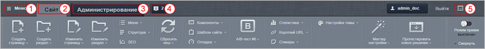
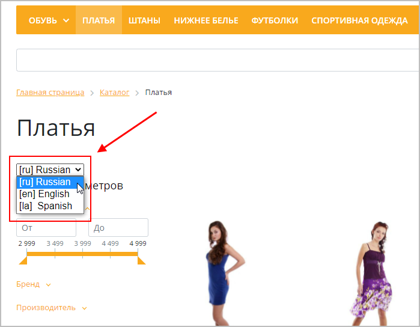
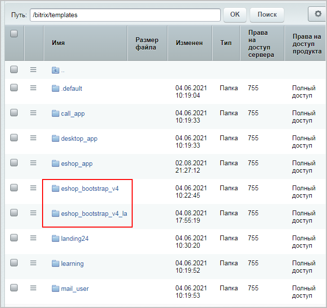
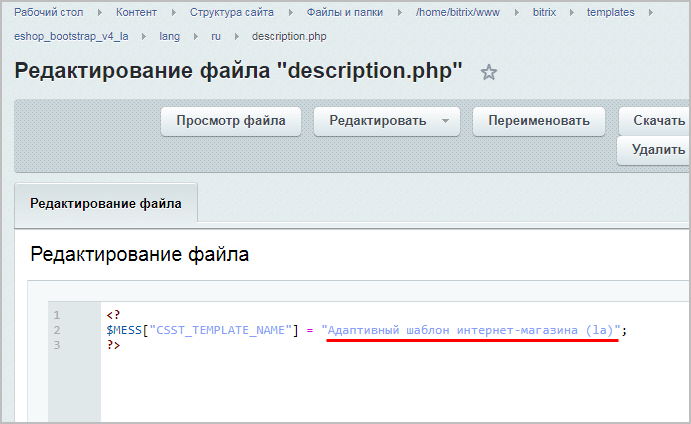
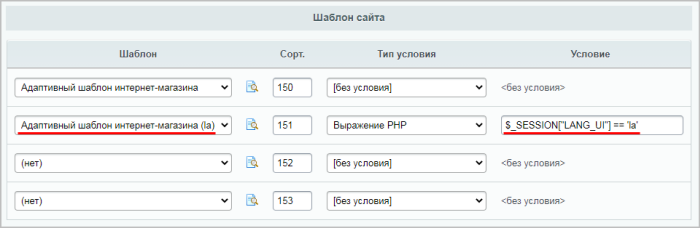
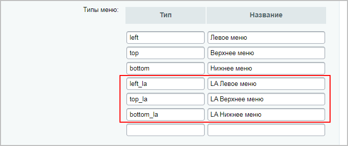
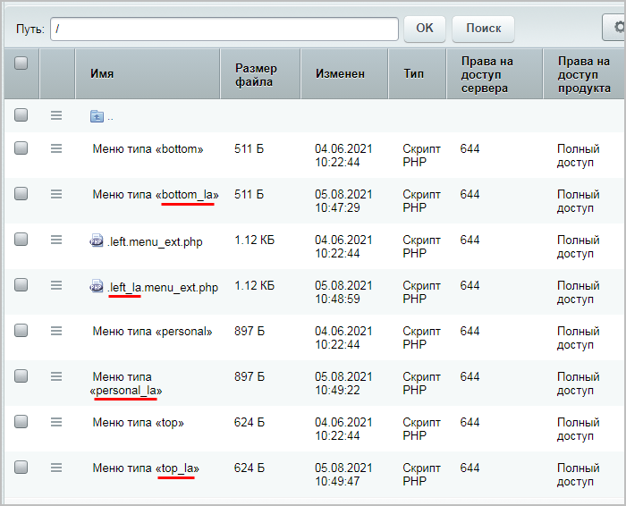

# Алгоритм добавления языка

**Навигация**
- [← Оглавление курса](index.md)
- [← Предыдущий: 1979 — Шаблоны дизайна](lesson_1979.md)
- [Следующий: 1980 — Установка решения с помощью мастера →](lesson_1980.md)

Официальная страница урока: https://dev.1c-bitrix.ru/learning/course/index.php?COURSE_ID=35&LESSON_ID=22790

### Добавление языка в административном разделе

Как Вы уже

			знаете

                    
*Bitrix Framework* поддерживает работу с многоязычным интерфейсом в административном разделе сайта. В административной части это позволяет выводить служебные сообщения (например, сообщения об ошибках), отображать сообщения форм и таблиц на различных языках.

[Подробнее](lesson_2070.md)...

		, *Bitrix Framework* поддерживает работу с многоязычным интерфейсом в административном разделе сайта.

О том, как сделать, чтобы

			меню в административном разделе

                    

		 и

			панель управления в публичном разделе

                    

		 отображались на нужном Вам языке, мы уже рассказывали в уроке [Управление языками](lesson_2071.md) и в видеоролике [Пример добавления языка в административный интерфейс](https://www.youtube.com/watch?v=IRz3Bq8DB90). 

Напомним, что для это достаточно выполнить два простых действия:

1. На странице **Языки интерфейса** (Настройки &gt; Настройки продукта &gt; Языковые параметры &gt; Языки интерфейса)
  			добавьте
  Управление языками интерфейса системы выполняется на странице **Языки интерфейса** (Настройки &gt; Настройки продукта &gt; Языковые параметры &gt; Языки интерфейса). В списке отображены языки, доступные для выбора в качестве языка административного интерфейса. На выбранном языке будут отображаться системные сообщения: информационные сообщения, сообщения об ошибках, заголовки таблиц, надписи на кнопках управления и т.д.
  [Подробнее](lesson_2071.md)...
  		 в систему необходимый язык (например, испанский).
2. Загрузите
  Многоязычный интерфейс административного раздела реализуется за счет использования языковых файлов. Загрузка и обновление языковых файлов для новых и/или уже используемых в системе языков выполняется через **Систему обновлений** (Marketplace &gt; Обновления платформы).
  [Подробнее](lesson_2072.md)...
  		 через **Систему обновлений** (Marketplace &gt; Обновления платформы) языковые файлы для добавленного языка.

**Примечание**: По умолчанию в системе используются русский и английский языки. Штатно через **Систему обновлений** можно загрузить следующие языки:

- украинский
- испанский (Латинская Америка)
- португальский (Бразилия)
- французский (Канада)
- польский

Немецкий язык загрузить нельзя, используйте соответствующие дистрибутивы. Для получения немецкого дистрибутива заполните [форму](https://www.bitrix24.de/prices/30-day-trial.php). После её заполнения придет ссылка на скачивание триальной версии коробки (на 30 дней).

### Добавление языка в публичном разделе. Видеоурок

Настроить показ публичной части сайта на разных языках гораздо сложнее, чем рассмотренной ранее административной части. Но и эта задача выполнима.

Выполните настройки по следующему алгоритму:

1. На странице **Региональные настройки** (Настройки &gt; Настройки продукта &gt; Языковые параметры &gt; Региональные настройки)
  			добавьте
  **Региональная настройка**- набор параметров, которые имеют разные значения в зависимости от культурных особенностей той или иной местности. Например: формат даты и времени, формат имени, первый день недели и другие.
  [Подробнее](lesson_8575.md)...
  		 настройки для нужного языка (например, для испанского, как в примере выше).
2. В форме
  			настроек сайта
  Управление сайтами осуществляется из административного раздела системы на странице **Список сайтов** (Настройки &gt; Настройки продукта &gt; Сайты &gt; Список сайтов).
  [Подробнее](lesson_1991.md)...
  		 выберите требуемый язык и подходящую региональную настройку.
3. Настройте
  Чтобы многоязычный интерфейс работал правильно, требуется где-то хранить весь текст, который используется в административном разделе. Он хранится в виде отдельных текстовых сообщений в языковых файлах соответствующих языков. Языковые файлы размещаются в папках тех модулей и шаблонов, для которых используются эти текстовые сообщения.
  [Подробнее](lesson_12980.md)...
  		 модуль **Перевод**, а далее
  			найдите
  Все языковые сообщения распределены по разным файлам. Чтобы поиск этих сообщений работал корректно, необходимо выполнить индексацию фраз. Кроме того, индексация позволяет подсчитать число фраз без перевода, найти лишние, найти примеры фраз с полным переводом или с неправильным переводом.
  [Подробнее](lesson_12982.md)...
  		 и
  			переведите
  Откройте файл для редактирования языковых фраз одним из следующих способов:
  **-** Откройте файл по его полному пути: через поиск или перейдя по папкам каталога;
  **-** В общем списке файлов выберите действие Показать ссылки на файлы без переводов при помощи кнопки выбора действий. Тогда в списке отобразятся ссылки на файлы , по которым доступен переход;
  **-** Из списка языковых файлов на странице.
  [Подробнее](lesson_12984.md)...
  		 языковые фразы.
4. Добавьте в публичном разделе
  			кнопку переключения языка
  
  		 (селектор языка):

  - В файл **/bitrix/php_interface/dbconn.php** добавьте следующий код:
    ```
    <?
    $arLang = array("en", "pl", "la");
    if (isset($_GET["user_lang"]) && in_array($_GET["user_lang"], $arLang))
    {
        setcookie("USER_LANG", $_GET["user_lang"], time()+9999999, "/");
       define("LANGUAGE_ID", $_GET["user_lang"]);
    }
    elseif (isset($_COOKIE["USER_LANG"]) && in_array($_COOKIE["USER_LANG"], $arLang))
    {
       define("LANGUAGE_ID", $_COOKIE["USER_LANG"]);
    }
    ?>
    ```
  - В используемом шаблоне сайта (**/bitrix/templates/&lt;шаблон_вашего_сайта&gt;/header.php**) пропишите в теге `<head>` следующий код:
    ```
    <script>
    function replaceQueryParam(param, newval, search)
    {
    var regex = new RegExp("([?;&])" + param + "[^&;]*[;&]?");
    var query = search.replace(regex, "$1").replace(/&$/, '');
    return (query.length > 2 ? query + "&" : "?") + (newval ? param + "=" + newval
    : '');
    }
    function action_lang()
    {
    window.location = replaceQueryParam('user_lang',
    document.getElementsByName('Lang')[0].value, window.location.search);
    }
    </script>
    ```
  - Наконец, в шаблоне сайта
    			в выбранном месте
    Кнопка переключения языка может быть добавлена как в пролог, так и в эпилог шаблона (в зависимости от дизайна сайта).
    [Подробнее о шаблоне сайта](https://dev.1c-bitrix.ru/learning/course/index.php?COURSE_ID=43&LESSON_ID=3234)...
    		 добавьте кнопку переключения языка, прописав код:
    ```
    <?echo CLanguage::SelectBox('Lang', LANGUAGE_ID,'','action_lang()');?>
    ```
5. Для изменения меню и сообщений необходимо создать новый тип и файлы меню:

  - Скопируйте папку используемого на сайте шаблона. Например, если шаблон сайта лежит в папке */bitrix/templates/eshop_bootstrap_v4*, то
    			копию
    
    		 можно разместить в папке */bitrix/templates/eshop_bootstrap_v4_la*.
  - Чтобы в дальнейшем было удобнее различать шаблоны, измените
    			название
    
    		 нового шаблона в файле **description.php** (в нашем примере файл располагается по пути */bitrix/templates/eshop_bootstrap_v4_la/lang/ru/description.php*).
  - Чтобы при переключении языка подключался нужный шаблон, в настройках сайта (Настройки &gt; Настройки продукта &gt; Сайты &gt; Список сайтов) добавляем условие вида `$_SESSION["LANG_UI"]=='la'` на подключение шаблона:
    
  - Создайте новые
    			типы меню
    Тип меню, заданный в настройках модуля **Управления структурой**, будет использован в названии файла с шаблоном меню (например, **top.menu_template.php**), а также для определения файлов с пунктами меню (например, **.top.menu.php**). Кроме того, имя типа меню используется для подключения меню в шаблоне дизайна.
    [Подробнее](https://dev.1c-bitrix.ru/learning/course/index.php?COURSE_ID=34&LESSON_ID=10239)...
    		 на странице настроек модуля **Управление структурой** (Настройки &gt; Настройки продукта &gt; Настройки модулей &gt; Управление структурой):
    
  - В ранее скопированном шаблоне */bitrix/templates/eshop_bootstrap_v4_la* в файлах **header.php** и **footer.php** найдите код подключения компонентов меню и измените типы меню, например:
    ```
    IncludeComponent(
    	"bitrix:menu",
    	"bootstrap_v4",
    	array(
    		"ROOT_MENU_TYPE" => "left",
    		"MENU_CACHE_TYPE" => "A",
    		"MENU_CACHE_TIME" => "36000000",
    		"MENU_CACHE_USE_GROUPS" => "Y",
    		"MENU_THEME" => "site",
    		"CACHE_SELECTED_ITEMS" => "N",
    		"MENU_CACHE_GET_VARS" => array(),
    		"MAX_LEVEL" => "3",
    		"CHILD_MENU_TYPE" => "left_la",
    		"USE_EXT" => "Y",
    		"DELAY" => "N",
    		"ALLOW_MULTI_SELECT" => "N",
    		"COMPONENT_TEMPLATE" => "bootstrap_v4"
    	),
    	false
    );?>
    ```
  - Наконец, нужно в корне и разделах сайта найти файлы меню и скопировать их. В скопированных файлах
    			поменяйте названия
    
    		 (в соответствии с созданными типами меню) и переведите содержимое файлов на требуемый язык.
6. Разделите контент по языкам
  Очень часто возникает вопрос: для проекта необходимо представить на сайте материалы на
  разных языках, потребуется ли для этого покупать дополнительные лицензии на сайты?
  Многосайтовость и языковые версии сайта – это разные понятия, хотя иногда взаимосвязанные.
  При необходимости языковые версии можно реализовать и как отдельные языковые папки (разделы)
  в составе одного сайта, и как отдельные сайты.
  В каждом конкретном случае следует предварительно проанализировать, какая именно информация
  должна быть представлена на различных языках и какие действия с объектами сайта
  предполагается производить.
  [Подробнее](https://dev.1c-bitrix.ru/learning/course/index.php?COURSE_ID=103&LESSON_ID=284)...
  		 одним из способов:

  - **разные языковые папки**
    В этом случае создается дублирующий контент на втором языке. При этом статический контент (страницы и разделы) нужно разнести по папкам, например:
    ```
    /
    ..RU
    ....О компании
    ....Сотрудники
    ....Новости
    ..En
    ....About company
    ....Staff
    ....News
    ```
    Также нужно добавить переведенные копии динамического контента. Чтобы переключался динамический контент, следует настраивать компоненты на источник данных на нужном языке. Например, чтобы на странице **News** показывались новости на требуемом языке, нужно настроить компонент новостей на инфоблок, содержащий новости на этом языке.
    При этом кнопка переключения языка должна перенаправлять в папку с контентом на другом языке.
    ## Примерный алгоритм действий
    - В используемом шаблоне сайта (**/bitrix/templates/&lt;шаблон_вашего_сайта&gt;/header.php**) пропишите в теге `<head>` следующий код:
        ```
        <a href="/ru/?user_lang=ru">Русский</a>
        <a href="/la/?user_lang=la">Espanol</a>
        ```
      - Cоздайте в файловой системе нужные вам языковые папки.
      - Скопируйте статические файлы в созданные папки и переведите их.
      - Создайте динамический контент - инфоблоки и их разделы, наполните инфоблоки.
      - Пропишите в индексных страницах разделов и в файлах динамических меню ссылки на языковые папки и ID инфоблоков.
  - **языковые версии как отдельные сайты** (
    			многосайтовость
    Технически многосайтовая версия продукта может быть реализована в двух конфигурационных режимах:
    **-** **Многосайтовость на одном домене**. (Старое название: Многосайтовость по первому способу.) Продукт и все сайты работают под управлением одной копии веб-сервера Apache.
    **-** **Многосайтовость на разных доменах**. (Старое название: Многосайтовость по второму способу.) Каждый сайт работает под управлением отдельной копии веб-сервера Apache или отдельного виртуального веб-сервера.
    [Подробнее](https://dev.1c-bitrix.ru/learning/course/index.php?COURSE_ID=103&CHAPTER_ID=03987)...
    		)
    При использовании многосайтовости для языковой версии создается дополнительный сайт, контент также дублируется для обоих сайтов.
