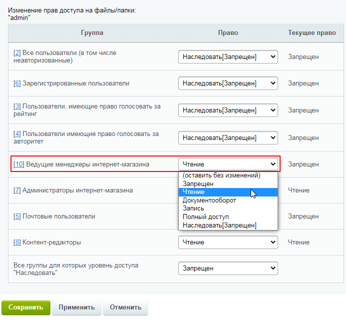
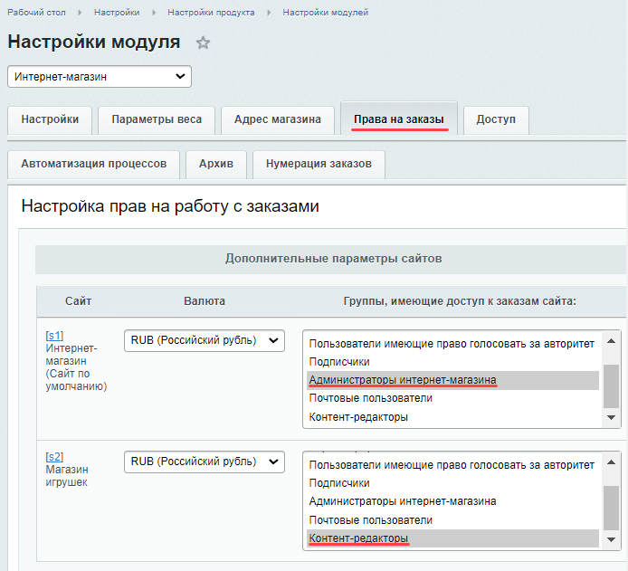
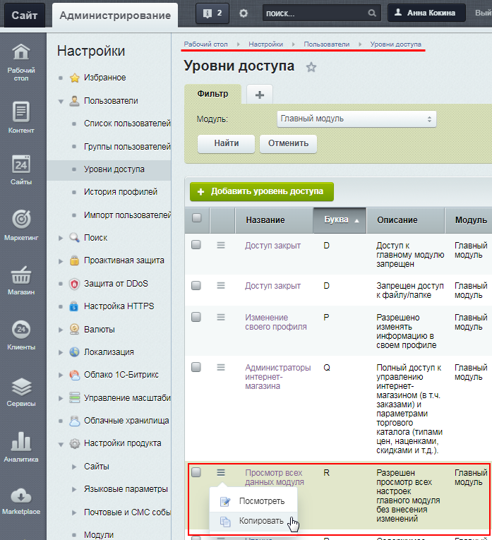
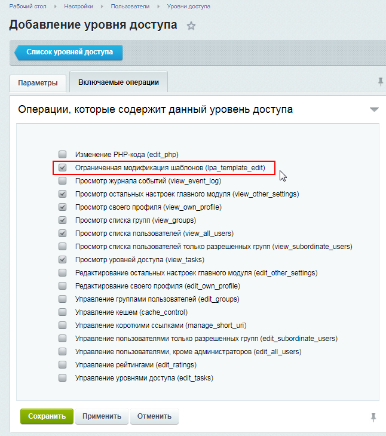

# Назначение прав доступа в интернет-магазине

**Навигация**
- [← Оглавление курса](index.md)
- [← Предыдущий: 9411 — Настройка доступа к инфоблокам](lesson_9411.md)
- [Следующий: 8617 — Несколько примеров работы →](lesson_8617.md)

Официальная страница урока: https://dev.1c-bitrix.ru/learning/course/index.php?COURSE_ID=35&LESSON_ID=23422

### Видеоурок

Чтобы пользователи могли выполнять различные операции на сайте, необходимо предоставить им соответствующие права доступа. В этом уроке рассмотрим пример назначения прав доступа для сотрудников интернет-магазина.

Создадим

			группу пользователей

                    
Создание и управление группами пользователей выполняется на странице **Группы пользователей** 

(Настройки &gt; Пользователи &gt; Группы пользователей).

[Подробнее](lesson_7175.md)...

		 **Ведущие менеджеры интернет-магазина**. Эти сотрудники должны выполнять следующие действия:

- создание/редактирование товаров;
- создание/редактирование заказов;
- создание/редактирование правил работы с корзиной;
- редактирование страниц интернет-магазина;
- настройка дизайна интернет-магазина.

Для обычных менеджеров интернет-магазина, которые отвечают только за создание/редактирование товаров, заказов и правил работы с корзиной (без доступа к правке дизайна сайта и страниц) Вы можете создать отдельную группу и назначить ей права по аналогии с данным уроком.

Процесс назначения прав на выполнение вышеуказанных операций будем рассматривать пошагово, постепенно расширяя права.

**Важно!** После включения пользователя в новую группу или после расширения прав группы пользователю необходимо **заново авторизоваться** в системе, иначе добавленные права останутся недоступными.

### Пошаговая настройка прав

**Важно!** Предварительно **рекомендуем ознакомиться с базовыми уроками** по настройке прав доступа и управлению группами пользователей, чтобы лучше понимать описываемые в данном уроке действия:

- глава [Управление доступом](https://dev.1c-bitrix.ru/learning/course/index.php?COURSE_ID=35&CHAPTER_ID=04504&LESSON_PATH=3906.4493.4504) (как назначить права доступа к модулям, инфоблокам, файлам и папкам, а также как создать новые уровни доступа)
- глава [Группы пользователей](https://dev.1c-bitrix.ru/learning/course/index.php?COURSE_ID=35&CHAPTER_ID=02006&LESSON_PATH=3906.4503.2006) (как добавить новую группу пользователей и как задать ей права)
- урок [Типовые роли пользователей](lesson_5336.md) (примеры задания прав для менеджеров разных уровней)

Рассмотрим настройку прав пошагово:

1. Первым делом необходимо предоставить права на
  			Чтение
  
  		 к
  			папке
  Настройка прав доступа к управлению структурой сайта выполняется в
  Менеджере файлов (Контент &gt; Структура сайта). Для настройки прав:
  1) Перейдите в раздел **Файлы и папки** (Контент &gt; Структура сайта)
  2) Отметьте нужные файлы и папки в Колонке флажков;
  3) Выберите действие **Права на доступ продукта** на панели
  групповых операций и нажмите кнопку **Применить**.
  4) В форме настройки прав доступа укажите уровень доступа каждой
  группы пользователей к выбранным файлам и папкам.
  [Подробнее](lesson_2019.md)...
  		`/bitrix/admin` (без этого права пользователи группы не смогут вносить никакие изменения).
2. Чтобы группа могла добавлять/изменять товары, предоставим ей доступ уровня **Изменение** к
  			инфоблокам
  Права доступа задаются для каждого инфоблока отдельно в форме его редактирования на закладке **Доступ**. По умолчанию к новому инфоблоку полный доступ имеет только группа пользователей Администраторы, а для всех остальных групп доступ закрыт.
  [Подробнее](lesson_9411.md)...
  		 товаров и торговых предложений. Также нужно предоставить права уровня **Редактирование цен**
  			к модулю
  Настройка прав доступа к модулям определяет действия,
  которые может позволить себе пользователь выбранной группы.
  Управление выполняется двумя способами:
  Способ 1: на закладке **Доступ** в форме настройки группы пользователей
  (Настройки &gt; Пользователи &gt; Группы пользователей).
  Способ 2: в форме настройки модуля (Настройки &gt; Настройки продукта
   &gt; Настройки модулей &gt;_нужный модуль_).
  [Подробнее](lesson_2016.md)...
  		 **Торговый каталог**.
3. Чтобы можно было создавать/изменять заказы, настроим доступ к модулю **Интернет-магазин**. Для работы с заказами достаточно уровня
  			Обработка заказов
  При установке уровня доступа **Обработка заказов** не забудьте настроить права на работу с заказами в зависимости от статусов заказов.
  [Подробнее](https://dev.1c-bitrix.ru/learning/course/index.php?COURSE_ID=42&LESSON_ID=5251)...
  		, однако для возможности создать правила работы с корзиной потребуется **Полный доступ**, поэтому сразу дадим **Полный доступ**.
  **Примечание**: Если сайтов несколько, то для каждого из них можно выбрать свою группу пользователей, обладающую доступом к обработке заказов. Для этого нужно сначала во вкладке
  			Доступ
  
  		 задать всем нужным группам права уровня **Обработка заказов**, а затем во вкладке
  			Права на заказы
                      В данном случае пользователи группы **Администраторы интернет-магазина** смогут работать только
  с заказами первого сайта "Интернет-магазин", а пользователи группы **Контент-редакторы** смогут
  работать только с заказами второго сайта "Магазин игрушек":
  
  		 для каждого из сайтов выбрать желаемую группу.
4. При настроенных выше правах доступа пользователи группы уже могут создавать/редактировать правила работы с корзиной (наши настройки удовлетворяют минимальным требованиям для работы с данным функционалом).
  ## Минимальные требования для создания правил работы с корзиной
  - право **Чтение** на папку `/bitrix/admin`;
  - право доступа **Просмотр в панели** к инфоблокам товаров/торг. предложений;
  - право доступа  **Полный доступ** к модулю **Интернет магазин**;
  - право доступа  **Чтение** к модулю **Торговый каталог**.
5. Для редактирования страниц интернет-магазина в настройках модуля **Управление структурой** установим право **Редактирование файлов и папок**. Далее по аналогии с первым пунктом отметим в Менеджере файлов нужные разделы (папки) и страницы (файлы) и настроим права доступа уровня **Запись**.
6. Для изменения дизайна страниц сайта (например,
  			назначать для страниц шаблоны
  **Шаблон дизайна** — это внешний вид сайта, в котором определяется расположение различных элементов на сайте, художественный стиль и способ отображения страниц.
  [Подробнее](https://dev.1c-bitrix.ru/learning/course/index.php?COURSE_ID=34&LESSON_ID=1994)...
  		 и редактировать эти шаблоны), необходимо указать для группы уровень **Полный доступ**  в настройках **Главного модуля**. Однако это не всегда целесообразно с точки зрения безопасности, поэтому
  			создадим новый уровень доступа
  Есть два способа:
  **-** Нажатием **Копировать** в контекстном меню существующего уровня доступа.
  Создастся копия выбранного уровня и откроется форма редактирования. Обратите
  внимание, что если был скопирован системный уровень доступа, то вновь созданный
  уровень будет уже пользовательским.
  **-** C помощью кнопки контекстного меню **Добавить уровень доступа** на
  странице списка. В этом случае откроется пустая форма создания.
  [Подробнее](lesson_2015.md)...
  		:
  Теперь для группы **Ведущие менеджеры интернет-магазина** назначим этот новый уровень доступа к **Главному модулю**.

  - На странице **Уровни доступа** (Настройки &gt; Пользователи &gt; Уровни доступа) найдём уровни, относящиеся к **Главному модулю**, и
    			скопируем
    
    		 уровень доступа **Просмотр всех данных модуля**.
  - В скопированном уровне доступа поменяем название (например, на **Просмотр всех данных модуля и смена шаблона**), а также во **Включаемых операциях** этого уровня отметим опцию
    			Ограниченная модификация шаблонов (lpa_template_edit)
    
    		 и сохраним изменения.
