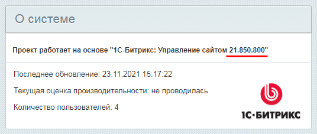

# Как узнать редакцию продукта

**Навигация**
- [← Оглавление курса](index.md)
- [← Предыдущий: 25050 — Типовые действия на сайте](lesson_25050.md)
- [Следующий: 4631 — Модульная структура →](lesson_4631.md)

Официальная страница урока: https://dev.1c-bitrix.ru/learning/course/index.php?COURSE_ID=35&LESSON_ID=23444

### Как узнать, какая редакция сейчас у вас?

Так как у разных компаний могут быть разные потребности в функционале, *1С-Битрикс* предоставляет целую линейку редакций (лицензий), отличающихся по набору доступных инструментов.

Чтобы узнать, какая редакция *1С-Битрикс* установлена у вас, достаточно перейти

			в административном разделе

                    
**Административный раздел** – часть сайта, где производится 

управление модулями системы, структурой сайта, его содержанием, посетителями и 

другими составляющими сайта. Недоступен для просмотра обычным посетителям сайта.

Для перехода в Административный раздел служит закладка **Администрирование**,
расположенная на Панели управления в Публичном разделе сайта.

[Подробнее](https://dev.1c-bitrix.ru/learning/course/?COURSE_ID=34&LESSON_ID=4508)...

		 сайта на страницу **Обновление платформы** (Marketplace &gt; Обновление платформы) во вкладку

			Установка обновлений

                    

		:

### Информация о редакциях в уроках

Для вашего удобства мы указываем в уроках ограничения по редакциям (т.е. в каких редакциях **недоступен** описываемый в уроке функционал):

### Как узнать текущую версию продукта?

Когда в уроках упоминается «версия продукта» (без указания конкретного модуля), то имеется в виду версия **Главного модуля**.

Версию продукта (т.е. версию **Главного модуля**) можно определить несколькими способами:

- прокрутив в административной панели любую страницу до конца:
  
- на странице  **Модули** (Настройки &gt; Настройки продукта &gt; Модули):
  
  **Примечание.** На этой странице можно посмотреть текущие версии **всех** модулей, установленных в системе.
- с помощью предустановленного
  			гаджета на Рабочем столе
  Гаджеты в продуктах *«1С-Битрикс: Управление сайтом»* – это особые программные элементы, выполняющие функции уведомления и быстрого перехода к различным элементам управления и настройки системы и её элементов. С помощью гаджетов на Рабочем столе может быть представлена самая разнообразная информация.
  [Подробнее](https://dev.1c-bitrix.ru/learning/course/index.php?COURSE_ID=34&LESSON_ID=2774)...
  		:
  

### Сравнение редакций «1С-Битрикс: Управление сайтом»

Ниже сравниваются возможности всех редакций продукта

			«1С-Битрикс: Управление сайтом»

                     
**«1С-Битрикс: Управление сайтом»** – профессиональная система управления сайтами и интернет-магазинами.

[Подробнее](https://www.1c-bitrix.ru/products/cms/)...

		 по следующим категориям: CMS, Интернет-магазин, Маркетинг, Производительность, Безопасность и мобильность. Для просмотра таблицы сравнения кликните по значку  справа от названия выбранной категории.

[Старт](https://www.1c-bitrix.ru/products/cms/editions/start.php)

[Подробнее](https://www.1c-bitrix.ru/products/cms/editions/start.php)

[Стандарт](https://www.1c-bitrix.ru/products/cms/editions/standart.php)

[Подробнее](https://www.1c-bitrix.ru/products/cms/editions/standart.php)

[Малый бизнес](https://www.1c-bitrix.ru/products/cms/editions/smallbusiness.php)

[Подробнее](https://www.1c-bitrix.ru/products/cms/editions/smallbusiness.php)

[Бизнес](https://www.1c-bitrix.ru/products/cms/editions/business.php)

[Подробнее](https://www.1c-bitrix.ru/products/cms/editions/business.php)

[Энтерпрайз](https://www.1c-bitrix.ru/products/cms/editions/enterprise.php)

[Подробнее](https://www.1c-bitrix.ru/products/cms/editions/enterprise.php)

[Старт](https://www.1c-bitrix.ru/products/cms/editions/start.php)

[Стандарт](https://www.1c-bitrix.ru/products/cms/editions/standart.php)

[Малый бизнес](https://www.1c-bitrix.ru/products/cms/editions/smallbusiness.php)

[Бизнес](https://www.1c-bitrix.ru/products/cms/editions/business.php)

[Энтерпрайз](https://www.1c-bitrix.ru/products/cms/editions/enterprise.php)

CMS

[Главный модуль](https://dev.1c-bitrix.ru/learning/course/index.php?COURSE_ID=35&CHAPTER_ID=04493)

[Сайты24](https://dev.1c-bitrix.ru/learning/course/index.php?COURSE_ID=41&CHAPTER_ID=012625)

Число сайтов

2

∞*

∞*

∞*

∞*

Число страниц

∞

∞

∞

∞

∞

[Управление структурой](https://dev.1c-bitrix.ru/learning/course/index.php?COURSE_ID=34&CHAPTER_ID=04460)

[Информационные блоки](https://dev.1c-bitrix.ru/learning/course/index.php?COURSE_ID=34&CHAPTER_ID=04477)

[Highload-блоки](https://dev.1c-bitrix.ru/learning/course/index.php?COURSE_ID=41&CHAPTER_ID=06638)

[Поиск](https://dev.1c-bitrix.ru/learning/course/index.php?COURSE_ID=35&CHAPTER_ID=04507)

[Перевод](lesson_12980.md)

[Форумы и Блоги](https://dev.1c-bitrix.ru/learning/course/index.php?COURSE_ID=41&CHAPTER_ID=04552)

[Фотогалерея 2.0](https://dev.1c-bitrix.ru/learning/course/index.php?COURSE_ID=34&CHAPTER_ID=04481)

[Социальная сеть](https://dev.1c-bitrix.ru/learning/course/index.php?COURSE_ID=41&CHAPTER_ID=04560)

[Обучение, тестирование](https://dev.1c-bitrix.ru/learning/course/index.php?COURSE_ID=41&CHAPTER_ID=04559)

[Бизнес-процессы](https://dev.1c-bitrix.ru/learning/course/index.php?COURSE_ID=57)

[Почта](https://dev.1c-bitrix.ru/learning/course/index.php?COURSE_ID=41&CHAPTER_ID=04558)

[Техподдержка](https://dev.1c-bitrix.ru/learning/course/index.php?COURSE_ID=41&CHAPTER_ID=04557)

[Календари](https://dev.1c-bitrix.ru/learning/course/index.php?COURSE_ID=41&LESSON_ID=5266)

[Документооборот](https://dev.1c-bitrix.ru/learning/course/index.php?COURSE_ID=41&CHAPTER_ID=04548)

[AD/LDAP интеграция](https://dev.1c-bitrix.ru/learning/course/index.php?COURSE_ID=35&CHAPTER_ID=04536)

[Универсальные списки](https://dev.1c-bitrix.ru/learning/course/index.php?COURSE_ID=41&CHAPTER_ID=02953)

[База знаний Wiki](https://dev.1c-bitrix.ru/learning/course/index.php?COURSE_ID=41&LESSON_ID=4562)

[Сервис «Есть идея!»](https://dev.1c-bitrix.ru/learning/course/index.php?COURSE_ID=41&CHAPTER_ID=06470)

[Контроллер сайтов](https://dev.1c-bitrix.ru/learning/course/index.php?COURSE_ID=41&CHAPTER_ID=04546)

Интернет-магазин

[Торговый каталог](https://dev.1c-bitrix.ru/learning/course/index.php?COURSE_ID=42&CHAPTER_ID=04771)

[Функционал подарков](https://dev.1c-bitrix.ru/learning/course/index.php?COURSE_ID=42&LESSON_ID=7571)

[Интеграция с CRM](https://dev.1c-bitrix.ru/learning/course/index.php?COURSE_ID=42&CHAPTER_ID=04999)

[Мастер управления магазином](https://dev.1c-bitrix.ru/learning/course/index.php?COURSE_ID=42&LESSON_ID=3558)

[Складской учет](https://dev.1c-bitrix.ru/learning/course/index.php?COURSE_ID=42&CHAPTER_ID=06837)

1 склад

∞

∞

[Валюты](https://dev.1c-bitrix.ru/learning/course/index.php?COURSE_ID=42&CHAPTER_ID=04770)

[Конструктор отчетов](https://dev.1c-bitrix.ru/learning/course/index.php?COURSE_ID=42&CHAPTER_ID=04839)

Разделение заказов между филиалами компании

Маркетинг

[SEO-модуль](https://dev.1c-bitrix.ru/learning/course/index.php?COURSE_ID=139&CHAPTER_ID=04545)

[Социальные сервисы](https://dev.1c-bitrix.ru/learning/course/index.php?COURSE_ID=41&CHAPTER_ID=04772)

[Интеграция с Битрикс24](https://dev.1c-bitrix.ru/learning/course/index.php?COURSE_ID=42&CHAPTER_ID=012836)

[Веб-формы](https://dev.1c-bitrix.ru/learning/course/index.php?COURSE_ID=41&CHAPTER_ID=06801)

[Опросы](https://dev.1c-bitrix.ru/learning/course/index.php?bitrix_include_areas=Y&COURSE_ID=41&LESSON_ID=2859)

[Подписка и рассылки](https://dev.1c-bitrix.ru/learning/course/index.php?COURSE_ID=139&CHAPTER_ID=04696)

[A/B тестирование](https://dev.1c-bitrix.ru/learning/course/index.php?COURSE_ID=41&CHAPTER_ID=06747)

[E-mail маркетинг](https://dev.1c-bitrix.ru/learning/course/index.php?COURSE_ID=139&CHAPTER_ID=011235)

[Реклама](https://dev.1c-bitrix.ru/learning/course/index.php?COURSE_ID=139&CHAPTER_ID=07361)

[Веб-аналитика](https://dev.1c-bitrix.ru/learning/course/index.php?COURSE_ID=139&CHAPTER_ID=04544)

Производительность

[Композитный сайт](https://dev.1c-bitrix.ru/learning/course/index.php?COURSE_ID=39)

Допустимое число серверов

1

1

1

1

от 4

[Монитор производительности](https://dev.1c-bitrix.ru/learning/course/index.php?COURSE_ID=35&CHAPTER_ID=04904)

[Визуальное масштабирование](https://dev.1c-bitrix.ru/learning/course/index.php?COURSE_ID=35&CHAPTER_ID=06644)

[Пульс конверсии](https://dev.1c-bitrix.ru/learning/course/index.php?COURSE_ID=139&CHAPTER_ID=09037)

[Веб-сервисы](https://dev.1c-bitrix.ru/learning/course/index.php?COURSE_ID=43&CHAPTER_ID=04566)

[Модуль "Веб-кластер"](https://dev.1c-bitrix.ru/learning/course/index.php?COURSE_ID=35&CHAPTER_ID=04750)

[Балансировка нагрузки между серверами](https://dev.1c-bitrix.ru/learning/course/index.php?COURSE_ID=35&LESSON_ID=2990)

[Отказоустойчивость на уровне кластера серверов](https://dev.1c-bitrix.ru/learning/course/index.php?COURSE_ID=38&CHAPTER_ID=02421)

[Географически распределенный кластер](https://dev.1c-bitrix.ru/learning/course/index.php?COURSE_ID=38&LESSON_ID=3233)

[Автоматическое масштабирование](https://dev.1c-bitrix.ru/learning/course/?COURSE_ID=35&CHAPTER_ID=06644)

Среды разработки и тестирования

1 временная среда

1 временная среда

1 временная среда

1 временная среда

∞

Безопасность и мобильность

[Облачные хранилища](https://dev.1c-bitrix.ru/learning/course/index.php?COURSE_ID=35&CHAPTER_ID=011629)

[Автоматический бекап в облако](lesson_4464.md)

2 ГБ

2 ГБ

4 ГБ

10 ГБ

∞

[Маркетплейс](https://dev.1c-bitrix.ru/learning/course/index.php?COURSE_ID=101)

Базы данных

MSSQL

MSSQL

MSSQL

MSSQL

MSSQL

[Проактивная защита](https://dev.1c-bitrix.ru/learning/course/index.php?COURSE_ID=35&CHAPTER_ID=04547)

[Технология Push & Pull](https://dev.1c-bitrix.ru/learning/course/index.php?COURSE_ID=41&CHAPTER_ID=011757)

[Подробнее](https://www.1c-bitrix.ru/products/cms/editions/start.php)

[Подробнее](https://www.1c-bitrix.ru/products/cms/editions/standart.php)

[Подробнее](https://www.1c-bitrix.ru/products/cms/editions/smallbusiness.php)

[Подробнее](https://www.1c-bitrix.ru/products/cms/editions/business.php)

[Подробнее](https://www.1c-bitrix.ru/products/cms/editions/enterprise.php)

*Все сайты, работающие на одной лицензии, должны размещаться на одном хостинге и использовать одну копию программного продукта «1С-Битрикс: Управления сайтом».

**Примечание.** Сравнить возможности редакций

			коробочного «Битрикс24»

                    
**1C-Битрикс24 (коробочная версия Битрикс24)** – это цифровое рабочее пространство для вашей компании. Ставьте и контролируйте задачи, отправляйте файлы и голосовые сообщения, общайтесь в чате, обсуждайте планы в профильных группах и принимайте взвешенные решения.

[Подробнее](https://www.bitrix24.ru/features/box/box.php)...

		 можно [тут](https://www.bitrix24.ru/prices/self-hosted.php).
