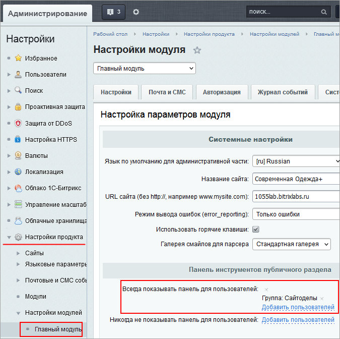

# Права на работу с Сайтами24

**Навигация**
- [← Оглавление курса](index.md)
- [← Предыдущий: 5133 — Права на изменение статических страниц](lesson_5133.md)
- [Следующий: 12575 — Регистрация по номеру телефона →](lesson_12575.md)

Официальная страница урока: https://dev.1c-bitrix.ru/learning/course/index.php?COURSE_ID=35&LESSON_ID=23828

Для возможности работы с **Сайтами24** нужно настроить права на несколько модулей, некоторые папки в файловой структуре и панель администратора.

 

Сотрудника, который будет создавать и публиковать страницы с помощью модуля **Сайты24**, нужно включить в специальную группу для работы с **Сайтами24**. Этой группе понадобится:

- Право **[P] Изменение своего профиля** в **Главном модуле**.
- Право **[F] Редактирование файлов и папок** в модуле **Управление структурой**.
- Максимальные права **[X] Удаление** в модуле **Сайты24**:
   
- Права **Чтение** на папку `/bitrix/admin`.
- Добавление в список **Всегда показывать панель для пользователей** в настройках **Главного модуля**:
  
