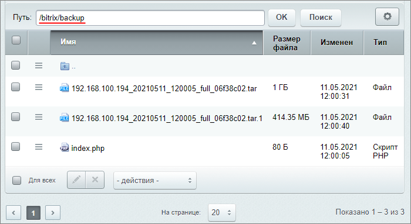

# Резервное копирование из командной строки

**Навигация**
- [← Оглавление курса](index.md)
- [← Предыдущий: 4464 — Регулярное резервное копирование](lesson_4464.md)
- [Следующий: 6979 — Восстановление сайта из резервной копии →](lesson_6979.md)

Официальная страница урока: https://dev.1c-bitrix.ru/learning/course/index.php?COURSE_ID=35&LESSON_ID=2563

В уроке рассмотрим, как выполнить резервное копирование из командной строки в операционных системах Linux и Windows.

### для Linux систем

Создание бэкапа из командной строки в Linux рассмотрим на примере операционной системы семейства Linux Centos 7.

**Важно**: выполняйте указанные ниже команды от имени того пользователя, под которым работает веб-сервер. В [BitrixVM](https://dev.1c-bitrix.ru/learning/course/index.php?COURSE_ID=37) и окружении [BitrixEnv](https://dev.1c-bitrix.ru/learning/course/index.php?COURSE_ID=37&LESSON_ID=8811) это пользователь **bitrix**.

Подключитесь к серверу по ssh и выполните команду для запуска скрипта, создающего бэкап:

```
php –f /home/bitrix/www/bitrix/modules/main/tools/backup.php
```


В результате будет запущено резервное копирование с параметрами, указанными в настройках

			регулярного резервного копирования

                    Параметры автоматического резервного копирования задаются на странице **Регулярное резервное копирование** (Настройки &gt; Инструменты &gt; Резервное копирование &gt; Регулярное резервное копирование).

[Подробнее](lesson_4464.md)...

		. В параметрах обязательно укажите метод запуска **через прямой запуск /bitrix/modules/main/tools/backup.php**.

Локальная резервная копия сохранится в директорию `/bitrix/backup/`:



**Примечание:** папки с большим количеством файлов, такие как `/upload`, лучше архивировать отдельно (т.е. указывать в масках исключения в настройках резервного копирования). Перейдите в папку, в которой хотите хранить архив, и создайте архив при помощи команды:

```
tar -czvf upload.tar.gz ./upload
```

#### Смена названия бэкапа

В качестве аргумента возможно указать своё название бэкапа. Для этого перейдите в консоли в папку для хранения бэкапа и в конце команды укажите своё название:

```
cd /home/bitrix/www/bitrix/backup // переходим в папку хранения бэкапов
php –f /home/bitrix/www/bitrix/modules/main/tools/backup.php my_backup_may2021 // запуск скрипта с именем бэкапа my_backup_may2021
```

### для Windows

Перед выполнением бэкапа вам обязательно необходимо перейти в папку, где установлено *«Битрикс: Веб-окружение»*, иначе не подключатся нужные модули php. Если *«Битрикс: Веб-окружение»* размещено по пути `c:\Bitrix\`, то нужно перейти в папку:

```
cd c:\Bitrix\
```

И выполнить бэкап:

```
"C:\Bitrix\apache2\zendserver\bin\php.exe" -c "C:\Bitrix\apache2\zendserver\etc\php.ini" -f "C:\Bitrix\www\bitrix\modules\main\tools\backup.php"
```

  

В результате будет запущено резервное копирование с параметрами, указанными в настройках

			регулярного резервного копирования

                    Параметры автоматического резервного копирования задаются на странице **Регулярное резервное копирование** (Настройки &gt; Инструменты &gt; Резервное копирование &gt; Регулярное резервное копирование).

[Подробнее](lesson_4464.md)...

		. В параметрах обязательно укажите метод запуска **через прямой запуск /bitrix/modules/main/tools/backup.php**.
