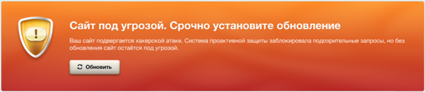
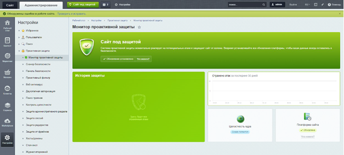
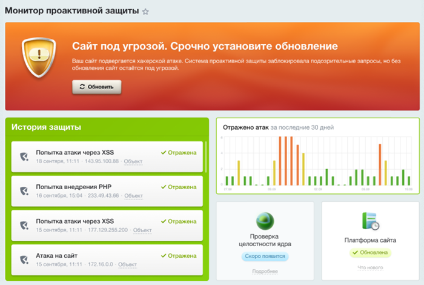

# Монитор проактивной защиты

**Навигация**
- [← Оглавление курса](index.md)
- [← Предыдущий: 9113 — Настройки модуля Проактивная защита](lesson_9113.md)
- [Следующий: 6639 — Что может сканер безопасности →](lesson_6639.md)

Официальная страница урока: https://dev.1c-bitrix.ru/learning/course/index.php?COURSE_ID=35&LESSON_ID=27172

Ваш сайт всегда находится под угрозой хакерских атак в интернете. Хакеры постоянно находят новые способы совершения атак и используют уязвимости в устаревших версиях системы. Компания *1С-Битрикс* прилагает все усилия для обеспечения безопасности сайтов клиентов и оперативно закрывает обнаруженные уязвимости. Важно понимать, что для полной защиты вашего сайта, необходимо устанавливать все новые обновления продукта.

 

### Монитор проактивной защиты

С версии модуля **Security 24.0.0** выпущен новый инструмент — **Монитор проактивной защиты**.

> **Монитор проактивной защиты** — это файрвол, который доставляет и применяет предварительную защиту от уязвимостей на сайты и порталы клиентов без доставки основных обновлений продукта. Доступен в *1С-Битрикс: Управление сайтом* и коробочной версии *Битрикс24*.

Таким образом компания защищает сайты и порталы клиентов до установки на них полноценных обновлений.

Обращаем ваше внимание, что монитор проактивной защиты не гарантирует полной защиты от взлома без установки свежих обновлений продукта. Инструмент заблокирует подозрительные запросы, но сообщит вам о необходимости срочно обновить сайт/портал. Без установки обновлений сайт остается под угрозой.

### Как работать с монитором

На панели управления в административном разделе, рядом с вкладкой «Администрирование», теперь отображается **статус безопасности сайта**. Вариантов статуса два:

- красного цвета
                      
  		 с текстом «Угроза безопасности»
- зеленого цвета
                      
  		 с текстом «Сайт под защитой» или «Портал под защитой»

Cтатус поможет вам оперативно получать информацию о безопасности сайта. Он всегда виден на любой странице административного раздела, чтобы вы были в курсе текущей ситуации.

Когда статус сменится с зеленого на оранжевый, вы увидите

			всплывающее окно

                    

		 с информацией об обнаружении подозрительных запросов. Мы настоятельно рекомендуем обновить продукт сразу же, нажав на кнопку «Обновить», или сделать это в ближайшее время. Таким образом вы обеспечите надежную защиту вашего сайта.

По клику на статус выполнится переход на страницу Настройки &gt; Проактивная защита &gt; Монитор проактивной защиты. Это информационная страница, которая показывает различные данные о безопасности: статус, историю защиты, график отражения атак и так далее.

Во время работы монитора собирается информация обо всех атаках и показывается в виде истории защиты и графика «Отражено атак»:

Так вы сможете оперативно отслеживать информацию о совершенных атаках. А именно, в какое время и какого типа атака произошла.

Для вашего удобства, мы разместили в баннере кнопку «Обновить» для быстрого перехода к обновлениям.

> **Совет**: уделите должное внимание безопасности вашего сайта или портала. Не пренебрегайте рекомендациями и всегда устанавливайте свежие обновления. Это действительно важно для обеспечения надежной защиты. А наш новый инструмент поможет вам в этом.

### Полезные ссылки

- [Продлить лицензию](https://www.1c-bitrix.ru/buy/update.php)
- [Центр информирования о необходимых обновлениях](https://www.1c-bitrix.ru/vul/)
- [Безопасность вашего сайта и защита от хакерских атак. Что вы обязаны знать?](https://www.1c-bitrix.ru/about/news/17891178/)
- [О безопасности в CMS «1С-Битрикс: Управление сайтом»](https://www.1c-bitrix.ru/products/cms/security/index.php)
- [Битрикс24 и 1С-Битрикс: Управление сайтом получили сертификаты ФСТЭК](https://www.1c-bitrix.ru/about/news/19906788/)
