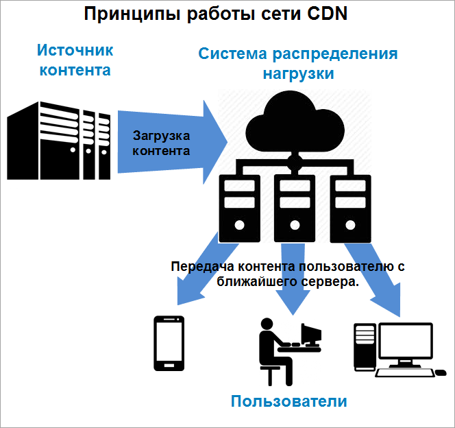
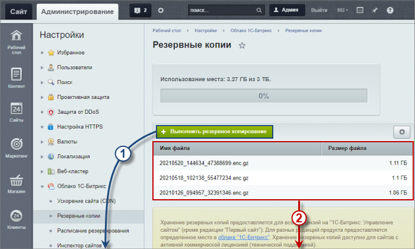
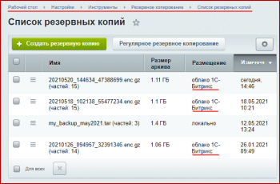

# Возможности штатных средств модуля

**Навигация**
- [← Оглавление курса](index.md)
- [← Предыдущий: 4469 — Сжатие css и js файлов](lesson_4469.md)
- [Следующий: 5517 — Инспектор сайтов →](lesson_5517.md)

Официальная страница урока: https://dev.1c-bitrix.ru/learning/course/index.php?COURSE_ID=35&LESSON_ID=2743

**Примечание.** Облако  *1С-Битрикс* физически размещается на следующих серверах:

- Яндекс (Yandex Object Storage) — для лицензий, купленных в России, Беларуси и Казахстане,
- Amazon S3 (Simple Storage Service) — для остальных стран.

Оно обладает всеми возможностями по безопасности и производительности соответствующих облачных сервисов.

### Функции модуля

Штатные средства модуля содержат такие продвинутые функции, как:

- [Инспектирование сайта](lesson_5517.md). Периодическая автоматическая проверка доступности и работоспособности сайта. Инспектор сообщит обо всех неполадках через E-mail или push-уведомления для мобильных устройств.
- [CDN](/learning/course/index.php?COURSE_ID=35&LESSON_ID=11775).
  			Раздача статического контента
                      
  		  (картинки, файлы стилей css, скрипты js) через сеть дистрибуции контента (Content Delivery Network или Content Distribution Network, CDN). При этом значительная часть ресурсов сайта загружается посетителем с ближайшего к нему сервера. Это позволяет увеличить скорость загрузки страниц до нескольких раз!
- [Работа с резервными копиями](lesson_7080.md#backup_cloud).
  			Создание и просмотр резервных копий
                      
  		 непосредственно в административном разделе вашего сайта.

### Связи с инструментом Резервное копирование

Модуль Облако 1С-Битрикс тесно связан с инструментом

			Резервное копирование

                    В главе рассматривается механизм резервного копирования и способы хранения копий для любого коробочного продукта: *1С-Битрикс: Управление сайтом* и *Битрикс24 в коробке*.

[Подробнее](https://dev.1c-bitrix.ru/learning/course/index.php?COURSE_ID=35&CHAPTER_ID=04833&LESSON_PATH=3906.4833)...

		. Посмотрим эти связи подробнее.

1. **Резервные копии** - на странице Настройки &gt; Облако 1С-Битрикс &gt; Резервные копии находится список облачных резервных копий (хранящихся в облаке 1С-Битрикс).
  Схема (*каждое изображение можно открыть в увеличенном размере*):
  |  |  |
  | --- | --- |
  |  |  |

2. **Расписание резервирования** - на странице Настройки &gt; Облако 1С-Битрикс &gt; Расписание резервирования выведена информация о расписании регулярного резервного копирования в облако 1С-Битрикс.
  Непосредственно настройки этого расписания выполняются на странице Настройки &gt; Инструменты &gt; Резервное копирование &gt; Регулярное резервное копирование, закладка **Параметры**.
  | 
    |  |
  | --- | --- |
  |  |  |
  |  |  |
