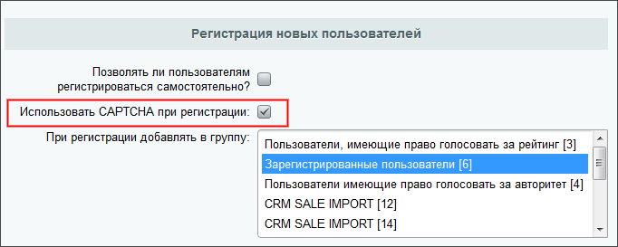
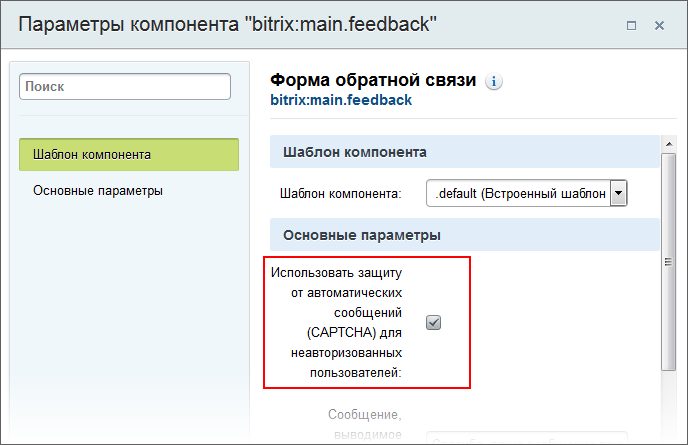
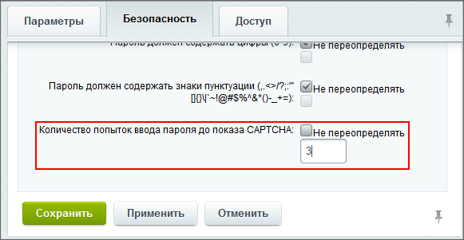

# Подключение CAPTCHA

**Навигация**
- [← Оглавление курса](index.md)
- [← Предыдущий: 7174 — Настройка CAPTCHA](lesson_7174.md)
- [Следующий: 12800 — Проверьте себя →](lesson_12800.md)

Официальная страница урока: https://dev.1c-bitrix.ru/learning/course/index.php?COURSE_ID=35&LESSON_ID=2836

После настройки основных параметров необходимо подключить CAPTCHA. Существует несколько вариантов подключения:

### В настройках модуля

 

В ряде модулей (**Главный**, **Блоги**, **Wiki** и других) CAPTCHA подключается прямо в настройках модуля. Например, опция **Использовать CAPTCHA при регистрации** в настройках **Главного модуля** позволяет включить использование CAPTCHA при регистрации новых пользователей:

 



### В параметрах компонента

CAPTCHA возможно подключить и для

			отдельных компонентов

                    Обычно настройки CAPTCHA в параметрах компонента используются для неавторизированных пользователей.

		, например, **Добавление элементов инфоблока (комплексный компонент)**, **Каталог (комплексный компонент)** и других. 
Рассмотрим пример использования CAPTCHA в компоненте **Форма обратной связи**, где опция **Использовать защиту от автоматических сообщений (CAPTCHA) для неавторизованных пользователей** позволяет включить CAPTCHA только для данного компонента:

 



### Настройка показа в форме авторизации

Использование CAPTCHA в форме авторизации ограничивается в настройках группы пользователей (Настройки &gt; Пользователи &gt; Группы пользователей, форма редактирования выбранной группы, вкладка Безопасность). Опция **Количество попыток ввода пароля до показа CAPTCHA** позволяет отключить CAPTCHA или задать количество неправильных попыток ввода пароля, после которых в форме авторизации выводится CAPTCHA для пользователя из соответствующей группы:

 



- При установке значения **0** или галочки **Не переопределять** (т.е. 0 по умолчанию) CAPTCHA в форме авторизации не выводится, т.е. отключена;
- При установке значения, отличного от нуля, CAPTCHA включена и выводится для пользователя после указанного числа неудачных попыток ввода пароля.

  

**Внимание!** Если в шаблоне компонента не предусмотрен вывод CAPTCHA, то возможна ситуация, когда система (при малом значении в поле **Количество попыток ввода пароля до показа CAPTCHA**) как бы "забывает" пароль пользователя не давая ему авторизоваться в системе. При этом при входе в административную часть (ваш_сайт/bitrix/admin/) авторизация осуществляется. 

Это происходит потому, что при последовательном неправильном наборе пары логин/пароль и при малом значении в поле **Количество попыток ввода пароля до показа CAPTCHA**) система ждёт ввода верного кода CAPTCHA. А пользователь этого не делает, так как шаблон не предусматривает вывод CAPTCHA.

### В своих скриптах, модулях или компонентах

Для начала создайте саму CAPTCHA :

         

```
01      <?include_once($_SERVER["DOCUMENT_ROOT"]."/bitrix/modules/main/classes/general/captcha.php");
02	$cpt = new CCaptcha();
03	$captchaPass = COption::GetOptionString("main", "captcha_password", "");
04	if(strlen($captchaPass) <= 0)
05	{
06	    $captchaPass = randString(10);
07	    COption::SetOptionString("main", "captcha_password", $captchaPass);
08	}
09	$cpt->SetCodeCrypt($captchaPass);
10	?>
```

         

После этого выводите в нужном месте формы три элемента: скрытое поле со сгенерированным кодом, поле для ввода капчи пользователем и саму картинку.

         

```
<input name="captcha_code" value="<?=htmlspecialchars($cpt->GetCodeCrypt());?>" type="hidden">
<input id="captcha_word" name="captcha_word" type="text">
GetCodeCrypt());?>">
```

         

В скрипте, при выполнении которого отправляется форма, добавьте проверку:

         

```
01      <?
02      if(!$APPLICATION->CaptchaCheckCode($_POST["captcha_word"], $_POST["captcha_code"]))
03	{
04	    // Неправильное значение
05	}
06	else
07	{
08	    // Правильное значение
09	}
10	?>
```

### Документация по теме

- [CAPTCHA](https://dev.1c-bitrix.ru/user_help/settings/settings/captcha.php)
