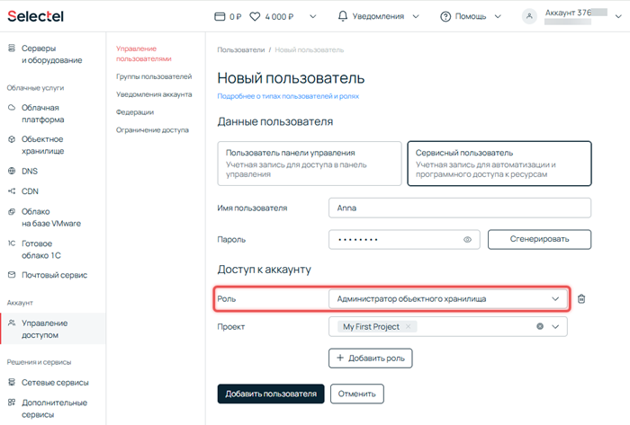
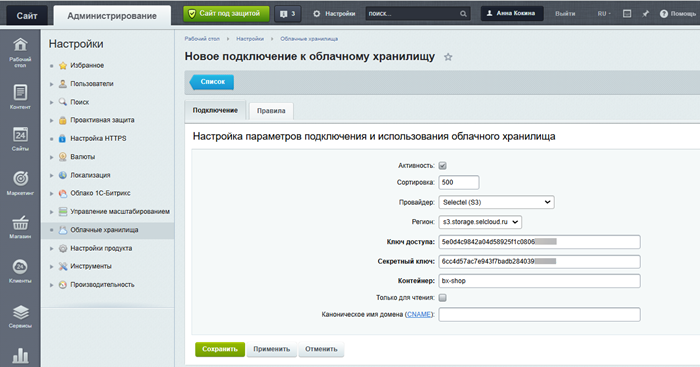
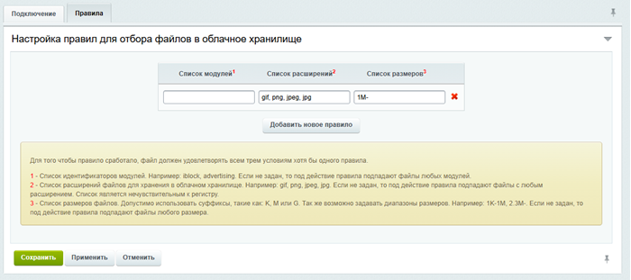
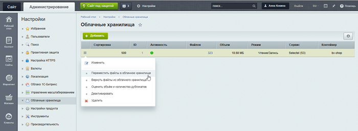

# Как подключить облачное хранилище Selectel

**Навигация**
- [← Оглавление курса](index.md)
- [← Предыдущий: 22022 — Как подключить облачное хранилище Yandex Object Storage](lesson_22022.md)
- [Следующий: 3089 — Перенос файлов и поиск дубликатов →](lesson_3089.md)

Официальная страница урока: https://dev.1c-bitrix.ru/learning/course/index.php?COURSE_ID=35&LESSON_ID=30294

### Действия на стороне Selectel

1. Зарегистрируйтесь [в панели управления Selectel](https://my.selectel.ru/) и заполните профиль аккаунта. Как это сделать, читайте [в документации Selectel](https://docs.selectel.ru/control-panel-actions/account/registration/).
2. Создайте сервисного пользователя. Перейдите на страницу *Аккаунт &gt; Управление доступом &gt; Управление пользователями* и добавьте сервисного пользователя с ролью «Администратор объектного хранилища».
  
3. Создайте ключ доступа. Для этого кликните по созданному сервисному пользователю, перейдите во вкладку «S3 ключи» и нажмите кнопку «Добавить ключ».
  
  В открывшемся окне нажмите «Сгенерировать».
  
  **Важно!** Сохраните сгенерированные Access key и Secret key. Вы не сможете их увидеть, когда закроете окно.
4. Перейдите на страницу *Облачные услуги &gt; Объектное хранилище &gt; ваш проект &gt; Контейнеры* и создайте контейнер.
  
  Придумайте уникальное имя для контейнера. Используйте только цифры, строчные латинские буквы и символы `.` и `-`.
  Выберите приватный тип доступа. Тогда ваш контейнер будет доступен только по логину и паролю или авторизационному токену. При публичном доступе контейнер будет открыт для чтения из интернета.
  Выберите класс хранения:
  Класс хранения влияет только на стоимость ресурсов. Технически и по скорости классы одинаковые. После создания контейнера класс хранения изменить нельзя.
  В параметре Тип адресации отметьте vHosted.

  - стандартное хранение — для часто запрашиваемых данных,
  - холодное хранение — для редко запрашиваемых данных.
5. Привяжите созданный контейнер к сервисному пользователю. Для этого кликните по контейнеру, перейдите во вкладку Политика доступа и нажмите кнопку «Создать политику доступа».
  
  Выберите сервисного пользователя и задайте ему права уровня «Редактор». Сохраните изменения.

### Действия на стороне сайта

1. Перейдите на страницу *Настройки &gt; Облачные хранилища* и добавьте новое подключение.
  
  Выберите провайдер Selectel (S3) и регион s3.storage.selcloud.ru.
  Укажите ключ доступа и секретный ключ — это Access key и Secret key, которые вы сгенерировали для сервисного пользователя в панели управления Selectel.
  Укажите имя созданного контейнера.
  Если хотите, чтобы новые файлы сохранялись не в контейнере, а на хостинге с проектом, отметьте опцию Только для чтения.
  **Примечание.** Поле «Каноническое имя домена» можно оставить пустым. Оно нужно разработчикам для оптимизации раздачи контента клиентам.
2. Перейдите во вкладку Правила и задайте условия, по которым будут отбираться файлы для загрузки в облачное хранилище.
  
  В списке модулей укажите названия модулей, чьи данные нужно загружать в облачное хранилище. Если поле оставить пустым, правило будет применяться к файлам всех модулей.
  В списке расширений укажите через запятую расширения файлов для хранения в облачном хранилище, например: gif, png, jpeg, jpg. Если поле пустое, правило применится к статическим файлам с любым расширением. Расширения можно указывать в любом регистре.
  В списке размеров укажите размеры файлов, используя буквы K, M или G. Можно задавать диапазоны. Например, 1M- позволит загружать файлы больше одного мегабайта. Если поле пустое, правило применится к файлам любого размера.
3. Нажмите кнопку «Сохранить». Новый контейнер появится в списке облачных хранилищ. Перенесите файлы с сайта в облачное хранилище с помощью одноименного пункта меню.
  
  **Примечание.** После переноса файлов вы увидите сообщение о результате. В случае неудачного подключения на странице появится текст ошибки, переданный сервисом облачного хранения файлов.

Система будет проверять новые загружаемые файлы на соответствие правилам и сохранять их в облачном хранилище. Ссылки на файлы будут сгенерированы автоматически с учетом их расположения в облаке.
