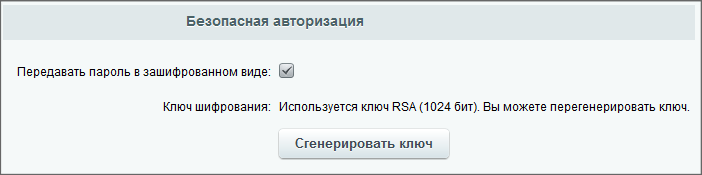

# Безопасная авторизация

**Навигация**
- [← Оглавление курса](index.md)
- [← Предыдущий: 2013 — Импорт пользователей из LDAP-directory](lesson_2013.md)
- [Следующий: 14172 — Контроль слабых паролей →](lesson_14172.md)

Официальная страница урока: https://dev.1c-bitrix.ru/learning/course/index.php?COURSE_ID=35&LESSON_ID=3081

### Штатный инструмент безопасной авторизации

Пароли для большинства сайтов передаются в открытом виде, если не используется

			SSL

                    
**SSL** (англ. Secure Sockets Layer — уровень защищённых сокетов) — криптографический протокол, который подразумевает более безопасную связь. Он использует асимметричную криптографию для аутентификации ключей обмена, симметричное шифрование для сохранения конфиденциальности, коды аутентификации сообщений для целостности сообщений.

[Подробнее](https://ru.wikipedia.org/wiki/SSL)...

		. Отказ от использования SSL связан в большинстве случаев с  административным фактором. Тем не менее проблему передачи паролей и логинов в открытом виде надо решать. Это можно сделать с помощью штатной функции **Безопасная авторизация**.

> **Безопасная авторизация** - функция, обеспечивающая зашифрованную передачу пароля пользователя. Пароли пользователей хешируются по алгоритму SHA-512, но шифрование пароля не является заменой SSL. Безопасная авторизация защищает от перехвата пароля только при прослушивании трафика. Требует дополнительных подключенных библиотек.

При изменениях трафика шифрование не поможет. При разработке функции исходили из того, что изменить трафик сложнее, чем прослушать его (тот же открытый WiFi). Более того, шифрование паролей не защищает от перехвата сессии, но у сессии есть свои механизмы защиты (привязка к IP, частое изменение кода сессии). В целом можно сказать, что уровень защиты повысился, но лучше использовать SSL.

Безопасная авторизация работает в компоненте **system.auth.authorize**, при входе в Административную часть системы этот механизм защиты не включается. Функционал безопасной авторизации активируется только при работе сайта по протоколу HTTP. Если сайт использует защищенное соединение

			HTTPS

                    Перевод сайта на работу по протоколу https обеспечивает защиту от атак, основанных на прослушивании сетевого соединения. Действия по такому переводу не сложны, но требуют определённых знаний.

[Подробнее ...](lesson_3261.md)

		, шифрование пароля на клиентской стороне не применяется, так как HTTPS уже обеспечивает достаточный уровень безопасности передачи данных. Рекомендуется использовать HTTPS для защиты всей сессии целиком.

### Подключение

Подключается **Безопасная авторизация**

			в настройках Главного модуля

                     

		 на закладке **Авторизация**:

**Примечание**: После установки флажка в чекбоксе перед генерацией ключа обязательно нажмите на кнопку **Применить**, сохраняющую настройки модуля. Без этого генерации ключа не произойдет.

По нажатию на **Сгенерировать ключ** происходит генерация ключа

			RSA

                    **RSA** (буквенная аббревиатура от фамилий Rivest, Shamir и Adleman) — криптографический алгоритм с открытым ключом.

		.

Размер ключа зависит от библиотек, установленных на сервере. По умолчанию используется модуль PHP **openssl**, который создаёт 1024-битный ключ. Его и рекомендуется использовать. Если модуль не установлен, то возможно использование **bcmath** с генерацией 512-битного ключа. Если нет ни того, ни другого модуля, включить шифрование нельзя.

Генерация ключа выполняется один раз. Повторную генерацию производить необходимо, если есть подозрения в компрометации ключа.

**Внимание!** На браузерах клиентских компьютеров должно быть разрешено использование Javascript.

### Алгоритм работы

1. Вместе с формой авторизации клиенту передается открытый ключ;
2. Перед отправкой формы авторизации Javascript перехватывает отправку, зашифровывает пароль с использованием открытого ключа и отправляет на сервер;
3. Сервер принимает шифротекст, расшифровывает его с использованием секретного ключа и проводит аутентификацию пользователя.
