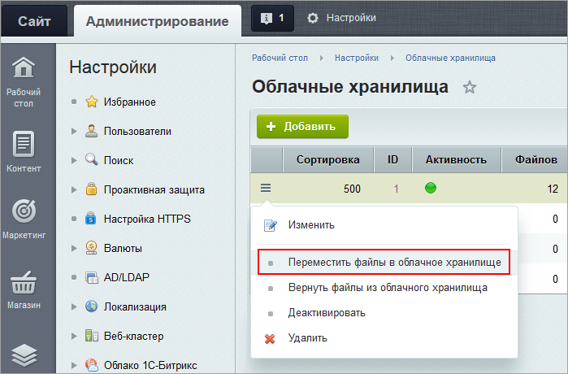
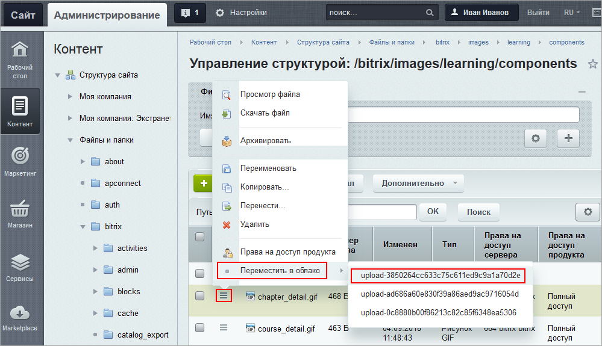
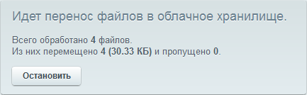
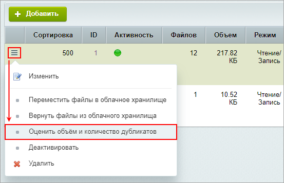
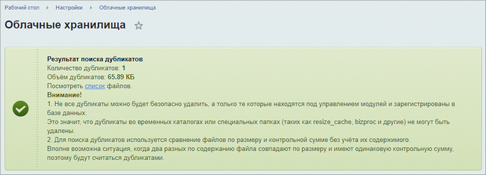
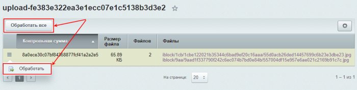

# Перенос файлов и поиск дубликатов

**Навигация**
- [← Оглавление курса](index.md)
- [← Предыдущий: 30294 — Как подключить облачное хранилище Selectel](lesson_30294.md)
- [Следующий: 11637 — Что можно сделать с файлами в облачном хранилище →](lesson_11637.md)

Официальная страница урока: https://dev.1c-bitrix.ru/learning/course/index.php?COURSE_ID=35&LESSON_ID=3089

Для каждого контейнера в списке на странице Настройки &gt; Облачные хранилища доступен ряд действий.

### Перенос файлов в облачное хранилище

Файлы, которые вы будете загружать в Битрикс после создания нового подключения, сразу будут сохраняться в "облако".

А если необходимо перенести в облачное хранилище старые файлы, то в меню действий списка подключений выберите пункт **Переместить файлы в облачное хранилище**:

Запустится процесс переноса файлов в облачное хранилище. Файлы будут переноситься из модулей, с расширениями и размерами, указанными в [правилах](lesson_3102.md#rules).

**Внимание!** Перенос файлов из папки `/upload` через команду меню **Переместить файлы в облачное хранилище** возможен, но эти изменения не пропишутся в системе, и сайт всё равно будет обращаться за файлами к папке `/upload`, а не в облако.

## Как перенести файлы, не указанные в правилах

В меню действий любого файла есть пункт "Переместить в облако". Вам просто нужно выбрать, в какой контейнер поместить файл:

 

**Помните**  Основная задача облачного хранения - снижение нагрузки на ваш сервер от большого количества картинок, видео и других "тяжелых" файлов. То есть перенос в "облако" имеет смысл для статических файлов. Например, в случае с файлами типа ***.php** текст файла перенесется, но выполняться файл не будет.

Процесс переноса можно отслеживать:

Чтобы перенести файлы обратно из "облака" на сервер, в меню действий необходимо выбрать пункт **Вернуть файлы из облачного хранилища**.

## Перенос файлов большого объёма

При переносе файлов большого объёма могут возникать проблемы: часть файлов может не загружаться. Для устранения этой ошибки используйте составную (мультипарт) загрузку.

Облачное хранилище, как правило, представляет собственную документацию для такой загрузки. Например, [документация](https://cloud.vk.com/docs/base/s3/instructions/objects/upload-object) для VK cloud. Для загрузки файлов так же рекомендуется использование [AWS CLI](https://cloud.vk.com/docs/base/s3/storage-connecting/s3-cli).

Аналогичная документация есть и у других хранилищ.

### Поиск и удаление дубликатов файлов

**Примечание:** Поиск и удаление дубликатов в облачном хранилище доступны с версии **22.0.0** модуля Облачные хранилища.

Для поиска дубликатов файлов в контейнере облачного хранилища выберите пункт меню **Оценить объём и количество дубликатов**:

После выполнения оценки над списком отобразится уведомление о результатах поиска с указанием количества дубликатов и занимаемом ими объёме, а также с полезными пояснениями о работе функционала:

По ссылке список откроется детальный список найденных дубликатов. Каждый файл открывается по ссылке. Дубликаты можно удалить массово нажатием кнопки **Обработать все** или по одной строке через меню действий:

  

При этом дубликаты, везде где необходимо, будут заменены на основной файл.

**Важно**: Чтобы избежать дублирования файлов в системе и в облачном хранилище, включите

			Контроль дубликатов

                    Для экономии места рекомендуется использовать контроль дубликатов загружаемых файлов.

[Подробнее](lesson_13776.md)...

		 в настройках Главного модуля.

## Поясним замену дубликатов на примере модуля Информационные блоки

Пусть создано облачное хранилище, в которое загружаются все изображения модуля Информационные блоки (**iblock**).

Допустим, мы загрузили одно и то же изображение для двух разных элементов инфоблока в качестве картинки для анонса. Автоматически, эти изображения будут загружены как 2 разных файла в разные папки, т.е. будут иметь разные ссылки на файл

 изображения.

Поиск дубликатов в облачном хранилище определит эти два файла как дубликаты. После **Обработки** останется только один файл. А ссылки в элементах инфоблока, в которые были загружены изображения-дубликаты, будут заменены на этот единственный оставшийся файл.

### Остальные действия

Для контейнеров также доступны следующие действия:

- **Изменить** - изменение параметров подключения. Действия аналогичны
  			созданию нового подключения к облачному хранилищу
  Модуль **Облачные хранилища** позволяет перенести хранение файлов разных модулей в облачные хранилища. Например, можно настроить, что изображения, загружаемые посетителями сайта в блог, будут автоматически сохраняться в "облаке".
  [Подробнее](lesson_3102.md)...
  		;
- **Деактивировать** - перевод контейнера облачного хранилища в неактивное состояние. В этом случае данные будут доступны для чтения, но запись будет невозможна;
- **Удалить** - удаление подключения к облачному хранилищу.
  **Примечание:** Если в хранилище находятся файлы, то будет выдано предупреждение о невозможности удаления такого подключения. Подключение можно будет удалить только после удаления файлов из него.
