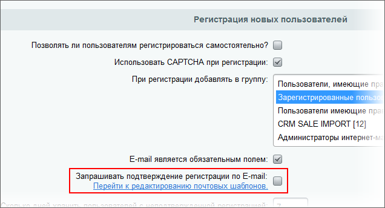

# Борьба с автоматической регистрацией

**Навигация**
- [← Оглавление курса](index.md)
- [← Предыдущий: 3734 — Что делать с ботами?](lesson_3734.md)
- [Следующий: 3091 — Если боты всё же зарегистрировались →](lesson_3091.md)

Официальная страница урока: https://dev.1c-bitrix.ru/learning/course/index.php?COURSE_ID=35&LESSON_ID=3092

Несколько способов борьбы с автоматической регистрацией ботов

### CAPTCHA

CAPTCHA

                    Форма Настройка CAPTCHA (Настройки &gt; Настройки продукта &gt; CAPTCHA) предназначена для настройки защиты от автоматических регистраций.

[Подробнее ...](https://dev.1c-bitrix.ru/learning/course/index.php?COURSE_ID=35&CHAPTER_ID=02128&LESSON_PATH=3906.4503.2128)

		 - классический инструмент защиты от автоматической авторизации. Достоинства и недостатки этого метода хорошо известны, но пренебрегать этим методом защиты не нужно. Очень часто простое изменение настроек стандартной CAPTCHA может дать серьезный результат.

Пока нет возможности "из коробки" подключать разную CAPTCHA. Но есть достаточно большие возможности по её настройке, это снижает вероятность автоматической регистрации ботов. Например, используйте кириллический шрифт, который не смогут правильно набрать нерусскоязычные работники бирж. Впрочем, в последнее время появились и русские биржи по регистрации аккаунтов. Но число таких бирж не велико и их услуги стоят дороже.

Если вас не удовлетворяют возможности штатного функционала CAPTCHA, то можно ["усилить"](https://dev.1c-bitrix.ru/community/webdev/user/9700/blog/2015/) этот функционал.

### Доступ на сайт через соцсети

Позволить входить на сайт только через социальные сети. Метод плох тем, что есть люди, которые ими не пользуются. И ещё тем, что не для всех такой способ авторизации кажется приемлемым.

### Поля формы регистрации

Добавить в форму регистрации невидимое поле и скрыть его с помощью CSS. Скрывать с учётом того, что особо продвинутые боты обнаруживают `display: none`. Невидимое поле нужно назвать как-нибудь привлекательно для ботов в контексте содержания сайта: Компания, telefpone. К этому полю можно поставить знак *****, - бот решит что без его заполнения не отправится форма.

Следом следует программное условие, что если это поле заполнено, то блокировать пользователя, либо возвращать ему тот же ответ, что и при удачной регистрации.

Другой вариант: подменить поле Имя. Для бота будет стандартное, для пользователей - названное вами, а при регистрации менять значения. Алгоритм регистрации не изменится, бот будет по-прежнему вводить поле "имя(стандартное)" и не проходить регистрацию.

### Защита по IP

Как вариант защиты очень часто рекомендуют подключить к сайту список IP адресов спамботов, такие списки благо есть. Но практика показывает, что возможности этого способа защиты существенно ограничены.

**Во-первых**, есть вероятность отсеять простого человека который:

- имеет прокси с этим IP,
- получил динамический IP который есть в базе (очень малая вероятность),
- человек, случайно попавший в базу.

**Во-вторых**, этих IP-адресов тысячи и десятки тысяч и ими не удобно эффективно управлять. Бессмысленно с ними возиться ради ботов, гораздо проще использовать нестандартные приёмы для защиты от автоматической регистрации. Кроме того, уже на нескольких специализированных форумах есть услуга регистрации аккаунтов не через прокси, а с IP реальных людей. Судя по всему используются ботнеты.

### Организационные меры защиты

Возможен такой вариант: пользователь после регистрации попадает в группу **Новички** с минимальными правами. Он может только заполнить профиль и ответить на форуме. Личные сообщения, публикация ссылок, добавление файлов, открытие новой темы и прочего ему запрещено. Как только он оставит на форуме N сообщений (на выбор администратора), он переходит в группу **зарегистрированные пользователи**, которая имеет базовые пользовательские права.

Можно создать и группу **Активные пользователи**, которые будут иметь расширенный набор прав и туда пользователь попадёт после набора M сообщений.

Штатно в **Bitrix Framework** такое реализовать не получится, нужны некоторые доработки. Пример возможного кода:

```
//при добавлении сообщения форума, если количество сообщений больше FLS_NUM_POSTS, 
//то припишем пользователя к специальной группе
define("FLS_NUM_POSTS", 50);
define("FLS_FORUM_GROUP", 27);
AddEventHandler("forum", "onAfterMessageAdd", "FlsOnForumMessageAdd");
function FlsOnForumMessageAdd($ID, $arFields)
{
   $arGroups = CUser::GetUserGroup($arFields["AUTHOR_ID"]);
   if(!in_array(FLS_FORUM_GROUP, $arGroups))
   {
      $arProfile = CForumUser::GetByUSER_ID($arFields["AUTHOR_ID"]);
      if(intval($arProfile["NUM_POSTS"]) >= FLS_NUM_POSTS-1)
      {
         //добавим в группу
         $arGroups[] = FLS_FORUM_GROUP;
   
         //запишем новую группу
         CUser::SetUserGroup($arFields["AUTHOR_ID"], $arGroups);
   
         //обновим сессию текущему пользователю
         if($GLOBALS["USER"]->GetID() == $arFields["AUTHOR_ID"])
            CUser::SetUserGroupArray($arGroups);
      }
   }
}
```

В качестве организационных мер можно предусмотреть:

- Использование
  			подтверждения регистрации по E-mail
                      
  		. Это штатная функция Главного модуля.
- Обязательную регистрацию на сайте по [номеру телефона](lesson_12575.md).

### Несколько уровней регистрации

Самый "тяжёлый" способ. Не в плане технической реализации, а в плане удобства для пользователей. Суть проста: выполнение регистрации в несколько этапов.

Такую регистрацию могут пройти только специально написанные под конкретный проект боты. Либо производится ручная, человеческая регистрация с последующей передачей аккаунта под управление ботам.

Есть более мягкий вариант, когда авторизация происходит в один этап, но в её конце пользователям предлагается завершить авторизацию, заполнив ещё некоторое количество полей. Авторизовать на сайте пользователей можно и сразу, после заполнения минимума обязательных полей. И дать возможность им пользоваться сайтом. Но те из них, которые не сделали завершение авторизации (то есть не заполнили поля, которые их просили заполнить) попадают под подозрение, что они - боты. В дальнейшем их можно будет удалить или ограничить в правах (поместить в группу подозрительных), пока не заполнят.
