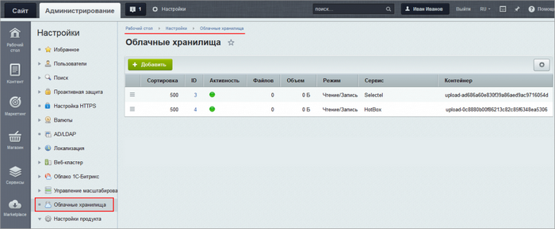
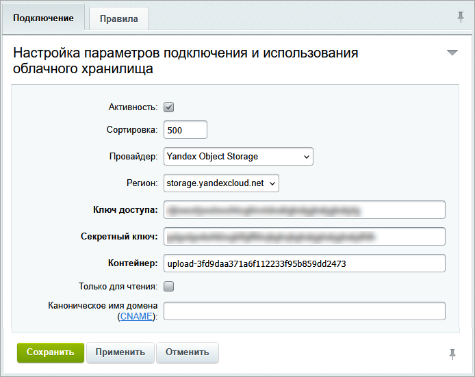
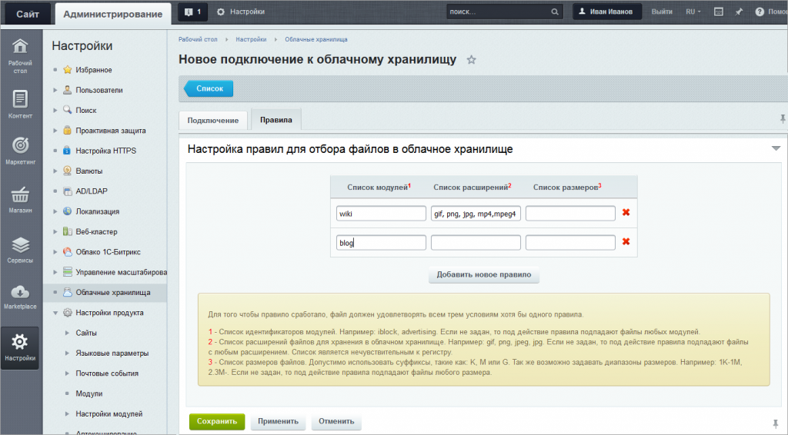
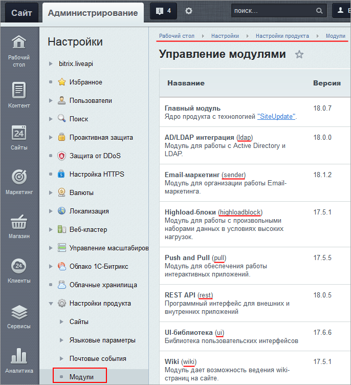

# Создание подключения

**Навигация**
- [← Оглавление курса](index.md)
- [← Предыдущий: 4826 — Облачные хранилища - настройка модуля](lesson_4826.md)
- [Следующий: 22022 — Как подключить облачное хранилище Yandex Object Storage →](lesson_22022.md)

Официальная страница урока: https://dev.1c-bitrix.ru/learning/course/index.php?COURSE_ID=35&LESSON_ID=3102

Модуль **Облачные хранилища** позволяет перенести хранение файлов разных модулей в облачные хранилища. Например, можно настроить, что изображения, загружаемые посетителями сайта в блог, будут автоматически сохраняться в "облаке".

|  | ### Создание и просмотр подключений |
| --- | --- |

Список всех подключений к облачным хранилищам находится на странице **Облачные хранилища** (Настройки &gt; Облачные хранилища). В таблице можно увидеть, активно ли подключение, сколько файлов в нём расположено и какого объема и т.д.

Здесь же можно создать новое подключение, нажав кнопку . На вкладке **Подключение** задаются основные параметры:

1. В поле **Провайдер** выберите поставщика услуг облачного хранения данных. В зависимости от вашего выбора следующие поля в форме будут отличаться:
2. В поле **Контейнер** укажите название
  			контейнера
                      **Контейнер** - логическая структура облачного хранилища
  		, которое потом позволит идентифицировать его. По умолчанию в поле уже указано уникальное название. Для каждого подключения создается отдельный контейнер.
3. Опция **Только для чтения** позволяет производить с контейнером только операции чтения. При отмеченной опции новые файлы будут сохраняться не в контейнере, а на хостинге с проектом.
4. При желании можно указать **Каноническое имя домена** ([CNAME](http://en.wikipedia.org/wiki/CNAME_record)).
  **Важно!** Поле **Каноническое имя домена** предназначено для разработчиков и служит для налаживания более
  			эффективной
  Сеть доставки (и дистрибуции) содержимого (англ. Content Delivery Network или Content Distribution Network, CDN) — географически распределённая сетевая инфраструктура, позволяющая оптимизировать доставку и дистрибуцию содержимого конечным пользователям в сети Интернет. Использование контент-провайдерами CDN способствует увеличению скорости загрузки интернет-пользователями аудио-, видео-, программного, игрового и других видов цифрового содержимого в точках присутствия сети CDN.
  [Подробнее](https://ru.wikipedia.org/wiki/Content_Delivery_Network)...
  		  раздачи контента клиентам. Требуются дополнительные сторонние настройки и соответствующие навыки.

 

На вкладке **Правила** настройте правила, по которым будет происходить отбор файлов для загрузки в облачное хранилище:

 

- В колонке **Список модулей** укажите
  			названия модулей
                       &lt;
  		, данные которых будут загружаться в "облако". **Например:** `iblock, advertising`. Если оставить поле пустым, то под действие правила попадают файлы любых модулей.
- В колонке **Список расширений** укажите расширения файлов для хранения в облачном хранилище. **Например:** `gif, png, jpeg, jpg`. Если поле не заполнено, то под действие правила подпадают статические файлы с любым расширением. Список является нечувствительным к регистру.
- В колонке **Список размеров** укажите размеров файлов. Допустимо использовать суффиксы, такие как: **K**, **M** или **G**. Так же возможно задавать диапазоны размеров. **Например:** `1K-1M, 2.3M-`. Если поле не заполнено, то под действие правила подпадают файлы любого размера.

Нажмите кнопку **Сохранить**.

Новый контейнер появится в списке на странице **Облачные хранилища** (Настройки &gt; Облачные хранилища) сразу после подключения. Вновь загружаемые файлы автоматически будут сохраняться в "облако". Ссылки на файлы будут также автоматически формироваться с учетом их расположения в "облаке".

**Примечания:** 

1. В случае неудачного подключения текст ошибки, отображаемой на странице, выдается самим провайдером, то есть сервисом облачного хранения файлов.
2. Если Облачное хранилище планируется использовать только как место хранения резервных копий, то рекомендуется не создавать правила и удалить единственное пустое правило, создаваемое по умолчанию.
