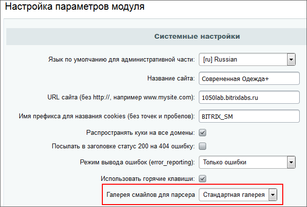
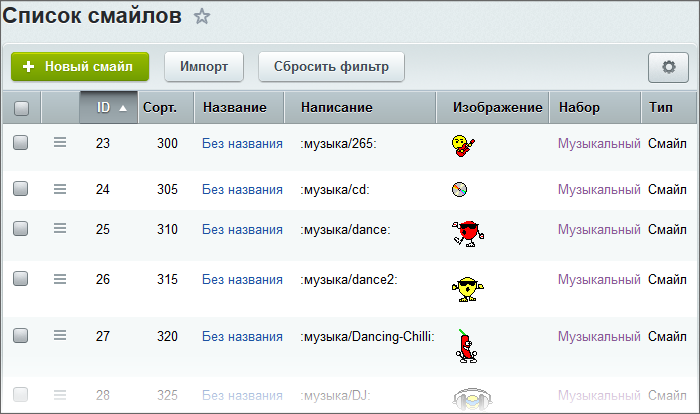

# Смайлы

**Навигация**
- [← Оглавление курса](index.md)
- [← Предыдущий: 3582 — Примеры работы](lesson_3582.md)
- [Следующий: 2030 — Агенты →](lesson_2030.md)

Официальная страница урока: https://dev.1c-bitrix.ru/learning/course/index.php?COURSE_ID=35&LESSON_ID=3106

### Системные и дополнительные смайлы. Видеоурок

Раздел **Смайлы** (Сервисы &gt; Смайлы) - системный раздел для смайлов, используемых модулями системы.

Для работы со смайлами используются понятия **Галереи смайлов** и **Набор смайлов**. Число Галерей и Наборов не ограничено. Каждая из Галерей может быть использована в

			любом из модулей

                    На данный момент переход на системные смайлы главного модуля совершён не полностью. Часть модулей использует собственные наборы смайлов, детальнее об этом смотрите в описании настроек модулей.

		. Выбор осуществляется в настройках модуля.

			Настройки **Главного модуля**

                    

		 являются настройками по умолчанию для остальных модулей.

### Галереи

В дистрибутиве по умолчанию присутствует **Стандартная галерея** с **Основным набором**. Они неудаляемые, но при необходимости можно

			удалить из них все смайлы

                    Однако при обновлении системы смайлы восстановятся, а добавленные - затрутся. Поэтому рекомендуется создавать пользовательские галереи.

		. Каждая Галерея может содержать в себе несколько наборов. Пользователь может использовать любой из имеющихся наборов, переключившись на нужный:

Один и тот же смайл может быть использован только в одной галерее.

**Примечание**: "Смайлом" для системы является не конкретная картинка или ID, а её написание. Соответственно, вы не можете использовать одно и то же написание в разных наборах в рамках одной галереи, для этого вам понадобится создать отдельную галерею.

#### Создание галереи

Для создания Галереи достаточно заполнить

			поля формы

                    
Форма служит для добавления/редактирования галереи смайлов.

 

						[Описание компонента «Добавление и редактирование галереи» в пользовательской документации.](http://dev.1c-bitrix.ru/user_help/detail.php?ID=1420965)

		. Число галерей не ограничено. Кликнув на созданную галерею, можно перейти на страницу с созданием наборов.

### Наборы

Для создания набора достаточно заполнить

			поля формы

                    Форма служит для добавления/редактирования наборов смайлов.

 

						[Описание компонента «Добавление/редактирование набора смайлов» в пользовательской документации.](http://dev.1c-bitrix.ru/user_help/detail.php?ID=836039)

		 с указанием Галереи, к которой они относятся, и произвести

			импорт архива

                    Перед импортированием смайлов необходимо приготовить архив в формате **ZIP** без сжатия.

						[Описание компонента «Импорт архива смайлов» в пользовательской документации.](http://dev.1c-bitrix.ru/user_help/detail.php?ID=835257)

		 смайлов.

Для импорта необходимо заранее подготовить архив в формате ZIP. В простейшем виде архив может представлять из себя набор картинок, лежаших в корне архива. Но при использовании архива в таком виде импорт будет произведен по списку файлов с использованием меток в названии файла (если они есть). Варианты меток: "smile_" - смайл, "icon_" - иконка, "_hr" -

			высокое разрешение

                    Применяется так же и для сверхвысокого разрешения Ultra HD

		.

Например, при импорте в набор с кодом **test** файла **smile_green_hr.png** будет интерпретирован как "Смайл в высоком разрешении", а код вставки в редактор будет `:test/green:`.

В результате потребуется дальнейшее редактирование каждого смайла в отдельности. Нужно будет отредактировать поля **Название** и **Написание**, которые будут добавлены в виде неудобном для использования:

Чтобы избежать этого в архиве необходимо предусмотреть служебные файлы в

			формате csv

                    В системе есть пример архива, который расположен по пути: /bitrix/admin/fileman_admin.php?lang=ru&path=/bitrix/modules/main/install/smiles.

		. Служебных файлов должно быть как минимум два:

- **install.csv** - данные для загрузки;
- **install_lang_**.csv** - языковой файл, где ** -
  			код языка
                      Если в системе есть несколько языков, то необходимо создать на каждый язык по своему языковому файлу.
  		, например, ru для русского.

## Поля в файлах

Все поля в обоих файлах являются обязательными. Более того, порядок следования полей строго регламентирован и не может быть нарушен.

**Поля файла install.csv**

| \| **Название** \| **Описание и значения** \| \| --- \| --- \| \| **TYPE** \| Тип: смайл (S) или иконка (I). По умолчанию S. \| \| **CLICKABLE** \| Служебное значение (Y\\|N). По умолчанию Y. \| |  |
| --- | --- |
| **SORT** | Значение сортировки, определяет расположение смайла в общем списке. Чем меньше число, тем выше расположение смайла. По умолчанию ставится 300. |
| **IMAGE** | Имя файла в архиве. |
| **IMAGE_WIDTH** | Ширина картинки в пикселях. |
| **IMAGE_HEIGHT** | Высота картинки в пикселях. |
| **IMAGE_DEFINITION** | Разрешение изображения:  - Стандартное разрешение (SD) - Высокое разрешение (HD) - Сверхвысокое разрешение (UHD) |
| **HIDDEN** | Скрытое изображение, то есть вывод производится только по использованию написания (Y\|N). По умолчанию N. |
| **IMAGE_LANG** | Мнемоническое название на английском языке для связки в языковом файле. |
| **TYPING** | Образцы написания смайла. Возможно несколько описаний, которые должны вводиться через пробел. |

**Поля файла install_lang_**.csv**

| \| **Поле** \| **Описание и значение** \| \| --- \| --- \| \| **Мнемоническое название** \| Значение поля IMAGE_LANG из файла install.csv. \| \| **Название** \| Название смайла на подгружаемом языке. \| |
| --- |

Также доступно

			ручное добавление

                    Форма предназначена для создания новых и редактирования уже существующих смайлов.

 

						[Описание компонента «Добавление/редактирование смайла» в пользовательской документации.](http://dev.1c-bitrix.ru/user_help/detail.php?ID=836363)

		 смайлов, в ходе которого его необходимо привязать к тому или иному набору.

### Документация по теме

- [АПИ для работы со смайлами](http://dev.1c-bitrix.ru/api_help/main/reference/csmile/index.php)
- [Пользовательская документация по смайлам](http://dev.1c-bitrix.ru/user_help/service/smile/index.php)
