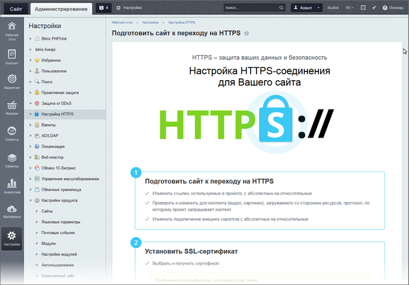

# Настройка HTTPS-соединения

**Навигация**
- [← Оглавление курса](index.md)
- [← Предыдущий: 6637 — Обеспечение безопасности](lesson_6637.md)
- [Следующий: 3556 — Контроль за изменениями в системе →](lesson_3556.md)

Официальная страница урока: https://dev.1c-bitrix.ru/learning/course/index.php?COURSE_ID=35&LESSON_ID=3261

### Как перевести сайт на протокол HTTPS

Перевод сайта на работу по протоколу **https** обеспечивает защиту от атак, основанных на прослушивании сетевого соединения. Действия по такому переводу не сложны, но требуют определённых знаний. В административном разделе "1С-Битрикс: Управление сайтом" создана специальная страница с указанием последовательности работ по настройке HTTPS соединения. Поясним каждый из пунктов этого списка.



**Внимание!** Для выполнения работ администратор должен иметь полный доступ к проекту.

### Подготовить сайт к переходу на HTTPS

- Изменить ссылки, используемые в проекте, с абсолютных путей на относительные: в каждом файле проекта
  			поменять ссылки
                      Поиск ссылок можно осуществлять с помощью функции поиска. Кнопка "Поиск" в менеджере файлов.
  
  		 вида http://_ваш_сайт/bitrix/admin/*** на /bitrix/admin/*** (убрать указание на протокол и домен).
- Проверить и изменить ссылки для контента (видео, картинки), загружаемого со сторонних ресурсов, протокол, по которому проект запрашивает контент.
  Пункт лёгкий для исполнения, если используются стандартные компоненты "1С-Битрикс: Управление сайтом": штатные компоненты работают по умолчанию "как надо". Если используются кастомизированные компоненты, то проверьте , что этот пункт в них выполняется.
  Сложнее ситуация, если используется решение от партнёров "1С-Битрикс". В этом случае нужно либо обратиться к разработчику решения для внесения таких правок, либо произвести эти правки самостоятельно.
  Определить наличие неверных указаний протокола можно с помощью консоли. При открытии страниц сайта будут отображены неверные ссылки:
  
- Изменить подключение внешних скриптов с абсолютных путей на относительные. Внешние скрипты: различные счётчики, виджеты "Обратный звонок" и подобные, обращение к сторонним библиотекам, шрифтам и так далее.
  Если используются внешние скрипты, то нужна уверенность, что они работают корректно. Если это счётчики Google или Yandex или скрипты иного "серьёзного" проекта, то тут, как правило, всё работает правильно. Если разработчик стороннего скрипта недостаточно профессионален, то такие ошибки также отслеживаются в консоли. Самостоятельное исправление невозможно, нужно либо обратиться к разработчику внешнего скрипта с просьбой исправить его работу, либо поискать другой внешний скрипт, решающий ваши задачи и работающий корректно по протоколу HTTPS.

### Установить SSL-сертификат

- Выбрать и получить сертификат
                      Существует достаточно много цифровых сертификатов, каждый из которых служит для своих целей. Самые распространенный тип сертификатов это естественно SSL сертификаты, которые также имеют несколько подвидов.
  		. Простая процедура, просто выберите поставщика, оплатите и получите.
- Установить полученный сертификат на хостинг.
  Операция требует определённой квалификации. Если она у вас есть - то пояснять вам нечего и незачем вам читать эту страницу.  Если квалификации нет, то обратитесь к хостеру: его администраторы установят сертификат.
  Если используется BitrixVM, то как установить сертификат описано в уроке
  			Добавление ssl-сертификатов в BitrixVM
                      Предположим у нас есть сайт http://site1.bx, и нам нужно переключить работу сайта на защищенный протокол https...
  [Подробнее ...](https://dev.1c-bitrix.ru/learning/course/index.php?COURSE_ID=37&LESSON_ID=9101)
  		.
  ## Если сертификат из нескольких файлов
  Некоторые поставщики сертификатов выдают три файла и несколько промежуточных сертификатов. В этом случае сделайте следующее (на примере поставщика Comodo):
  Все полученные файлы (private.key, vash_domen.crt и промежуточный сертификаты) скопируйте под правами root по ssh на вашу BitrixVM в папку `/etc/nginx/ssl/1`. (Папку надо предварительно создать.)
  Объедините ваш сертификат домена и промежуточный сертификат в один файл формата **pem**. Важно соблюсти обратную последовательность: сначала должен быть сертификат для домена, затем промежуточные сертификаты №2, №1 и корневой сертификат. Сделайте это через любой текстовый редактор или через командную строку сервера.
  ```
  cd /etc/nginx/ssl/1/
  cat vash_domen.crt COMODORSADomainValidationSecureServerCA.crt COMODORSAAddTrustCA.crt AddTrustExternalCARoot.crt > cert.pem
  ```
  Полученный файл **cert.pem** скопируйте в папку `/nginx/ssl/`, заменив старый файл. Пропишите в конфигурационном файле NGINX путь к публичному ключу - `/etc/nginx/bx/conf/ssl.conf`:
  ```
  ssl_certificate /etc/nginx/ssl/cert.pem;
  ssl_certificate_key /etc/nginx/ssl/private.key;
  ```
  Перезагрузите NGINX:
  ```
  [root@1 conf]# service nginx restart
  Stopping nginx:                                            [  OK  ]
  Starting nginx:                                            [  OK  ]
  ```
- Проверить доступность сайта через HTTPS-протокол. В консоли не должно быть красных строк.

### Выполнить важные изменения на сайте

- В файле
  			robots.txt
                      При поисковом продвижении сайта нужно думать не только о том, какие страницы сайта должны попасть в ТОП поисковых систем, но и о том, какие не должны быть проиндексированы ни при каких обстоятельствах. Основной инструмент ограничения доступности информации для поисковых роботов – файл robots.txt.
  [Подробнее ...](/learning/course/index.php?COURSE_ID=139&LESSON_ID=5814)
  		 в директиве Host исправить протокол с http на https.
- Установить 301 редирект с HTTP на HTTPS.
  301 редирект на HTTPS задаётся в файле
  			**.htaccess**
                      Файл .htaccess является подобием httpd.conf с той разницей, что действует только на каталог, в котором располагается, и на его дочерние каталоги.
  [Подробнее](https://dev.1c-bitrix.ru/learning/course/index.php?COURSE_ID=32&LESSON_ID=3295)...
  		. Это файл занимает много места в памяти, поэтому через год редиректы рекомендуется удалить. За этот год произойдёт полная переиндексация сайта в поисковых системах.
  ## Примеры установки редиректа:
  ```
  RewriteEngine on
  RewriteCond %{HTTPS} !=on
  RewriteRule ^(.*)$ https://%{HTTP_HOST}/$1 [R=301,L]
  ```
  ```
  RewriteEngine On
  RewriteCond %{SERVER_PORT} !^443$
  RewriteRule .* https://%{SERVER_NAME}%{REQUEST_URI} [R=301,L]
  ```
  ```
  RewriteEngine On
  RewriteCond %{HTTPS} off
  RewriteCond %{HTTP:X-Forwarded-Proto} !https
  RewriteRule ^(.*)$ https://%{HTTP_HOST}%{REQUEST_URI} [L,R=301]
  ```
  ```
  RewriteCond %{ENV:HTTPS} !on
  RewriteRule ^(.*)$ https://%{HTTP_HOST}%{REQUEST_URI} [L,R=301]
  ```
  ```
  RewriteCond %{HTTP:X-HTTPS} !1
  RewriteRule ^(.*)$ https://%{HTTP_HOST}/$1 [R=301,L]
  ```
  ```
  RewriteEngine On
  RewriteCond %{HTTP:SSL} !1
  RewriteRule (.*) https://%{HTTP_HOST}%{REQUEST_URI} [QSA,L,R=301]
  ```
  ```
  RewriteEngine On
  RewriteCond %{SERVER_PORT} 80
  RewriteRule ^(.*)$ https://www.yourdomain.ru/$1 [R,L]
  ```
  ```
  RewriteEngine On
  RewriteCond %{HTTP_HOST} ^yourdomain\.ru [NC]
  RewriteCond %{SERVER_PORT} 80
  RewriteRule ^(.*)$ https://www.yourdomain.ru/$1 [R,L]
  ```
  Если предложенные варианты не работают, то обратитесь к хостеру. Нужно понять как на хостинге различается https/http трафик. В некоторых реализациях тип протокола определяется только по какому-то дополнительному элементу, например, в NGINX добавляется специальный заголовок.
  

  Если используется BitrixVM, то достаточно
  			отключить http
                      По умолчанию в виртуальной машине включена поддержка доступа к сайтам через протоколы HTTP и HTTPS.
  [Подробнее ...](https://dev.1c-bitrix.ru/learning/course/index.php?COURSE_ID=37&LESSON_ID=6538)
  		 в меню виртуальной машины. (Выполняется после подключения ssl-сертификатов в BitrixVM.)
  **Внимание!** Отключение протокола HTTP - обязательная опция, оставлять его нельзя.
- Изменить ссылки в файле sitemap.xml. Аналогично с файлами проекта изменяются ссылки в файле **sitemap.xml**. Либо
  			пересоздать
                      Файл карты сайта sitemap.xml в "1С-Битрикс: Управление сайтом" создаётся автоматически. С помощью специальной формы вы можете легко указать какие страницы, форумы, элементы и разделы каких инфоблоков должны быть проиндексированы.
  [Подробнее ...](/learning/course/index.php?COURSE_ID=139&LESSON_ID=5816)
  		 этот файл с выбором настройки HTTPS в поле **Адрес карты сайта**.

### Оповестить поисковики об изменениях

Важный этап, требующий особой аккуратности в работе. В случае ошибки можно потерять все позиции в поисковых выдачах.

- Добавить HTTPS-версию сайта в панель для вебмастеров Яндекс Вебмастера и Google Search Console.
  При этом старый сайт удалять не рекомендуется до тех пор, пока
  			ИКС
                      **Индекс качества сайта** — это показатель того, насколько полезен ваш сайт для пользователей с точки зрения Яндекса.
  **ИКС** при переезде переносится, но правильное значения ИКС не отображается мгновенно (обновление ИКС происходит примерно раз в месяц)
  		 не "переедет" на новый сайт. Теоретически, после того как это произойдёт, можно старый сайт удалить, но рекомендуется оставить его не менее чем на год. В Google сайт лучше не удалять совсем.
- Изменить адрес в панели Яндекс Вебмастера и Google Search Console.
  Проверка выполнения этого пункта заключается в том, что в строке поиска нужно ввести запрос, по которому будет точно выдан ваш сайт, и проверить какой адрес указал поисковик. Протокол должен быть https. Если это есть, то значит настройка вашего сайта на https успешно завершена.
