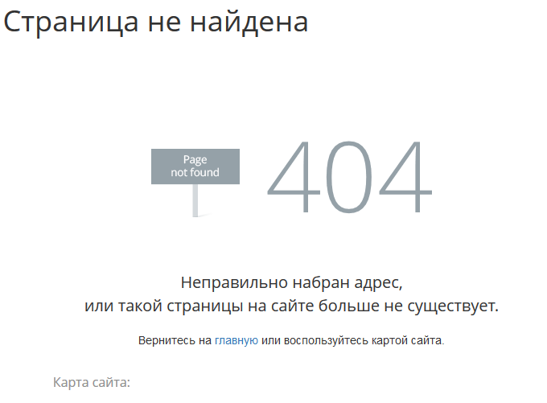
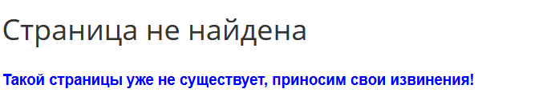

# Настройка вида страницы ошибки 404

**Навигация**
- [← Оглавление курса](index.md)
- [← Предыдущий: 12986 — Импорт и экспорт](lesson_12986.md)
- [Следующий: 1968 — Многоязычность →](lesson_1968.md)

Официальная страница урока: https://dev.1c-bitrix.ru/learning/course/index.php?COURSE_ID=35&LESSON_ID=3577

|  | ### Если страницы не существует |
| --- | --- |

При запросе пользователем страницы, отсутствующей на сервере, последний автоматически генерирует страницу с надписью, подобной этой:



Причин появления такой страницы может быть несколько:

- некорректная ссылка на сайте;
- неправильно введенный пользователем адрес;
- документ, на который ведет ссылка, был удален.

Можно сделать так, чтобы в таких случаях пользователь видел не техническую страницу, а заранее вами заготовленную. Для этого в корневом разделе сайта (Контент &gt; Структура сайта &gt; Файлы и папки) найдите файл

			**404.php**

                    В файле не рекомендуется размещать слишком тяжелый код. К тому же, заменять его на **404.html** нельзя, потому что данный файл участвует в работе [ЧПУ](https://dev.1c-bitrix.ru/learning/course/?COURSE_ID=35&CHAPTER_ID=04818&LESSON_PATH=3906.4493.4818).

		. В меню действий файла выберите **Редактировать как php**.

## Содержимое файла 404.php

В штатной установке *1С-Битрикс: Управление сайтом*  файл 404.php содержит следующий код:

```

<?
// подключение файла обработки адресов urlrewrite.php
include_once($_SERVER['DOCUMENT_ROOT'].'/bitrix/modules/main/include/urlrewrite.php');

// установка HTTP статуса 404
CHTTP::SetStatus("404 Not Found");
@define("ERROR_404","Y");
// скрывает боковую панель на странице
define("HIDE_SIDEBAR", true);

// подключение header.php
require($_SERVER["DOCUMENT_ROOT"]."/bitrix/header.php");

// установка заголовка страницы
$APPLICATION->SetTitle("Страница не найдена");?>

<! -- начало содержимого страницы 404.php -->
	<div class="bx-404-container">
		<div class="bx-404-block">images/404.png" alt=""></div>
		<div class="bx-404-text-block">Неправильно набран адрес, <br>или такой страницы на сайте больше не существует.</div>
		<div class="">Вернитесь на <a href="<?=SITE_DIR?>">главную</a> или воспользуйтесь картой сайта.</div>
	</div>
	<div class="map-columns row">
		<div class="col-sm-10 col-sm-offset-1">
			<div class="bx-maps-title">Карта сайта:</div>
		</div>
	</div>

	<div class="col-sm-offset-2 col-sm-4">
		<div class="bx-map-title"><i class="fa fa-leanpub"></i> Каталог</div>

	</div>

	<div class="col-sm-offset-1 col-sm-4">
		<div class="bx-map-title"><i class="fa fa-info-circle"></i> О магазине</div>
		// подключение компонента Карта сайта
		<?
		$APPLICATION->IncludeComponent(
			"bitrix:main.map",
			".default",
			array(
				"CACHE_TYPE" => "A",
				"CACHE_TIME" => "36000000",
				"SET_TITLE" => "N",
				"LEVEL" => "3",
				"COL_NUM" => "2",
				"SHOW_DESCRIPTION" => "Y",
				"COMPONENT_TEMPLATE" => ".default"
			),
			false
		);?>
	</div>
<! -- окончание содержимого страницы 404.php -->

<! --  подключение файла footer.php -->
<?require($_SERVER["DOCUMENT_ROOT"]."/bitrix/footer.php");?>
```

Внесите необходимые изменения в его содержимое и сохраните их. После этого при возникновении ошибки 404 отобразится созданная вами страница (в примере ниже удалён компонент **Карта сайта**, добавлен текст и настроен размер и цвет шрифта):



**Примечание**: При

			многосайтовости

                    
Технически многосайтовая версия продукта может быть реализована в двух 

конфигурационных режимах:

**Многосайтовость на одном домене.** (Старое название: Многосайтовость по первому
способу.) Продукт и все сайты работают под управлением одной копии веб-сервера Apache.

**Многосайтовость на разных доменах.** (Старое название: Многосайтовость по второму 

способу.) Каждый сайт работает под управлением отдельной копии веб-сервера Apache или 

отдельного виртуального веб-сервера.

[Подробнее](https://dev.1c-bitrix.ru/learning/course/?COURSE_ID=103&CHAPTER_ID=03987&LESSON_PATH=8799.3987)...

		 для каждого из сайтов можно создать свою **страницу ошибки 404**. Для этого в папке второго сайта (например, **/site2**) необходимо:

1. Создать файл
  			.htaccess
  **.htaccess** (от англ. hypertext access) - файл дополнительной конфигурации веб-сервера **Apache**. Позволяет задавать большое количество дополнительных параметров и разрешений для работы веб-сервера в отдельном каталоге без изменения главного конфигурационного файла **httpd.conf**.
  [Подробнее](https://dev.1c-bitrix.ru/learning/course/index.php?bitrix_include_areas=Y&COURSE_ID=32&LESSON_ID=3295)...
  		 (если он ещё не создан). В этом файле прописать код:
  ```
  ErrorDocument 404 /site2/404.php
  <IfModule mod_rewrite.c>
  	RewriteEngine Off
  </IfModule>
  ```
2. Создать и разместить файл **404.php** (пример файла рассмотрен ранее).

## Частые вопросы

При настройке отображения 404 страницы возникают следующие вопросы:

1. **Вопрос:** На сайте создан инфоблок и информация в публичном разделе выводится с помощью компонентов. Настроен [ЧПУ](https://dev.1c-bitrix.ru/learning/course/index.php?COURSE_ID=34&LESSON_ID=3579).
   Если раздел или элемент удалены, то вместо 404 ошибки на странице выведено сообщение Раздел не найден или Элемент не найден. Как сделать вывод 404 ошибки?
  **Решение:** в настройках компонента в разделе **Настройки 404 ошибки** отметить опции:
  В результате, если при обращении к странице система не найдет элемент или раздел инфоблока, то при отмеченных опциях, вместо HTTP статуса **200**, веб-сервер сообщит HTTP статус **404** и покажет специальную страницу **404.php**.

  - Устанавливать статус 404;
  - Показ специальной страницы
                        По умолчанию будет выведена страница **/404.php**. Если Вы хотите показывать другую страницу - укажите её в следующем поле **Страница для показа**
    		.
2. **Вопрос:** Сайт работает на сервере **nginx** и переадресация на 404.php не работает.
  Если используется сервер nginx, то в конфигурации сервера пропишите строку `error_page 404 /404.php;`.
