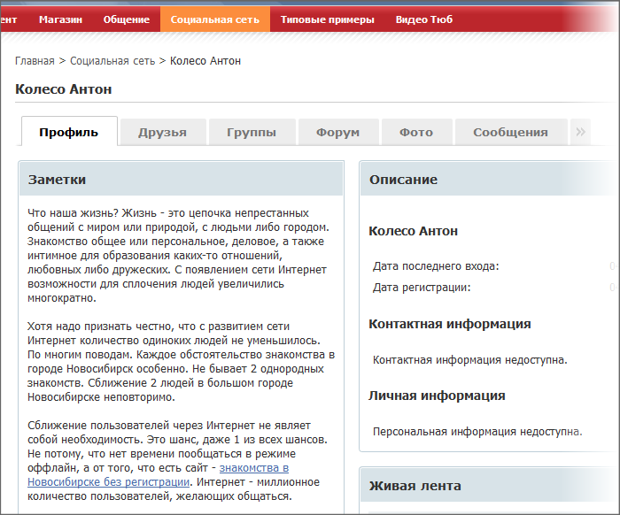
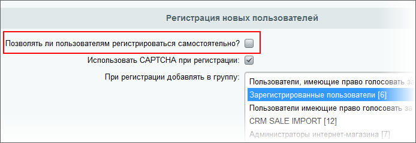

# Что делать с ботами?

**Навигация**
- [← Оглавление курса](index.md)
- [← Предыдущий: 3799 — Пример настроек закладки Безопасность группы пользователей](lesson_3799.md)
- [Следующий: 3092 — Борьба с автоматической регистрацией →](lesson_3092.md)

Официальная страница урока: https://dev.1c-bitrix.ru/learning/course/index.php?COURSE_ID=35&LESSON_ID=3734

|  | ### Что делать с ботами? |
| --- | --- |

> **Бот** (сокр. от «робот») в интернет-проектах и сервисах - специальная программа, имитирующая деятельность человека. Может использоваться для различных технических нужд: повышения удобства остальных пользователей, совершения однотипных операций владельцами проекта. Однако существует и практика использования ботов, когда остальным участникам неизвестно, что это бот: для троллинга или спама, скрытой записи логов канала, для вандализма.

Цели регистрации ботов - коммерческий спам или политическое влияние. В обоих случаях регистрация ботов может происходить как "про запас", так и аккаунты сразу могут начать вести активную деятельность.

Если боты регистрируются на вашем проекте, но не ведут активной деятельности, то это, скорее всего, набор базы сайтов. Боты проверили возможность регистрации и занесли ваш сайт в свой список. Потом владельцы ботов, получив заказ, пройдут по этой своей базе и добавят текстовой рекламы с ссылками в тексте, или польют грязью товары конкурентов или политиков на выборах в текстовой форме - смотря что проплатят:

В популярных CMS боты могут даже использовать инструменты самой CMS для придания ощущения "живого" пользователя, как в примере выше, где бот использовал не просто живую ленту на странице собственного аккаунта, а создал сообщение в гаджете **Заметки**.

Боты, "заточенные" под определённую CMS могут реагировать на какие-то присущие ей особенности, например, на стандартный шаблон демонстрационной версии, который, из соображений экономии, владелец сайта не стал менять, а просто "чуть-чуть" подправил под себя.

Подавляющее большинство ботов регистрируется на сайтах автоматически, без участия человека. В некоторых случаях (когда ресурс особо "ценен" с точки зрения спама или политических манипуляций, но с высокой степенью защиты) регистрацию проводят люди, а аккаунт потом передаётся под управление программам-спамерам.

Если на сайте регистрируется, допустим, по 20-40 ботов в день (это реальный кейс), то через полгода на сайте будет уже 180 дней х 30 ботов = 5400 профилей (возможно, даже реальных пользователей на сайте не будет столько). Эти аккаунты готовы к программному управлению извне (писать рекламные посты, изменить свой профиль, добавив в него ссылки, плюсовать или минусовать авторитет других и друг друга, писать матом или в личные сообщения и тому подобное).

Когда число регистрирующихся ботов достигает некоторой большой величины, допустим, 40 штук в день при определённой посещаемости сайта, то приходится прибегать к экстренной мере: временному отключению возможности самостоятельной регистрации в настройках Главного модуля (опция

			Позволять ли пользователям регистрироваться самостоятельно?

                    

		).

Администратора не должно успокаивать то, что боты просто регистрируются и ничего не делают, находятся в спячке. Потом, одним ударом (или не одним), эти пользователи напишут по одному-другому сообщению везде, где укажут хозяева, нанеся вред как вашему ресурсу, так и тем, против кого будут работать сообщения. Подобные ситуации потенциально опасны и их нужно упреждать, иначе, придётся удалять сразу всю базу пользователей, и реальных и ботов вместе.

Ваш ресурс должен быть не привлекательным для спама - например, вырезать из текста линк на рекламируемый ресурс или помещение добавляемого сообщения в очередь на модерацию. Последнее - самое эффективное, но, к сожалению, трудозатратное средство защиты. Поэтому надо использовать методы защиты от автоматической регистрации и периодически проверять базу пользователей на наличие ботов.

Компания "1С-Битрикс" вряд ли сможет создать решение проблемы ботов "из коробки". Любое такое программное решение боты достаточно быстро научатся обходить. Это просто вопрос денег - заплатить программистам за разработку обхода. Для популярной CMS такие вложения быстро окупятся. Нужно применять своё, "нестандартное" решение, либо использовать комплекс мер.

Чем более нестандартный (хоть и даже простой) способ вы придумаете, тем меньше будет ботов. Ваши решения не будут обходиться просто потому что это дорого: программная разработка алгоритма регистрации на одном, конкретно взятом сайте.

От ручного спама не защититесь и от написания софта "под вас" тоже, но это обычно сопутствует суперпопулярности. "Ловля на взлете" для раскрученных ресурсов не может быть эффективной на 100%, поэтому и вряд ли оправданы какие-то усложненные регистрации. Нужно периодически ещё проверять базу пользователей.
