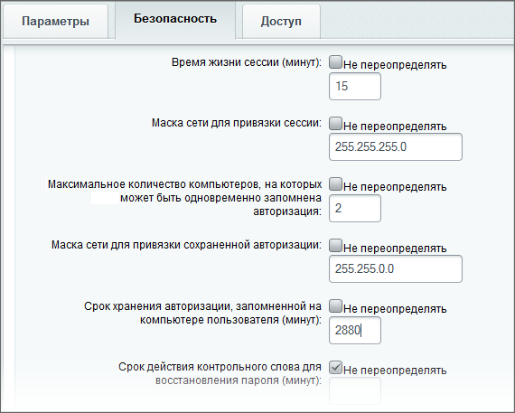

# Пример настроек закладки Безопасность группы пользователей

**Навигация**
- [← Оглавление курса](index.md)
- [← Предыдущий: 3556 — Контроль за изменениями в системе](lesson_3556.md)
- [Следующий: 3734 — Что делать с ботами? →](lesson_3734.md)

Официальная страница урока: https://dev.1c-bitrix.ru/learning/course/index.php?COURSE_ID=35&LESSON_ID=3799

### Оптимальное время жизни авторизации

Одна из задач, которую приходится решать администратору - это сочетание безопасности работы сайта и удобства работы пользователя. Например, снять с пользователя необходимость частой авторизации.

Неопытный администратор долгую авторизацию пользователя пытается решить через параметр

			Время жизни сессии

                    Даже если вы захотите увеличить значение этого параметра, учтите, что увеличить значение больше чем установлено в файле **php.ini** в параметре **session.gc_maxlifetime** - невозможно. Для изменения этого параметра необходимо обратиться к администратору сервера.

		, что неправильно. Долгая жизнь сессии (более 20-30 минут) у множества пользователей неизбежно приведёт к замедлению работы сайта из-за увеличения количества сессий на активных сайтах.

Гораздо лучше для этого использовать сочетание параметров закладки **Безопасность** в настройках

			группы пользователей

                     

		 (Настройки &gt; Пользователи &gt; Группы пользователей &gt; {группа_пользователей}).

Прежде всего устанавливаем

			маску

                    Маска подсети — битовая маска для определения по IP-адресу адреса подсети и адреса узла (хоста, компьютера, устройства) этой подсети. В отличие от IP-адреса маска подсети не является частью IP-пакета.

[Подробнее ...](https://ru.wikipedia.org/wiki/%D0%9C%D0%B0%D1%81%D0%BA%D0%B0_%D0%BF%D0%BE%D0%B4%D1%81%D0%B5%D1%82%D0%B8)

		 для **Маски сети для привязки сессии**. Этот параметр можно задать достаточно строго, так как за короткий период жизни сессии пользователь вряд ли сменит провайдера.

Для долгой авторизации можно использовать настройку трёх параметров:

- Поле **Максимальное количество компьютеров, на которых может быть  одновременно запомнена авторизация** не должно быть большим. Для сотрудников, работающих только в организации, естественно, это - 1. Для тех, кто может входить на сайт с разных компьютеров (рабочий, домашний, мобильные устройства) - число должно быть определено конкретно. Если в одной и той же группе есть пользователи с существенно разным числом компьютеров, то есть смысл подумать о создании новых групп пользователей. (Если руководством проекта задаются строгие требования к безопасности.)
- Для пользователей, работающих с разных мест имеет значение поле **Маска сети для привязки сохраненной авторизации**. Оно позволяет сохранять авторизацию используя разных провайдеров. Чем меньше провайдеров используется, тем строже может быть маска. Если постоянно используется один и тот же, то рекомендуется маска 255.255.255.0. Если провайдеров может быть несколько, то маску нужно расширить, скажем, 255.255.0.0. Выбор вместо 0 промежуточных значений (что позволяет повысить безопасность) зависит от конкретных условий работы вашей сети.
- Значение поля **Срок хранения авторизации, запомненной на компьютере пользователя** не рекомендуется больше одной недели.

Пример настройки для группы пользователей, работающих в течение рабочей недели на работе и дома с нескольких компьютеров может быть таким:

### Где посмотреть политику безопасности

Если пользователь находится в нескольких группах с разными политиками безопасности, то иной раз бывает сложно сказать что ему доступно. Посмотреть суммарную политику безопасности, применяемую к конкретному пользователю можно на странице редактирования его профиля на закладке **Безопасность**:

Номер группы, которая переопределяет тот или иной параметр безопасности по умолчанию показан в виде ссылки, по которой можно сразу перейти в форму редактирования группы.
