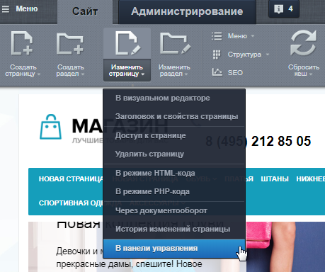
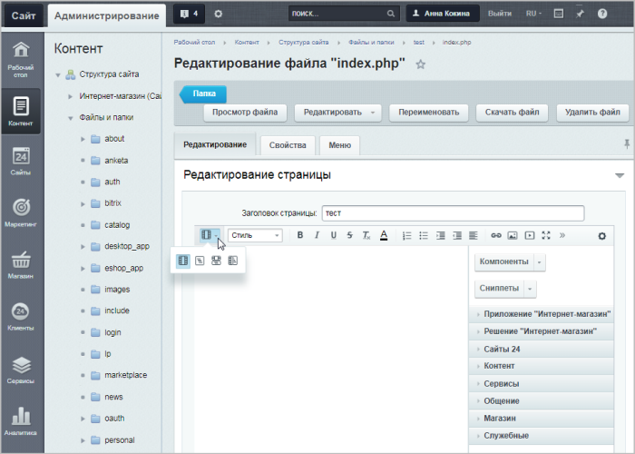

# Работа с визуальным редактором

**Навигация**
- [← Оглавление курса](index.md)
- [← Предыдущий: 1903 — Сниппеты в визуальном редакторе](lesson_1903.md)
- [Следующий: 1904 — Работа с PHP-скриптом →](lesson_1904.md)

Официальная страница урока: https://dev.1c-bitrix.ru/learning/course/index.php?COURSE_ID=35&LESSON_ID=4482

|  | ### Работа с визуальным редактором |
| --- | --- |

Работать с визуальным редактором можно и в

			публичном разделе

                    
В любой работе важен хороший инструмент. И работа с веб-сайтами не исключение. 1С-Битрикс обладает мощным встроенным WYSIWYG редактором для работы со страницами сайта. Благодаря визуальному редактору мы прямо в браузере выполняем многие операции: от простого редактирования текста до настройки компонентов. По сути, с помощью визуального редактора мы способны редактировать любую информацию на сайте. 

[Подробнее](https://dev.1c-bitrix.ru/learning/course/index.php?COURSE_ID=34&CHAPTER_ID=06299&LESSON_PATH=3905.6299)...

		, и в административном. Работа визуального редактора в Административном разделе идентична работе в Публичной части.

Чтобы перейти к редактированию страницы в Административном разделе, нужно выбрать соответствующую команду в

			Публичном разделе

                     

		 или в

			Административном разделе.

                     

**Примечание.** В публичном разделе *коробочной версии Битрикс24* такая панель управления по умолчанию скрыта — предварительно потребуется

			включить ее показ

                    
Чтобы включить показ административной панели, выполните следующие действия:

1. Авторизуйтесь под администратором и перейдите в административный раздел по ссылке http://адрес_вашего_портала/bitrix/.
2. Перейдите на страницу с настройками главного модуля (Настройки &gt; Настройки продукта &gt; Настройки модулей &gt; Главный модуль).
3. В параметре **Всегда показывать панель для пользователей** выберите пользователей или целые группы пользователей, для которых административная панель должна быть показана.

[Подробнее](https://dev.1c-bitrix.ru/learning/course/index.php?COURSE_ID=48&LESSON_ID=4508)...

		.

При редактировании страницы в Административном разделе появится специальное меню для работы с существующей страницей, а также сам

			визуальный редактор

                    Визуальный редактор может работать в двух режимах. Визуальный режим - более простой и интуитивно понятный вариант. Мы сразу видим как будут выглядеть элементы на странице. Второй вариант - режим исходного кода. Он предназначен для опытных пользователей и позволяет произвести дополнительную настройку (например, задать значения параметров).
[Подробнее](https://dev.1c-bitrix.ru/learning/course/index.php?COURSE_ID=34&LESSON_ID=6301)...

		:

