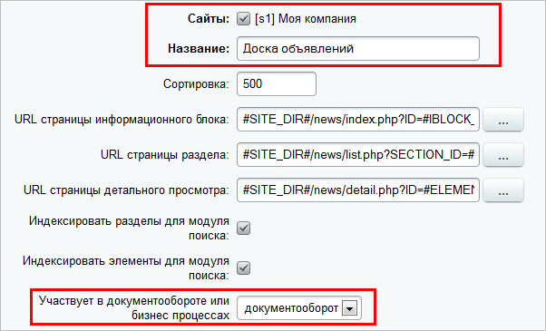
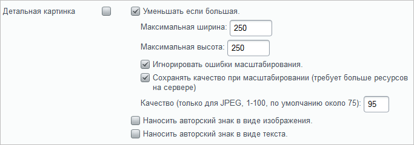
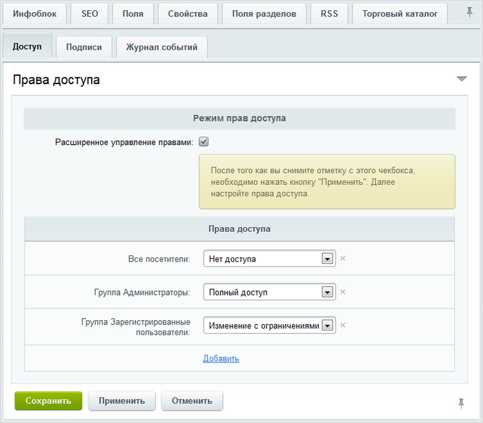

# Создание инфоблока

**Навигация**
- [← Оглавление курса](index.md)
- [← Предыдущий: 2530 — Постановка задачи](lesson_2530.md)
- [Следующий: 4683 — Создание раздела и размещение компонента →](lesson_4683.md)

Официальная страница урока: https://dev.1c-bitrix.ru/learning/course/index.php?COURSE_ID=35&LESSON_ID=4511

|  | ### Где будем хранить информацию |
| --- | --- |

 

Создайте инфоблок

                    Для создания инфоблока перейдите на страницу Контент &gt; Инфоблоки &gt; Типы инфоблоков &gt; название_типа

[Подробнее ...](https://dev.1c-bitrix.ru/learning/course/index.php?COURSE_ID=34&CHAPTER_ID=02011&LESSON_PATH=3905.4477.2011)

		, который будет хранить объявления. Как правило, для инфоблоков подобного, сервисного плана используется отдельный Тип инфоблоков, в нашем примере это будет тип Сервисы.

На закладке **Инфоблок** формы создания впишите название инфоблока, отметьте свой сайт как тот, на котором данный инфоблок будет использоваться и укажите участие в

			документообороте

                    Должен быть установлен модуль **Документооборот**.

Проверить установлен ли модуль можно в Административном разделе по пути: *Настройки &gt; Настройки продукта &gt; Модули*.
Модуль доступен только в лицензиях **Бизнес** и **Энтерпрайз**.

		:

 

 

На закладке **Поля** укажем параметры загружаемых изображений:

 

 

На закладке **Доступ** установите для зарегистрированных пользователей право на инфоблок как **Изменение с ограничениями**: это не позволит пользователям удалять или изменять объявления. Чтобы появилось это право, включите **Расширенное управление правами** и нажмите **Применить**.

 

 

Сохраните внесенные изменения.
