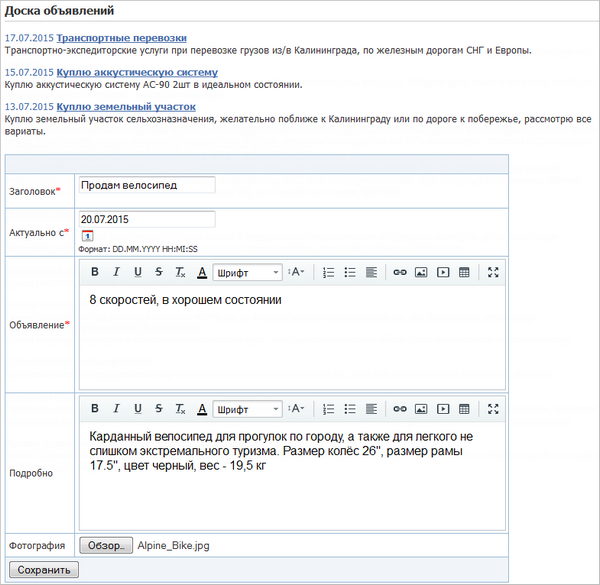
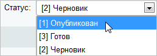
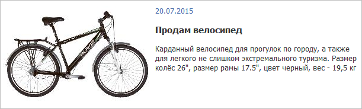

# Результат

**Навигация**
- [← Оглавление курса](index.md)
- [← Предыдущий: 4676 — Форма добавления объявлений](lesson_4676.md)
- [Следующий: 4941 — Подключение редактора →](lesson_4941.md)

Официальная страница урока: https://dev.1c-bitrix.ru/learning/course/index.php?COURSE_ID=35&LESSON_ID=4512

|  | ### Как работает то, что мы сделали |
| --- | --- |

Созданная доска объявлений будет иметь следующий вид:

 

 

При нажатии кнопки **Сохранить** новое объявление будет добавлено в инфоблок в статусе **Черновик**. Для публикации объявления на сайте администратор после модерации выставляет ему статус

			**Опубликован**

                    

		.

 

Если кликнуть по заголовку опубликованного объявления, то оно откроется в режиме детального просмотра (появятся информация полей **Подробно** и **Фотография**):

 

