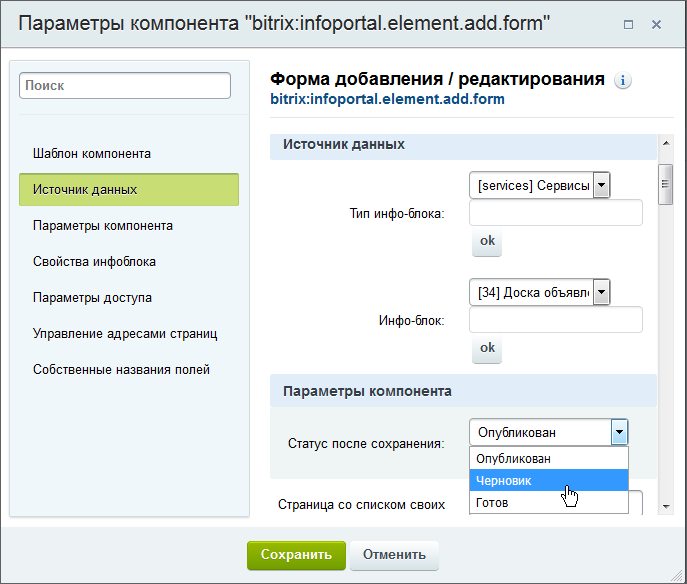
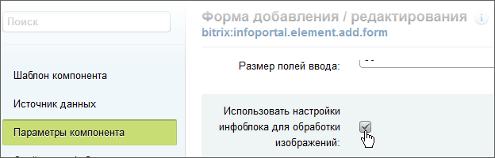
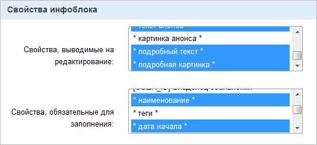
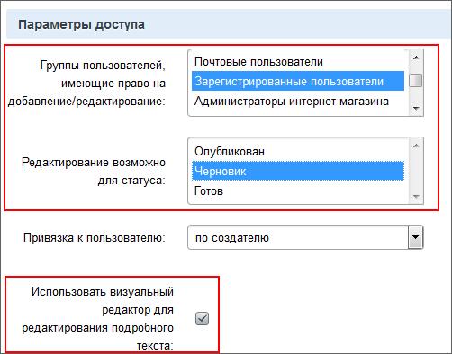

# Форма добавления объявлений

**Навигация**
- [← Оглавление курса](index.md)
- [← Предыдущий: 4683 — Создание раздела и размещение компонента](lesson_4683.md)
- [Следующий: 4512 — Результат →](lesson_4512.md)

Официальная страница урока: https://dev.1c-bitrix.ru/learning/course/index.php?COURSE_ID=35&LESSON_ID=4676

|  | ### Как пользователь будет создавать объявление |
| --- | --- |

На эту же страницу, под компонентом **Новости**, добавьте компонент

			**Форма добавления / редактирования**

                    Компонент осуществляет вывод формы создания (редактирования) элемента указанного информационного блока. Компонент стандартный и входит в дистрибутив модуля. В визуальном редакторе компонент расположен по пути: *Контент &gt; Добавление элементов &gt; Форма добавления / редактирования*. Компонент относится к модулю Информационные блоки.

 

						[Описание компонента «Форма добавления / редактирования» в пользовательской документации.](http://dev.1c-bitrix.ru/user_help/detail.php?ID=62993)

		. Данный компонент потребуется нам для реализации возможности добавления новых объявлений непосредственно с доски объявлений. Настроим его следующим образом:

 

- в **Источнике данных** выберите созданный нами инфоблок и установите статус после сохранения объявления **Черновик**, чтобы администратор мог просмотреть объявление перед его публикацией;
  
- установите опцию
  			**Использовать настройки инфоблока для обработки изображений**
                      
  		.
- Укажите
  			поля
                      
  		которые можно редактировать и обязательные для заполнения поля: **наименование**,
  			**дата начала**
                      Обязательное к заполнению по техническим причинам, иначе есть вероятность что объявление будет опубликовано с задержкой.
  		, **текст анонса**, **подробный текст** и **подробная картинка**.
- В группе полей **Параметры доступа** настройте
  			следующие опции
                      
  		:

  - Установите для зарегистрированных пользователей право на добавление\редактирование своих объявлений.
  - Редактирование возможно для статуса **Черновик**. Это необходимо в случае неустановленного модуля **Документооборот**.
  - Разрешим использование визуального редактора для редактирования текста анонса и подробного описания.
- Установите для формы добавления собственные названия полей:
  

 
 

Остальные настройки компонента трогать не будем. Сохраните внесенные изменения.
