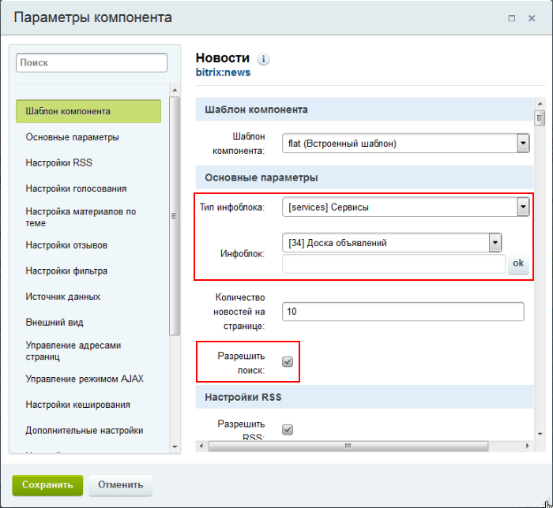
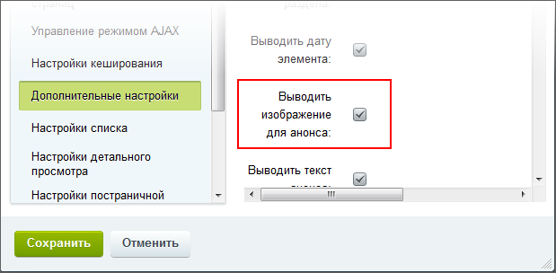
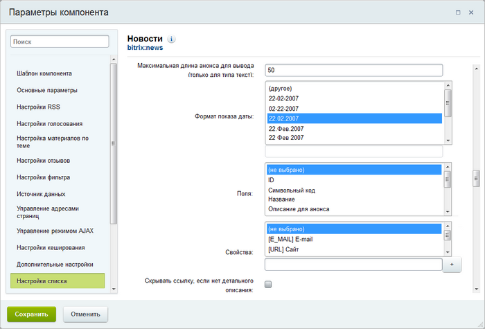

# Создание раздела и размещение компонента

**Навигация**
- [← Оглавление курса](index.md)
- [← Предыдущий: 4511 — Создание инфоблока](lesson_4511.md)
- [Следующий: 4676 — Форма добавления объявлений →](lesson_4676.md)

Официальная страница урока: https://dev.1c-bitrix.ru/learning/course/index.php?COURSE_ID=35&LESSON_ID=4683

|  | ### Вывод данных |
| --- | --- |

После того, как вы

			создали страницу или раздел

                    Создавать страницу лучше сразу в том разделе, где она должна "жить". Перенести неверно созданную страницу можно, но зачем лишние действия? Создание страниц доступно с помощью Мастера, по шаблону и через документооборот.

[Подробнее ...](/learning/course/index.php?COURSE_ID=34&LESSON_ID=1911)

		, где будет работать доска объявлений,

			разместите

                    Как разместить компонент на странице?

Просто переместите его мышкой в рабочую область слева от списка. Заметьте, что у простых 

компонентов серая иконка, а у комплексных - зеленая: 

[Подробнее ...](/learning/course/index.php?COURSE_ID=34&LESSON_ID=9163)

		 на ней комплексный компонент

			**Новости**

                    Комплексный компонент позволяет создать новостной раздел на сайте. Доступен просмотр детальной информации, списка элементов, настройка экспорта в rss, организация голосования за новости (или другие элементы инфоблоков), настройка отзывов, вывода материалов по темам, настройки ЧПУ и многое другое.

						[Описание компонента «Новости (комплексный компонент)» в пользовательской документации.](http://dev.1c-bitrix.ru/user_help/detail.php?ID=62967)

		 и в его настройках выберите созданный инфоблок в качестве источника данных:

  

Разрешим

			вывод изображений для анонса

                    **Важно!**Снятие галочки с поля **Выводить изображение для анонса** приведет к запрету
 показа всех изображений.

		 и поиск по объявлениям.

 

В **Настройках списка** укажем максимальную длину анонса в 50 символов и разрешим показ названия объявления в виде ссылки на детальный просмотр, даже при отсутствии детального описания (поскольку там может быть загружена фотография):

 

 

Остальные настройки компонента трогать не будем. Сохраните внесенные изменения.
