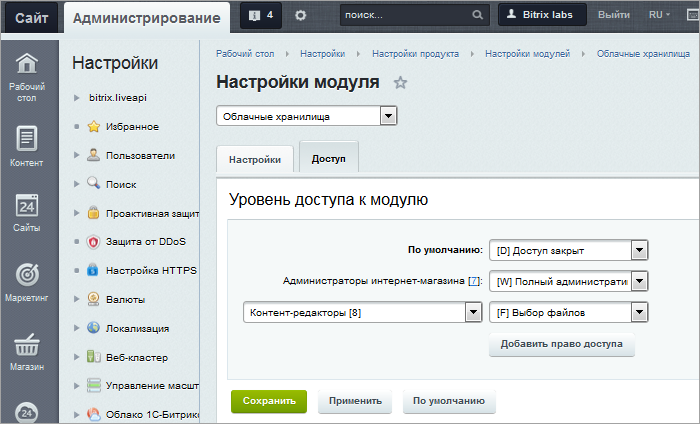

# Облачные хранилища - настройка модуля

**Навигация**
- [← Оглавление курса](index.md)
- [← Предыдущий: 5070 — Что такое облачные хранилища](lesson_5070.md)
- [Следующий: 3102 — Создание подключения →](lesson_3102.md)

Официальная страница урока: https://dev.1c-bitrix.ru/learning/course/index.php?COURSE_ID=35&LESSON_ID=4826

|  | ### Настройка модуля |
| --- | --- |

Для настройки модуля **Облачные хранилища** перейдите на страницу Настройки &gt; Настройка Продукта &gt; Настройки модулей &gt; Облачные хранилища:

На вкладке **Настройки** указывается, следует ли **Записывать 404 ошибки на перемещенных в облака файлах в журнал событий**.

На вкладке **Доступ** настраиваются права доступа к модулю Облачные хранилища для групп пользователей. Работа на вкладке аналогична таковой для модуля

			Веб-формы.

                    
На вкладке **Доступ** указывается уровень доступа к настройкам форм и результатам заполнения.

Чтобы добавить право доступа для какой-либо группы пользователей, нажмите ссылку **Добавить право доступа**. В противном случае ко всем группам пользователей, кроме администраторов, будет применено право доступа **По умолчанию**.

[Подробнее](/learning/course/index.php?COURSE_ID=41&LESSON_ID=2858#dostup)...

|  | #### Документация по теме: |
| --- | --- |

- [Описание модуля](https://dev.1c-bitrix.ru/user_help/settings/clouds/index.php)
