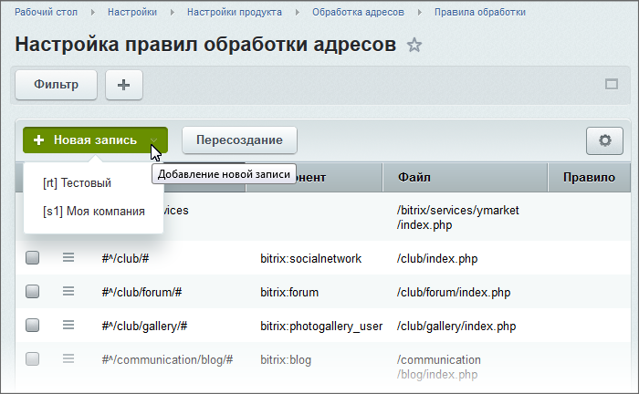
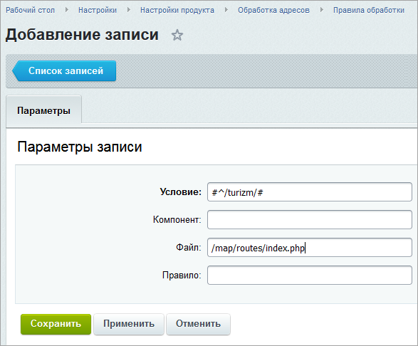

# Проверка настроек

**Навигация**
- [← Оглавление курса](index.md)
- [← Предыдущий: 4901 — Примеры правил](lesson_4901.md)
- [Следующий: 8621 — Что такое рейтинги →](lesson_8621.md)

Официальная страница урока: https://dev.1c-bitrix.ru/learning/course/index.php?COURSE_ID=35&LESSON_ID=4911

Проверить работу правила обработки несложно. Просто впишите путь в адресную строку и увидите, открылся ли нужный файл (страница). Если же этого не произошло – расскажем, в чём может быть проблема.

### Видеоурок

### Порядок действий (пример)

- Перейдите на страницу Настройки &gt; Настройки продукта &gt; Обработка адресов &gt; Правила обработки. Выберите пункт
  			**Новая запись**
                      
  		, нужный сайт и заполните форму
  			следующим образом
                      
  		:
  ```
  Условие: #^/turizm/#
  Компонент: ничего не указываем
  Файл: /map/routes/index.php (нужно указать файл, который фактически будет работать)
  Правило: ничего не указываем.
  ```
- Перейдите по адресу в разделе /turizm/.
  Например, http://localhost/turizm/map.html.
  Если ЧПУ работает, то вы должны увидеть содержимое страницы, указанной в поле **Файл** в правиле переопределения.

	 

### Правило не работает

В случае, если правило не заработало, проверьте следующие пункты:

1. Проверьте правильность создания правила;
2. Убедитесь, что подключается именно указанный в правиле файл, а не какой-нибудь другой. И вы указали полный путь к файлу;
3. Проверьте файл **urlrewrite.php**. Возможно у вас срабатывает условие, которое находится выше.
4. Сразу после подключения **header.php** добавьте для проверки код:
  ```
  echo '<pre>'.print_r($_REQUEST, true).'</pre>';
  ```
  Это даст вам возможность увидеть, что попадает в `$_REQUEST`.
5. Если файл открывается правильный и в `$_REQUEST` порядок, тогда следует проверить параметры компонента и настройки инфоблока (доступ закрыт, деактивирован элемент, действительно нет элемента с данным ID и так далее).
