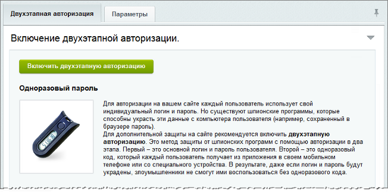

# Механизм двухэтапной авторизации

**Навигация**
- [← Оглавление курса](index.md)
- [← Предыдущий: 6686 — Система одноразовых паролей](lesson_6686.md)
- [Следующий: 6838 — Какие устройства можно подключить →](lesson_6838.md)

Официальная страница урока: https://dev.1c-bitrix.ru/learning/course/index.php?COURSE_ID=35&LESSON_ID=5002

### Видеоурок

 

### Включение механизма двухэтапной авторизации

Для авторизации на сайте с включенным механизмом двухэтапной авторизации пользователю нужно пройти два этапа: указать логин/пароль своей учётной записи, а также ввести секретный одноразовый пароль.

Включение/отключение механизма двухэтапной авторизации на сайте производится на странице **Двухэтапная авторизация** (Настройки &gt; Проактивная защита &gt; Двухэтапная авторизация).

### Настройки механизма двухэтапной авторизации

На закладке **Параметры** (Настройки &gt; Проактивная защита &gt; Двухэтапная авторизация) можно настроить параметры механизма двухэтапной авторизации:

## Подробное описание значений полей

- **Размер окна проверки паролей** - задается размер окна проверки паролей, если используется алгоритм генерации паролей **по счетчику** (
  			мобильное приложение
  Наиболее простым и удобным способом авторизации на сайте, использующим двухэтапную авторизацию, является авторизация с использованием мобильного приложения.
  Чтобы использовать такой способ, необходимо установить на мобильный телефон специальное приложение и затем подключить его на сайте, заполнив специальную форму. После чего, при каждой авторизации, помимо логина и пароля необходимо будет ввести еще и код, который и будет генерироваться с помощью приложения.
  [Подробнее](lesson_5005.md)...
  		 или
  			аппаратное устройство OTP
  Помимо мобильного приложения для двухэтапной авторизации
  можно использовать и аппаратные устройства, например,
  "брелок" Aladdin eToken PASS:
  
  [Подробнее](lesson_5006.md)...
  		).
  	Если на устройстве была нажата кнопка несколько раз (например, случайно), но не было выполнено ни одной удачной аутентификации, то при превышении числа нажатий значения, заданного в этом параметре, произойдет нарушение
  			синхронизации
  Синхронизация необходима для случаев, когда на устройстве генерации одноразовых паролей **по счетчику** была произведена генерация паролей несколько раз (например, случайно нажата кнопка на аппаратном устройстве), но не было выполнено ни одной удачной аутентификации. Тогда, в случае превышения числа нажатий значения, заданного в параметре **Размер окна проверки паролей**, произойдет нарушение синхронизации счетчика генерации, и пользователь не сможет выполнить вход на сайт.
  [Подробнее](lesson_5008.md)...
  		 счетчика генерации, и пользователь не сможет выполнить вход на сайт.
- **Алгоритм генерации паролей по умолчанию** - выбирается
  			алгоритм
  В продуктах «1C-Битрикс» поддерживаются два алгоритма генерации одноразовых паролей:
  | - по счетчику (HMAC-Based One-time Password, HOTP) - код будет доступен до тех пор, пока пользователь не запросит новый; - по времени (Time-based One-time Password, TOTP) - код будет доступен в течение 30 секунд с момента его получения, после чего он автоматически обновится. |
  | --- |
  [Подробнее](https://dev.1c-bitrix.ru/learning/course/index.php?COURSE_ID=35&CHAPTER_ID=05001&LESSON_PATH=3906.4829.4547.5001)...
  		 генерации паролей, который будет использоваться в системе по умолчанию:
  

  		**Разрешить запоминание одноразового пароля** - опция позволяет разрешить запоминание введенного одноразового пароля с помощью соответствующей опции в форме авторизации, что позволит в следующий раз его уже не запрашивать.
  **Примечание:** Опция позволят сохранить одноразовый пароль во всех случаях, согласно настройкам
  			политики безопасности
  | Опции:  
   - маска сети для привязки сохраненной авторизации - срок хранения авторизации, запомненной на компьютере пользователя |
  | --- |
  			[Подробнее](https://dev.1c-bitrix.ru/user_help/settings/users/group_edit.php#security)...
  		 группы, в которую входит пользователь, кроме случая самостоятельного завершения сессии.
  		**Разрешить использование резервных кодов** - опция разрешает использование функционала генерации
  			резервных кодов
                       Функционал резервных кодов используется для доступа на сайт в тех случаях, когда нет возможности использовать устройство двухэтапной авторизации. Например, если утерян брелок или телефон с приложением.
  		[Подробнее](lesson_5007.md)...
  		 авторизации, которые можно будет использовать для входа на сайт вместо одноразового пароля.
  		 Например, в случае утери устройства для двухэтапной авторизации, пользователь сможет *самостоятельно* авторизоваться на сайте только с помощью этих кодов.
  		**Требовать двухэтапную авторизацию** - опция позволяет **указанным ниже пользователям** через **заданное время** принудительно включить двухэтапную авторизацию.
  В редакциях **Стандарт** и **Малый бизнес** есть возможность включить двухэтапную авторизацию, но нет модуля **Социальная сеть**, где по умолчанию выводятся публичные инструменты подключения пользователями этой авторизации. В этом случае нужно добавить в публичную часть страницу с размещённым на ней компонентом **Подключение устройства OTP (bitrix:security.user.otp.init)**.
  		**Количество дней для подключения** - указывается период, в течение которого пользователь должен подключить свое устройство для двухэтапной авторизации. Отсчет времени начнется при первой авторизации пользователя после включения опции **требовать двухэтапную авторизацию**.
  По истечении указанного времени доступ на сайт будет возможен только с использованием одноразового пароля. Если в этом поле выбрано "0", то система будет требовать OTP уже при следующей авторизации пользователя.
  		**Пользователи с обязательной двухэтапной авторизацией** - указываются пользователи, для которых будет принудительно подключена двухэтапная авторизация.
  **Занести попытку запроса кода OTP в журнал** - опция позволяет записывать все запросы кода OTP в
  			журнал событий
                      **Журнал событий** - инструмент для просмотра событий на сайте и настройки оповещений.
  [Подробнее...](lesson_2034.md)
  		.

  - **по счетчику** - HOTP (RFC4226);
  - **по времени** - TOTP (RFC6238).

	

После включения механизма на сайте необходимо, чтобы пользователи произвели подключение своих

			устройств двухэтапной авторизации.

                     Одновременно можно использовать лишь одно средство (мобильное приложение/аппаратное устройство) для двухэтапной авторизации. При подключении нового устройства авторизоваться с помощью старого будет уже невозможно.

		[Подробнее](https://dev.1c-bitrix.ru/learning/course/index.php?COURSE_ID=35&CHAPTER_ID=05004&LESSON_PATH=3906.4829.4547.5001.5004)...

	

**Внимание!** В случае если пользователь в указанный промежуток времени не подключил свое устройство для двухэтапной авторизации и не может зайти на сайт, администратор может на странице редактирования пользователя

			отключить

                     **Отключить** - позволяет отключить двухэтапную авторизацию бессрочно или же на определенное количество дней.

		[Подробнее](lesson_5005.md#otp_off)...

		 для него двухэтапную авторизацию на необходимое время.

 

### Если не получается зайти на портал

При жалобах пользователей на невозможность войти на портал при подключённой двухэтапной авторизации нужно сделать следующее:

- При алгоритме **по времени** пользователь должен проверить
  			расхождение времени
  Двухэтапная авторизация допускает расхождение времени на устройстве со временем сервера не более одной минуты.
  		 на его устройстве и на сервере сайта (портала).
- При алгоритме **по счётчику** администратору нужно повторно подключить телефон пользователя как
  			аппаратное устройство.
  Для подключения устройства необходимо перейти на страницу редактирования пользователя (Настройки &gt; Пользователи &gt; Список пользователей), вкладка Двухэтапная авторизация.
  [Подробнее](lesson_5006.md)...

### Документация по теме

- [Пример настроек закладки Безопасность группы пользователей](lesson_3799.md) (курс Администратор. Базовый)
