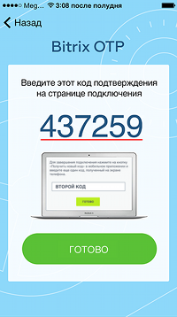

# Мобильное приложение

**Навигация**
- [← Оглавление курса](index.md)
- [← Предыдущий: 6838 — Какие устройства можно подключить](lesson_6838.md)
- [Следующий: 5006 — Аппаратное устройство →](lesson_5006.md)

Официальная страница урока: https://dev.1c-bitrix.ru/learning/course/index.php?COURSE_ID=35&LESSON_ID=5005

### Мобильное приложение

Наиболее простой и удобный способ авторизации на сайте, использующем

			одноразовые пароли

                    
**Одноразовый пароль** (англ. *one time password, OTP*) — это пароль, действительный только для одного сеанса аутентификации. Действие одноразового пароля также может быть ограничено определенным промежутком времени. Преимущество одноразового пароля по сравнению со статическим в том, что пароль невозможно использовать повторно. Таким образом, злоумышленник, перехвативший данные из успешной сессии аутентификации, не может использовать скопированный пароль для получения доступа к защищаемой информационной системе.

[Подробнее](lesson_6686.md)...

		 двухэтапной авторизации – авторизация с использованием мобильного приложения. Такой способ защиты используется в большинстве систем, и *«1С-Битрикс»* не исключение.

Чтобы использовать этот способ, нужно установить на мобильный телефон специальное приложение для генерации одноразовых паролей, а затем подключить его на сайте, заполнив специальную форму. После этого при каждой авторизации, помимо логина и пароля, необходимо будет ввести еще и код, который сгенерирует приложение.

> Рекомендуется использовать мобильное приложение *Bitrix24 OTP*:
>
>
> 
>
>
>
>
>
> Подробнее про работу с приложением можно посмотреть в статье на [helpdesk.bitrix24.ru](https://helpdesk.bitrix24.ru/open/6641271/).

**Внимание!** Перед подключением двухэтапной авторизации проверьте правильность установленного времени и часового пояса в вашем мобильном устройстве.

### Подключение приложения в административной части сайта

Подключить приложение можно и в **публичной**, и в **административной** части сайта.

Подробнее про подключение приложения в публичной части сайта смотрите в уроке

			Мобильное приложение Bitrix24 OTP.

                    
Скачайте приложение Bitrix24 OTP.

После запуска приложения выберите удобный вам способ получения кода...

[Подробнее](https://dev.1c-bitrix.ru/learning/course/index.php?COURSE_ID=34&LESSON_ID=6819)...

Для подключения мобильного приложения в административной части перейдите на страницу редактирования пользователя (Настройки &gt; Пользователи &gt; Список пользователей), вкладка **Двухэтапная авторизация**:

**Примечание:** Вкладка отображается только если в системе **включено** использование механизма двухэтапной авторизации.

1. С помощью кнопки **Подключить телефон** выберите
  			алгоритм
  В продуктах *«1C-Битрикс»* поддерживаются два алгоритма генерации одноразовых паролей:
  - **по счетчику** (HMAC-Based One-time Password, HOTP) - код будет доступен до тех пор, пока пользователь не запросит новый;
  - **по времени** (Time-based One-time Password, TOTP) - код будет доступен в течение 30 секунд с момента его получения, после чего он автоматически обновится.
  [Подробнее](https://dev.1c-bitrix.ru/learning/course/index.php?COURSE_ID=35&CHAPTER_ID=05001&LESSON_PATH=3906.4829.4547.5001)...
  		 генерации паролей, который будет использоваться для двухэтапной авторизации сайта и поддерживаться приложением:

  - **По счетчику** (HOTP);
  - **По времени** (TOTP).
2. В открывшейся форме отсканируйте с помощью приложения QR-код.
  

  В случае отсутствия возможности отсканировать QR-код воспользуйтесь ссылкой Ввести данные вручную.
  

  - При использовании алгоритма **по счетчику** получите *первый код* и введите его в **первое поле**.
    		Затем сгенерируйте *второй код* и введите его во **второе поле**.
  - При использовании алгоритма **по времени** получите *код* и введите его в **единственное поле**.

  - **Адрес сайта** вида **www.site.ru**;
  - **E-mail**, с которым был зарегистрирован пользователь на сайте;
  - **Секретный ключ**, который указан на картинке (можно не обращать внимания на пробелы);
  - **Тип ключа**.
3. Сохраните внесенные изменения.

После чего подключение будет завершено, а форма на вкладке **Двухэтапная авторизация** примет следующий вид:

## Описание возможных действий

- **Отключить** - позволяет отключить двухэтапную авторизацию **бессрочно** или же на **определенное** количество дней.
- **Резервные коды** - позволяет перейти к форме работы с
  			резервными кодами.
  Функционал резервных кодов используется для доступа на сайт в тех случаях, когда нет возможности использовать устройство двухэтапной авторизации. Например, при утере брелка или телефона с приложением.
  [Подробнее](lesson_5007.md)...
- **Синхронизировать** - позволяет перейти к форме
  			синхронизации
  Синхронизация необходима для случаев, когда на устройстве генерации одноразовых паролей по счетчику была произведена генерация паролей несколько раз (например, случайно нажата кнопка на аппаратном устройстве), но не было выполнено ни одной удачной аутентификации.
  [Подробнее](lesson_5008.md)...
  		 устройств.
- **Подключить новый брелок/телефон** - позволяет произвести подключение нового устройства двухэтапной авторизации.

Резервные коды доступны, если на странице настроек двухэтапной авторизации отмечена соответствующая опция.

**Внимание!** Одновременно можно использовать лишь одно средство (мобильное приложение/аппаратное устройство) для двухэтапной авторизации. При подключении нового устройства авторизоваться с помощью старого будет уже невозможно.
