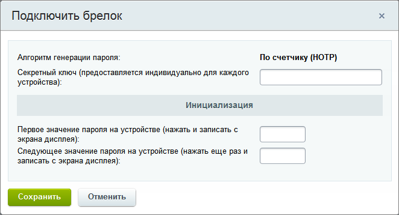
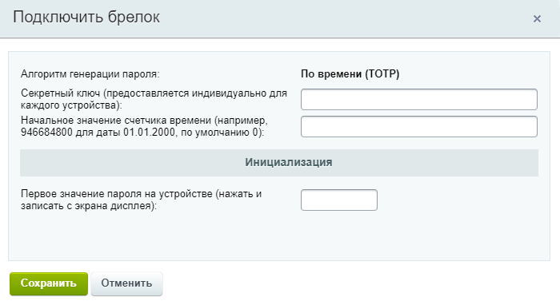

# Аппаратное устройство

**Навигация**
- [← Оглавление курса](index.md)
- [← Предыдущий: 5005 — Мобильное приложение](lesson_5005.md)
- [Следующий: 5007 — Резервные коды →](lesson_5007.md)

Официальная страница урока: https://dev.1c-bitrix.ru/learning/course/index.php?COURSE_ID=35&LESSON_ID=5006

|  | ### Аппаратное устройство |
| --- | --- |

Помимо мобильного приложения, для двухэтапной авторизации можно использовать и аппаратные устройства, например, USB-токен

			JaCarta WebPass

                     

[Подробнее](https://dev.1c-bitrix.ru/learning/course/index.php?COURSE_ID=34&LESSON_ID=6860&LESSON_PATH=3905.2339.6818.6860)...

		.

Чтобы подключить брелок, необходимо перейти на страницу редактирования пользователя (Настройки &gt; Пользователи &gt; Список пользователей), вкладка

			Двухэтапная авторизация:

                     
Вкладка отображается только если в системе **включено** использование механизма двухэтапной авторизации.

С помощью кнопки **Подключить брелок** выберите

			алгоритм

                    
В продуктах *«1C-Битрикс»* поддерживаются два алгоритма генерации одноразовых паролей:

- **по счетчику** (HMAC-Based One-time Password, HOTP) - код будет доступен до тех пор, пока пользователь не запросит новый;

- **по времени** (Time-based One-time Password, TOTP) - код будет доступен в течение 30 секунд с момента его получения, после чего он автоматически обновится.

[Подробнее](https://dev.1c-bitrix.ru/learning/course/index.php?COURSE_ID=35&CHAPTER_ID=05001&LESSON_PATH=3906.4829.4547.5001#algorithm)...

		 генерации паролей, который будет использоваться для двухэтапной авторизации сайта в соответствии с документацией к устройству и заполните поля в открывшейся форме:

- **По счетчику** (HOTP)
  

  - **Секретный ключ** – секретный ключ, который поставляется вместе с устройством.
  - **Первое значение пароля на устройстве** – вводится код, который необходимо сгенерировать с помощью устройства.
  - **Следующее значение пароля на устройстве** – вводится следующий по счету код, сгенерированный устройством.
- **По времени** (TOTP)
  

  - **Секретный ключ** – секретный ключ, который поставляется вместе с устройством.
  - **Начальное значение счетчика времени** – поле добавлено в версии 23.100.0 модуля Проактивная защита. Указывается начальное значение счетчика времени устройства (брелка). По умолчанию это значение равно 0, что соответствует дате 01.01.1970. Но если отсчёт времени устройства работает с другой даты, например с 01.01.2000, то необходимо указать время в формате
    			Unix Timestamp
                        Количество секунд, прошедших с полуночи 1 января 1970 года.
    		 (т.е. 946684800).
  - **Первое значение пароля на устройстве** – вводится код, который необходимо сгенерировать с помощью устройства.

Сохраните внесенные изменения.

	

После чего подключение будет завершено, а форма на вкладке **Двухэтапная авторизация** примет следующий вид:

## Описание возможных действий

- **Отключить** - позволяет отключить двухэтапную авторизацию **бессрочно** или же на **определенное** количество дней.
- **Резервные коды** - позволяет перейти к форме работы с
  			резервными кодами.
  Функционал резервных кодов используется для доступа на сайт в тех случаях, когда нет возможности использовать устройство двухэтапной авторизации. Например, если утерян брелок или телефон с приложением.
  [Подробнее](lesson_5007.md)...
- **Синхронизировать** - позволяет перейти к форме
  			синхронизации
  Синхронизация необходима для случаев, когда на устройстве генерации одноразовых паролей по счетчику была произведена генерация паролей несколько раз (например, случайно нажата кнопка на аппаратном устройстве), но не было выполнено ни одной удачной аутентификации.
  [Подробнее](lesson_5008.md)...
  		 устройств.
- **Подключить новый брелок/телефон** - позволяет произвести подключение нового устройства двухэтапной авторизации.

Резервные коды доступны, если на странице настроек двухэтапной авторизации отмечена соответствующая опция.

**Внимание!** Одновременно можно использовать лишь одно средство (мобильное приложение/аппаратное устройство) для двухэтапной авторизации. При подключении нового устройства авторизоваться с помощью старого будет уже невозможно.
