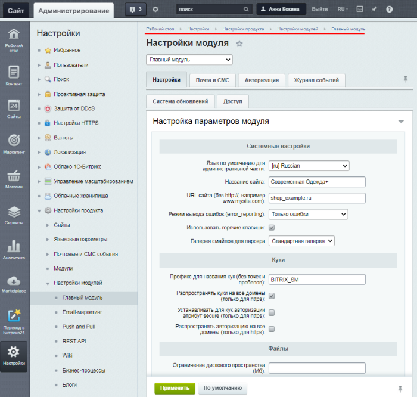

# Настройка главного модуля

**Навигация**
- [← Оглавление курса](index.md)
- [← Предыдущий: 2352 — Схема работы продукта](lesson_2352.md)
- [Следующий: 2021 — Создание и редактирование новых страниц и разделов →](lesson_2021.md)

Официальная страница урока: https://dev.1c-bitrix.ru/learning/course/index.php?COURSE_ID=35&LESSON_ID=5010

|  | ### Настройка системы в целом |
| --- | --- |

Главный модуль задаёт параметры работы системы в целом.

			Форма настройки

                     

		 находится на странице Настройки &gt; Настройки продукта &gt; Настройки модулей &gt; Главный модуль.

Значение каждого поля прописано в

			документации

                    Форма Настройки модуля служит для управления глобальными настройками как сайта в целом, так и каждого модуля в отдельности.

[Подробнее ...](/user_help/settings/settings/settings.php)

		. Здесь поясним несколько моментов, которые забываются администраторами.

На закладке **Настройки** рекомендуется:

- установить ограничения общего дискового пространства (рекомендации по размеру дать сложно, это зависит от назначения сайта, от доступного места на хостинге),
- установить ограничения на профайл пользователя, чтобы пользователь не испортил дизайн какой-то большой аватаркой (рекомендации тоже дать сложно, всё зависит от дизайна сайта),
- настроить каким группам пользователей показывать панель управления.

На закладке **Почта и СМС** рекомендуется установить ограничения на размер отправляемых по почте файлов. Устанавливаемые параметры зависят от параметров хостинга.

Закладка **Авторизация** очень важна, определяет условия и безопасность авторизации пользователей в системе.

С закладкой **Журнал** событий всё просто: выбираете сколько дней хранить события и какие именно события хранить в логе (Настройки &gt; Инструменты &gt; Журнал событий).

На закладке **Система обновлений** обратите внимание на поле **Установка для разработки**. При её включении на сайте проводится тестирование без закрытия публичного доступа к сайту или без установки продукта локально. Этот

			функционал

                    Установка для разработки позволяет проводить тестирование, не закрывая публичный доступ к сайту или не устанавливая продукт локально. Этот функционал поможет решить проблему коллективного доступа к одной установке продукта без возникновения ошибки ERROR_WRONG_CODE.

[Подробнее ...](/learning/course/index.php?COURSE_ID=135&LESSON_ID=8471)

		 также поможет решить проблему коллективного доступа к одной установке продукта.

Рекомендуется к использованию опция **Усиленная проверка корректности установки обновлений**. При копировании файлов из промежуточной папки `/updates/` в папки модулей будет выполняться проверка контрольной суммы. Если полученная контрольная сумма не соответствует исходной, то выводится сообщение о некорректной установке обновлений.

**Загружать только стабильные обновления** - выключение этой опции для тех, кто любит рисковать, т.к. тогда на сайт установятся обновления в статусе **beta**. Вы получите новый функционал до перевода в стабильный статус, но рискуете получить нерабочую систему, если тестировщики "1С-Битрикс" пропустили какой-то баг.

Настройка доступа к модулю производится [обычным способом](lesson_2016.md): выбор группы пользователей и указание уровня прав для неё.

 

|  | #### Документация по теме: |
| --- | --- |

- [Настройки главного модуля](https://dev.1c-bitrix.ru/user_help/settings/settings/settings.php)
