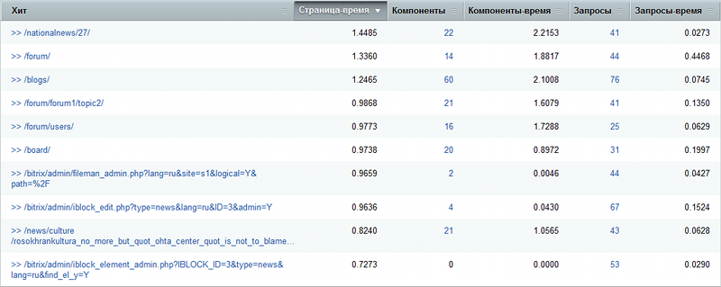
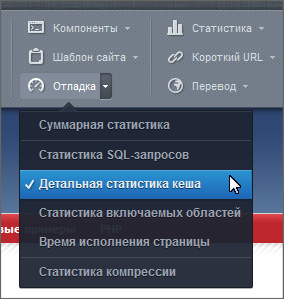

# Хиты

**Навигация**
- [← Оглавление курса](index.md)
- [← Предыдущий: 5125 — Страницы и компоненты](lesson_5125.md)
- [Следующий: 5128 — SQL запросы →](lesson_5128.md)

Официальная страница урока: https://dev.1c-bitrix.ru/learning/course/index.php?COURSE_ID=35&LESSON_ID=5126

|  | ### Учёт хитов |
| --- | --- |

На странице **Монитор производительности: хиты** (Настройки &gt; Производительность &gt; Хиты) выводится отчет по хитам**Хит** - это запрос к веб-серверу для получения файла (веб-страницы, изображения, JavaScript'а, таблицы стилей и т. д.).

  

Переход по ссылке &gt;&gt; позволяет перейти на желаемую страницу в публичную часть сайта и просмотреть

			детальную статистику

                    

		.

**Примечание:** Нажав кнопку

			Отладка

                    

		 или выбрав пункт меню **Суммарная статистика** (Отладка &gt; Суммарная статистика) на **Панели управления** в публичной части сайта и перейдя по ссылке &gt;&gt; со страницы **Монитор производительности: хиты** (Настройки &gt; Производительность &gt; Хиты), можно просмотреть

			более детальную статистику

                    

		.

Переход по ссылке с названием страницы (или по ссылке в графе **Запросы**) позволяет просмотреть все SQL запросы хита на странице **SQL Запросы**.

Переход по ссылке в графе **Компоненты** позволяет просмотреть отчет по используемым компонентам для хита на странице **Компоненты**.
