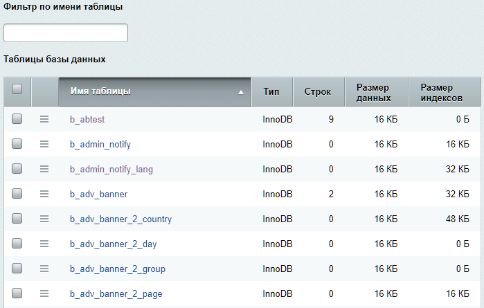

# Таблицы в базе данных

**Навигация**
- [← Оглавление курса](index.md)
- [← Предыдущий: 3838 — Кеширование](lesson_3838.md)
- [Следующий: 3798 — Индексы →](lesson_3798.md)

Официальная страница урока: https://dev.1c-bitrix.ru/learning/course/index.php?COURSE_ID=35&LESSON_ID=5129

### Таблицы БД

Просмотреть их можно на странице **Таблицы в базе данных** (Настройки &gt; Производительность &gt; Таблицы ):

 

Показ столбца **Размер индексов** добавлен с версии модуля 23.0.0.

Работая со списком таблиц вы можете использовать:

- Групповые действия
                      
  		 для применения оптимизации или преобразований сразу к нескольким таблицам;
- Фильтры
                      
  		. После введения текста в поле в списке останутся только те таблицы, что содержат указанный текст.

   

Переход по ссылке с именем таблицы позволяет просмотреть её содержимое.

### Работа с записями таблицы

При открытии таблицы из списка, вы увидите список всех её записей. На такой странице доступны следующие возможности:

**Примечание**: с версии модуля 23.0.0 обновлен интерфейс работы с таблицами. Далее в уроке показаны скриншоты из нового интерфейса.

- Инструмент
  			Фильтр+поиск
                      Найти среди большого количества однотипных элементов нужный товар, новость, баннер – да все, что угодно! – поможет удобный настраиваемый инструмент Фильтр+поиск.
  Подробнее в курсе [Контент-менеджер](https://dev.1c-bitrix.ru/learning/course/index.php?COURSE_ID=34&LESSON_ID=11771).
  		 – пригодится для поиска нужных вам записей или фильтрации списка.
- Для таблиц модуля **Инфоблоки**, **Поиск** и **Мгновенные сообщения** реализована выборка строк с фильтром по текущему значению в связанных таблицах.
  Поясним на примере. Выберем таблицу **b_search_content** и в контекстном меню конкретной записи (в примере: ID=41) укажем выборку строки
  			из связанной таблицы
                      
  		 (b_search_content_text). Выполнится выборка тех строк таблицы **b_search_content_text**, где `SEARCH_CONTENT_ID`=41.
  
- Вывод
  			информации
                      
  		, полученной из связанной таблицы (при наведении курсора на значение внешнего ключа).
- По команде
  			Изменить
                      
  		 –
  			редактирование записи и сброс управляемого кеша
                      
  		 после сохранения записи.
- Редактирование сериализованных значений
                      В системе должно быть установлено расширение [Tokenizer](http://php.net/manual/ru/book.tokenizer.php).
  		 в альтернативном представлении.
- Создание новых записей
                      
  		 в таблицах с автоинкрементным первичным ключом.

> Система запоминает просмотренные вами таблицы. В режиме просмотра записей, на контекстной панели в правом верхнем углу будет доступно меню **Последние таблицы (n)**, которое позволяет быстро и удобно переключаться между ними. На странице со списком всех таблиц также отображаются
>
> 			Последние просмотренные таблицы
>
>
>
>                     
>
>
>
> 		.
