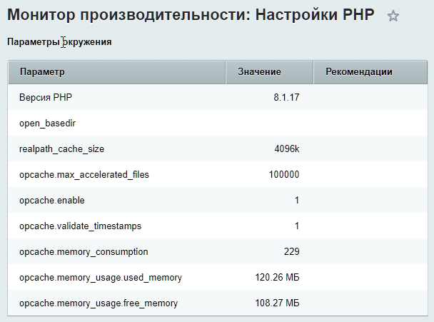

# Настройки и ошибки PHP

**Навигация**
- [← Оглавление курса](index.md)
- [← Предыдущий: 3798 — Индексы](lesson_3798.md)
- [Следующий: 5132 — Сервер БД →](lesson_5132.md)

Официальная страница урока: https://dev.1c-bitrix.ru/learning/course/index.php?COURSE_ID=35&LESSON_ID=5130

### Настройки

На странице **Монитор производительности: настройки PHP** (Настройки &gt; Производительность &gt; PHP) отображается сводная таблица **Параметры окружения** с анализом параметров PHP.

С помощью ссылки Настройки PHP можно перейти на страницу с подробной информацией (**phpinfo**).

### Ошибки

На странице **Монитор производительности: журнал ошибок PHP** (Настройки &gt; Производительность &gt; Ошибки PHP (N)) можно просмотреть журнал регистрации ошибок PHP, где N - общее количество ошибок.

**Примечание:** Данная страница отображается, только если в настройках модуля **Монитор производительности** указана опция **Вести журнал предупреждений PHP**.

Журнал ошибок PHP ошибок хранится в базе. Удалить журнал ошибок PHP можно с помощью опции

			Удалить собранные ранее данные

                    Доступна только при отключенном мониторе

	

		 в настройках модуля **Монитор производительности**.
