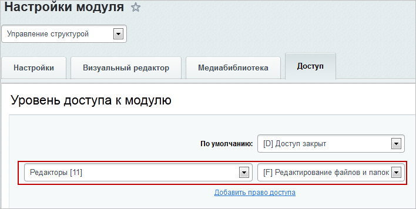

# Права на изменение статических страниц

**Навигация**
- [← Оглавление курса](index.md)
- [← Предыдущий: 8657 — Права на наполнение новостной ленты](lesson_8657.md)
- [Следующий: 23828 — Права на работу с Сайтами24 →](lesson_23828.md)

Официальная страница урока: https://dev.1c-bitrix.ru/learning/course/index.php?COURSE_ID=35&LESSON_ID=5133

Дать права на редактирование - означает выполнить последовательность действий по настройке различных параметров системы.

### Общий доступ на редактирование

Дадим

			права доступа на редактирование информации

                    Управление доступом в рамках системы подразумевает:

доступ к модулям,

доступ к элементам динамического контента,

доступ к файлам и папкам.

[Подробнее о правах доступа...](https://dev.1c-bitrix.ru/learning/course/index.php?COURSE_ID=35&CHAPTER_ID=04504&LESSON_PATH=3906.4493.4504)

		 о компании и контактах сотруднику с именем Даша, изначально не имеющей доступ к административному разделу сайта.

Перейдите в раздел **Компания** и нажмите **Изменить раздел** и выберите пункт меню

			Доступ к разделу

                    

		.

В открывшемся окне измените право доступа для контент-редакторов на **Чтение** и нажмите **Добавить право доступа**.

В категории **Пользователи**

			поиском найдите сотрудника Дашу

                    

		, кликните по ее имени левой кнопкой мыши и нажмите **Выбрать**, окно закроется, после чего укажите право доступа к разделу для Даши как **Запись**:

Произведите аналогичные действия для раздела **Контакты** и сохраните внесенные изменения.

### Редактирование конкретных разделов

Чтобы Даша могла воспользоваться своим правом записи для раздела **Компания** и **Контакты**, ей необходимо иметь право доступа на чтение к папке

			`/bitrix/admin`

                    Все пользователи, которые хоть что-то должны изменять в Публичной части сайта, должны иметь доступ на чтение к папке `/bitrix/admin`. Это папка, в которой расположен визуальный HTML-редактор. Без этого редактирование будет возможно только в текстовом режиме.

		. Задать право доступа для папки можно для

			группы пользователей

                    Для добавления новой группы служит кнопка Добавить группу, расположенная на контекстной панели. Перейти к редактированию параметров группы можно либо кликнув левой кнопкой мыши по соответствующей записи, либо с помощью пункта Изменить в контекстном меню.

[Подробнее ...](https://dev.1c-bitrix.ru/learning/course/index.php?COURSE_ID=35&CHAPTER_ID=02006&LESSON_PATH=3906.4503.2006)

		, поэтому перейдем на страницу административного раздела Настройки &gt; Пользователи &gt; Группы пользователей, и, нажав на кнопку контекстной панели **Добавить группу**, создадим группу **Редакторы**:

Заполните поля, отметьте галочкой пользователя Даша как участника данной группы и сохраните данную группу.

Затем в административном разделе пройдите на страницу Контент &gt; Структура сайта &gt; Файлы и папки &gt; bitrix и выберите в меню действий папки **admin** пункт

			Права на доступ продукта

                    

		. Для группы **Редакторы** должно быть установлено право **Чтение**.

### Доступ к файловой структуре

Для редактирования страниц сайта необходимо иметь доступ к файловой структуре. Чтобы его задать для нашей созданной группы, в административном режиме перейдите на страницу Настройки &gt; Настройки продукта &gt; Настройки модулей &gt; Управление структурой, закладка **Доступ**:

Для редакторов установите право доступа **Редактирование файлов и папок** и нажмите **Сохранить**.

Теперь пользователь Даша может редактировать страницы раздела **Компания** и **Контакты** как из административной, так и публичной части сайта.
