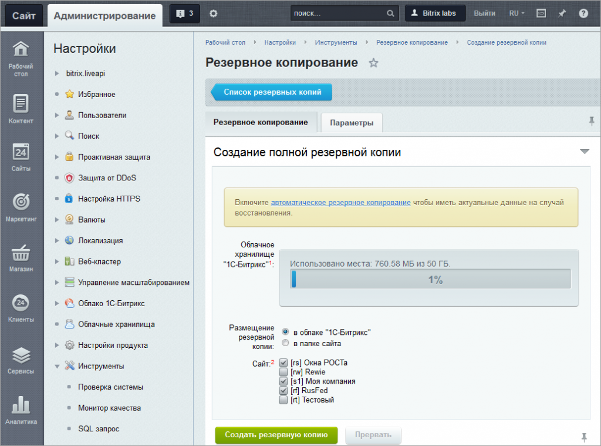
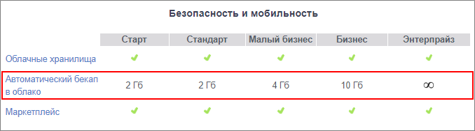
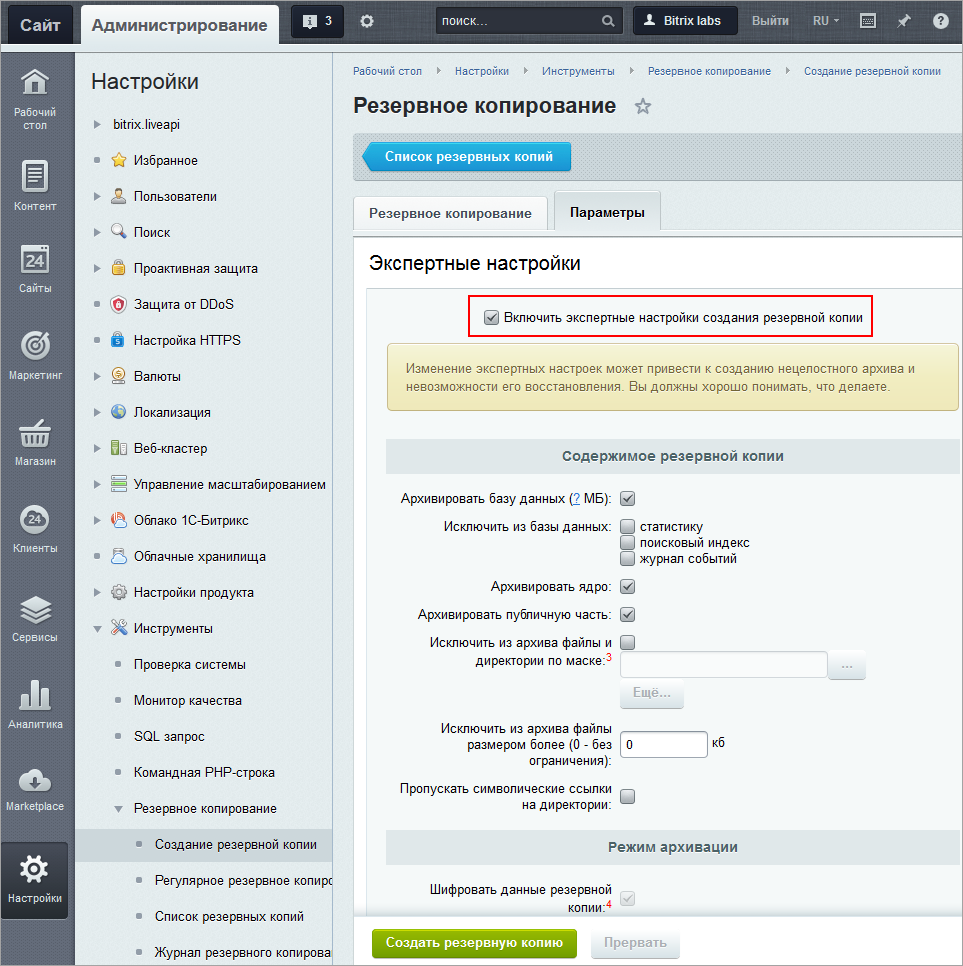
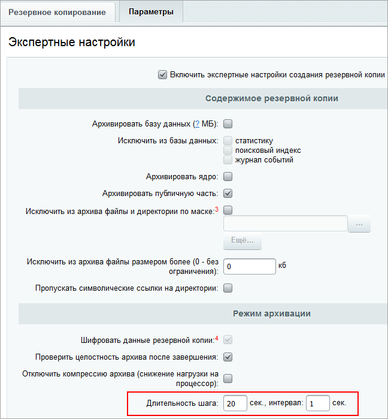
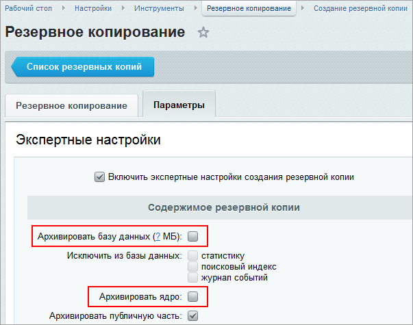

# Создание резервной копии

**Навигация**
- [← Оглавление курса](index.md)
- [← Предыдущий: 9493 — Основные возможности](lesson_9493.md)
- [Следующий: 7080 — Хранение и шифрование резервных копий →](lesson_7080.md)

Официальная страница урока: https://dev.1c-bitrix.ru/learning/course/index.php?COURSE_ID=35&LESSON_ID=5330

### Видеоурок

 

### Страница резервного копирования

Выполняется резервное копирование на странице

			Резервное копирование

                     

		 (Настройки &gt; Инструменты &gt; Резервное копирование &gt; Создание резервной копии).

	
	

**Обратите внимание!** Механизм резервного копирования может быть использован только для базы данных **MySQL**.

	

Форма создания резервной копии:

 )

В форме доступно на выбор два варианта хранения резервной копии: в

			облаке 1С-Битрикс

                    О возможностях модуля **Облако 1С-Битрикс** и связях с инструментом резервного копирования подробнее читайте в уроке [Возможности штатных средств модуля](lesson_2743.md).

		 и в папке сайта (

			локально

                    В рамках файловой структуры сайта файлы копий хранятся в папке `/bitrix/backup`.

		).

К вкладке Резервное копирование относятся важные примечания:

1. Компания "1С-Битрикс" бесплатно предоставляет место в облаке для хранения трех резервных копий на каждую активную лицензию.
  			Объём пространства в облаке
                      Например, для «1С-Битрикс: Управление сайтом»:
  		
  		
  		зависит от лицензии. Доступ к резервным копиям осуществляется по лицензионному ключу и паролю. Без знания пароля никто, включая сотрудников "1С-Битрикс", не сможет получить доступ к вашим данным.
2. Если выбрано несколько сайтов для помещения в архив, в корне архива будет лежать первый по списку сайт, а публичные части остальных сайтов будут помещены в папку `/bitrix/backup/sites`. При восстановлении нужно будет вручную скопировать их в нужные папки и создать символьные ссылки.

Созданная резервная копия отображается на странице Настройки &gt; Инструменты &gt; Резервное копирование &gt; Список резервных копий. С помощью

			меню действий

                    

		 резервную копию можно скачать, восстановить, удалить и т.д.

**Примечание**: Меню действий может отличаться для разных видов архивов, в зависимости от настроек при создании, порядка сохранения и удаления копий, настройки прав доступа на папки и файлы.  Например, бекап, хранящийся в облаке 1С-Битрикс, можно только восстановить, но не скачать. Или же меню действий будет ограничено при ограничении прав на папку */backup/*.

 

### Особенности резервного копирования при многосайтовости на разных доменах

	  

1. Создавать резервные копии можно для любого сочетания существующих в системе файлов. Просто отметьте "птичками" в форме нужные сайты.
2. База данных полностью копируется в архив. Даже тех сайтов, которые не были отмечены "птичками".
3. Восстановление сайтов потребует дополнительных действий со стороны администратора:

  - Учтите, что из выбранных сайтов в состав архива полностью копируется только первый по сортировке в [списке сайтов](lesson_1991.md). Соответственно, при восстановлении в полностью работоспособном состоянии восстанавливается только этот сайт.
  - Публичная часть остальных сайтов сохраняется в архиве в папках вида `/bitrix/backup/sites/_ID_сайта_`. При распаковке архива появится предупреждение, что в нём содержится несколько публичных частей. После распаковки администратор должен будет вручную перенести папки сайтов в соответствующие папки на сервере.
  - Многосайтовость надо восстановить вручную (восстановить [симлинки](https://dev.1c-bitrix.ru/learning/course/index.php?COURSE_ID=103&LESSON_ID=287#simlink)). Только после этого остальные сайты будут работоспособны.

**Примечание:** Для корректной работы резервного копирования сайты должны быть настроены в соответствии с уроком [Многосайтовость на разных доменах](https://dev.1c-bitrix.ru/learning/course/?COURSE_ID=103&LESSON_ID=287).

> **Для переноса резервной копии сайта на другой хостинг** используйте скрипт для восстановления **restore.php**. Скачать его можно по [ссылке](https://www.1c-bitrix.ru/download/files/scripts/restore.php). Затем поместите этот файл в корневой папке нового сайта и наберите в строке браузера [имя_вашего_сайта]/restore.php. Далее следуйте шагам мастера и инструкциям по переносу продукта (курс Установка и настройка):
>
> - [Перенос продукта «1C-Битрикс»](https://dev.1c-bitrix.ru/learning/course/index.php?COURSE_ID=135&CHAPTER_ID=02014);
> - [Перенос сайтов в многосайтовой конфигурации](https://dev.1c-bitrix.ru/learning/course/index.php?COURSE_ID=135&LESSON_ID=2559).

### Вкладка Параметры

Резервную копию можно сохранить как на локальный носитель, так и в облачное хранилище. В обоих случаях возможно изменение настроек этого процесса. Для этого перейдите на закладку **Параметры** и активируйте опцию **Включить экспертные настройки создания резервной копии**.

**Внимание**! Если вы не совсем ясно представляете суть настроек параметров, то рекомендуется не пользоваться этой опцией, а оставить настройки по умолчанию

)

К вкладке Параметры относятся важные примечания:

1. Для маски исключения действуют следующие правила:
  Примеры шаблонов:

  - шаблон маски может содержать символы "*", которые соответствуют любому количеству любых символов в имени файла или папки;
  - если в начале стоит косая черта ("/" или "\"), путь считается от корня сайта;
  - в противном случае шаблон применяется к каждому файлу или папке;

  - /content/photo - исключить целиком папку /content/photo;
  - *.zip - исключить файлы с расширением "zip";
  - .access.php - исключить все файлы ".access.php";
  - /files/download/*.zip - исключить файлы с расширением "zip" в директории /files/download;
  - /files/d*/*.ht* - исключить файлы из директорий, начинающихся на "/files/d" с расширениями, начинающимися на "ht".
2. При размещении резервной копии в облачном хранилище "1С-Битрикс" отключить шифрование нельзя.
3. Системные ограничения php не позволяют делать размер одной части архива более 2 Гб. Не устанавливайте это значение больше 200 Мб т.к. это существенно увеличивает время архивации и распаковки, оптимальное значение: 100 Мб.

### Подробнее о полях на вкладке Параметры

			 

- Величина поля
  			Длительность шага
                      
  		 зависит от параметров, установленных на хостинге (в **php.ini**). Если точное доступное значение шага неизвестно, то рекомендуются значения не более 30.
- Если настроено несколько сайтов с разными путями к корневой папке веб-сервера, они сохраняются и восстанавливаются отдельно. При этом полный архив делается один раз. А затем, при архивации других сайтов, необходимо будет
  			исключить ядро и базу данных
                      
  		 через экспертные настройки. Если восстановление делается на другом сервере, символьные ссылки на папки `/bitrix` и `/upload` необходимо будет создать вручную.
- Если копия будет сохраняться
  			локально
                      
  		, то можно не использовать опцию
  			шифрования данных резервной копии
                      
  		, это снизит нагрузку на сервер при создании архива.
- Суть
  			Проверки целостности архива после его завершения
                      
  		 в том, что идет "виртуальная" распаковка без создания файлов. То есть это гарантирует, что сам по себе файл получился корректный. Полную гарантию целостности резервной копии можно дать после полного восстановления сайта.

**Примечание:** Подробное описание полей формы смотрите на странице [пользовательской документации](http://dev.1c-bitrix.ru/user_help/settings/utilities/dump/dump.php).

	 Подробнее про операцию переноса сайта с локальной машины на удаленный хостинг смотрите в уроке [Перенос продукта](https://dev.1c-bitrix.ru/learning/course/index.php?COURSE_ID=135&CHAPTER_ID=02014).

			

### Оптимизация размера архива

Резервные архивы могут очень быстро занять место как в облаке, так и на локальном хранилище. Для облака есть ещё одна особенность: загрузка больших архивов для восстановления может быть проблемной из-за скорости каналов, возможных ошибок при передаче пакетов и другие нюансы. Поэтому рекомендуется применять экспертные настройки и управлять процессом создания архивов.

Прежде всего надо понять, что вам нужно включать в архив.

Если есть возможность создавать и хранить архив БД на ресурсах хостера, то возможно, его и не надо включать в ваш файл бекапа. Но если включаете, то подумайте нужна ли вам статистика, журнал событий и поисковый индекс. Если с сайтом не было проблем, то журнал событий и не нужен. Если вы не пользуетесь статистикой, то её тоже можно исключить из архива.

Поисковый индекс тоже можно исключить, только не забудьте после восстановления сайта создать его

			заново

                    Индексирование – процесс сбора, классификации и сохранения данных с целью облегчить быстрый и точный поиск информации.

					[Подробнее ...](lesson_2048.md)

		.

Архивировать ядро нужно обязательно, если у вас неактивная лицензия: найти потом дистрибутив с конкретно вашей версией продукта может оказаться не легко. Особенно, если вы не обновлялись давно.

Архивацию файлов публичной части сайта тоже лучше включить. Места они занимают не много, а восстановление сайта потом может вызвать сложности, если есть какие-то изменения от начального проекта и, что ещё хуже, эти изменения не зафиксированы нигде.

По умолчанию папка `/bitrix/backup`, где хранятся файлы бекапа, исключается из создаваемого архива. Но одной из частых ошибок при создании резервной копии является хранение бекапа не в папке по умолчанию, а в другой папке. Если такая папка не будет включена в маску исключения, то возникает рекурсия, приводящая к росту размера каждого следующего архива. То есть получается один бекап, вложен в другой, тот в следующий и так пока место не кончится. Для исключения этой ошибки воспользуйтесь полем **Исключить из архива файлы и директории по маске**. В этом поле укажите папку, где вы локально храните предыдущие резервные архивы.

Также внимательно просмотрите структуру сайта и подумайте, какие разделы вам не нужны в архиве. Это могут быть папки для временного хранения файлов, папки для хранения информации, которая у вас есть и так. (Например, архив документов, который хранится в локальной сети или папка с фотографиями и так далее). Исключать из архива можно любую папку, главное - указать верную маску исключения. Примеры масок есть в этом уроке выше и на странице создания архива.

Другой источник уменьшения размера - удаление из архива больших по размеру файлов. Как правило - это большие по размеру видео, изображения, документы. Эту информацию оптимально хранить где-то локально и, при необходимости восстановления сайта из бекапа, загружать отдельно в восстановленный сайт. Ограничивать размер включаемых файлов можно через поле **Исключить из архива файлы размером более**.

Если архив всё равно получается большой, то хранить его придётся локально.
