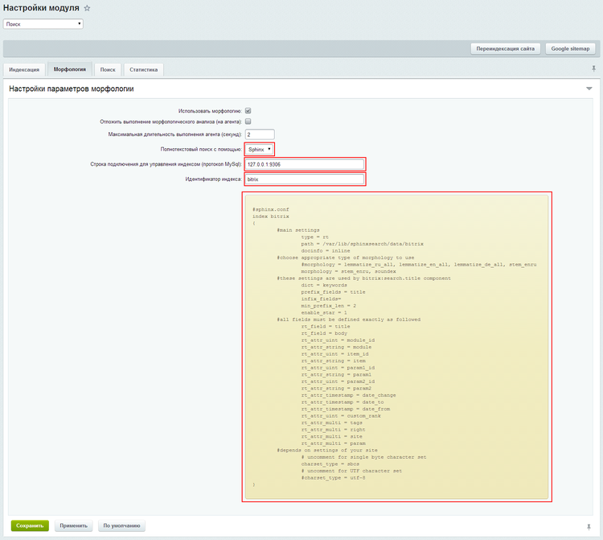
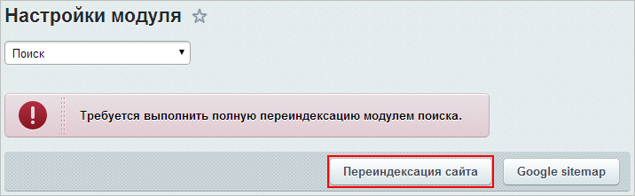

# Ручная настройка поиска Sphinx

**Навигация**
- [← Оглавление курса](index.md)
- [← Предыдущий: 2047 — Компоненты Поиска](lesson_2047.md)
- [Следующий: 2048 — Индексация →](lesson_2048.md)

Официальная страница урока: https://dev.1c-bitrix.ru/learning/course/index.php?COURSE_ID=35&LESSON_ID=5935

Внешний полнотекстовый поиск [Sphinx](http://sphinxsearch.com) позволяет сделать быстрым  и качественным поиск на вашем сайте, снизить нагрузку на сервер. Он доступен в продуктах «1С-Битрикс» с версии 14.0.0 и полностью интегрирован с компонентами модуля **Поиск**.

Если по каким-либо причинам не используется эталонная среда

			 Виртуальная машина VMBitrix версии 9.0.0

                    **«1C-Битрикс: Виртуальная машина»** - бесплатный программный продукт, готовый к немедленному использованию виртуальный сервер, полностью настроенный, протестированный и адаптированный для оптимальной работы как с продуктами «1С-Битрикс», так и с любыми PHP-приложениями.
[Подробнее...](https://dev.1c-bitrix.ru/learning/course/index.php?COURSE_ID=37&CHAPTER_ID=029228)

		 и выше, в которую уже включен

			Sphinx

                    Использование **Sphinx** в качестве поискового механизма позволит значительно увеличить скорость поиска и снизит нагрузку на сервер.
[Подробнее...](https://dev.1c-bitrix.ru/learning/course/index.php?COURSE_ID=37&CHAPTER_ID=030254)

		, то можно настроить его самим, следуя данным рекомендациям.

**Внимание!** Ограничения на версию Sphinx: не ниже 2.1.1, максимальная - 2.2.11. Версии Sphinx 3.x.x в настоящее время не поддерживаются.

|  | #### Ручная настройка поиска Sphinx |
| --- | --- |

1. Установите пакет *Sphinx* в свою среду. Процесс установки отличается в зависимости от используемой операционной системы (ОС) и подробно описан в [документации](http://sphinxsearch.com/docs/current.html#installation) раздела **Installation** на официальном сайте *Sphinx*. Раздел  [архив](http://sphinxsearch.com/downloads/archive/) официального сайта содержит пакеты версий 2.x.x для различных ОС.
  Пусть директория файлов настроек *Sphinx* - `/etc/sphinxsearch/`.
  **Примечание:** Путь хранения файлов настроек различается в зависимости от используемой операционной системы. Так для Centos по умолчанию это `/etc/sphinx/`, а для Debian/Ubuntu - `/etc/sphinxsearch/`. Также при установке Sphinx Вы можете указать свой вариант.
2. Настройте сам *Sphinx*. Делается это с помощью конфигурационного файла `/etc/sphinxsearch/sphinx.conf`.
  ## Код минимальной конфигурации
  ```
  #
  # Minimal Sphinx configuration for Bitrix
  #
  searchd
  {
  	listen			= 9312
  	listen			= 9306:mysql41
  	log			= /var/log/sphinxsearch/searchd.log
  	query_log		= /var/log/sphinxsearch/query.log
  	read_timeout		= 5
  	max_children		= 30
  	pid_file		= /var/run/sphinxsearch/searchd.pid
  	max_matches		= 1000
  	seamless_rotate		= 1
  	preopen_indexes		= 1
  	unlink_old		= 1
  	workers			= threads # for RT to work
  	binlog_path		= /var/lib/sphinxsearch/data/
  	binlog_max_log_size 	= 512M
  	binlog_flush		= 2
  	rt_flush_period		= 3600
  }
  indexer
  {
  	lemmatizer_cache	= 128M
  }
  common
  {
      lemmatizer_base       = /etc/sphinxsearch/dicts/
  }
  index bitrix
  {
  	#main settings
  		type = rt
  		path = /var/lib/sphinxsearch/data/bitrix
  		docinfo = inline
  	#choose appropriate type of morphology to use
  		#morphology = lemmatize_ru_all, lemmatize_en_all, lemmatize_de_all, stem_enru
  		morphology = stem_enru, soundex
  	#these settings are used by bitrix:search.title component
  		dict = keywords
  		prefix_fields = title
  		infix_fields=
  		min_prefix_len = 2
  		enable_star = 1
  	#all fields must be defined exactly as followed
  		rt_field = title
  		rt_field = body
  		rt_attr_uint = module_id
  		rt_attr_string = module
  		rt_attr_uint = item_id
  		rt_attr_string = item
  		rt_attr_uint = param1_id
  		rt_attr_string = param1
  		rt_attr_uint = param2_id
  		rt_attr_string = param2
  		rt_attr_timestamp = date_change
  		rt_attr_timestamp = date_to
  		rt_attr_timestamp = date_from
  		rt_attr_uint = custom_rank
  		rt_attr_multi = tags
  		rt_attr_multi = right
  		rt_attr_multi = site
  		rt_attr_multi = param
  	#depends on settings of your site
  		# uncomment for single byte character set
  		#charset_type = sbcs
  		# uncomment for UTF character set
  		charset_type = utf-8
  }
  ```
  Основные директивы, которые могут измениться в зависимости от настройки сервера и на которые следует обратить внимание:
  Секция **searchd**:
  Секция **indexer**:
  Секция **index bitrix**:

  - `listen` - указывается ip-адрес, порт, путь Unix-domain socket или протокол, которые прослушивает поисковый демон (в данном случае порты: 9312, 9306 с протоколом MySQL);
  - `log` - имя log-файла работы *Sphinx*-a и его расположение;
  - `query_log` - имя log-файла поисковых запросов *Sphinx*-a и его расположение;
  - `binlog_path` - путь, где хранятся бинарные логи (важный параметр, если указать директорию, на запись в которую нет прав, то поисковый демон не запустится);
  - `binlog_max_log_size` - максимальный объем файла бинарного лога, после которого будет создан новый файл.

  - `lemmatizer_cache` - максимальный объем кэша словарей морфологического поиска;
  - `lemmatizer_base` - директория хранения языковых словарей (ru.pak, en.pak, de.pak) для морфологического поиска, которые нужно предварительно [скачать](http://sphinxsearch.com/downloads/dicts/) и поместить в данную директорию.

  - `path` - путь и название файлов индекса;
  - `charset_type` - указывается кодировка сайта:
    **Примечание:** Начиная с версии 2.2.2 в Sphinx поддерживается только кодировка UTF-8. На сайтах с кодировкой Windows-1251 поиск Sphinx'ом работать не будет.

    - для кодировки UTF - `utf-8`;
    - для остальных - `sbcs`.
3. Cделайте рестарт *Sphinx*-a.
4. Откройте страницу **Настройки модуля Поиск** (Настройки &gt; Настройки продукта &gt; Настройки модулей &gt; Поиск) и выполните настройки для подключения *Sphinx*-а в качестве
  			поискового механизма
                      
  		:

  - **Полнотекстовый поиск с помощью** - выберите **Sphinx**;
  - **Строка подключения для управления индексом (протокол MySql)** - укажите ip-адрес и порт подключения для индексации через протокол **MySQL**;
  - **Идентификатор индекса** - укажите имя индекса (например, `bitrix`);
  - Также на этой странице для справки указан пример конфигурационного файла для индекса *Sphinx*-a в продуктах **1С-Битрикс**.
5. Выполните **Переиндексацию сайта** в административной части с помощью одноименной кнопки - о чем сообщит
  			мастер настройки
                      
  		.
  **Важно!** Если в *продукте «1С-Битрикс»* установлен модуль **Cоциальной сети**, то после индексации модулем поиска, требуется переиндексация социальной сети из компонента, размещенного в публичном разделе. Для этого нужно перейти в режим разработки в любой раздел социальной сети (где установлены компоненты **socialnetwork**, **socialnetwork_group**, **socialnetwork_user**) и нажать на кнопку **Индексация** в панели инструментов:
  

На этом минимальная настройка *Sphinx* в качестве поискового механизма для продуктов «1C-Битрикс» завершена.

**Примечание:** Информацию для более тонкой настройки поискового механизма *Sphinx* можно найти в [официальной документации](http://sphinxsearch.com/docs/current.html) этого продукта.
