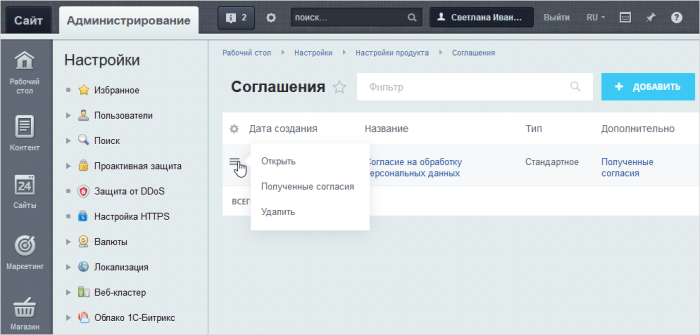
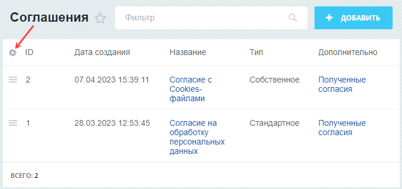
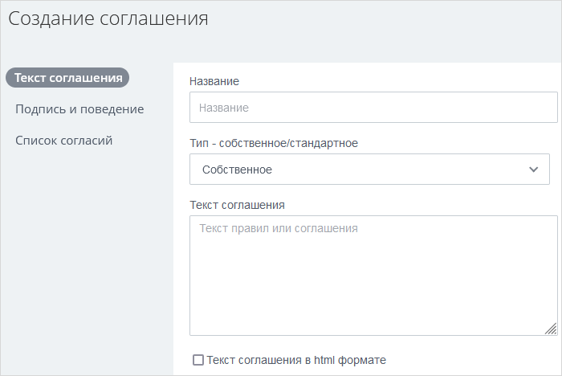
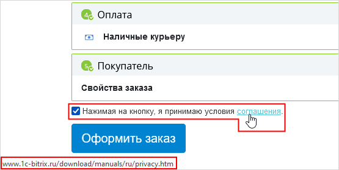
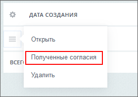
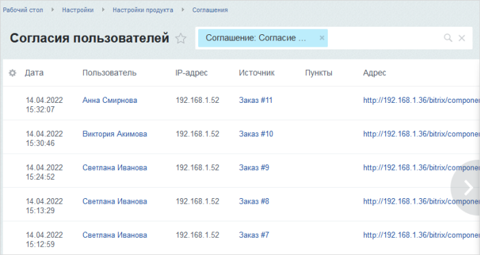
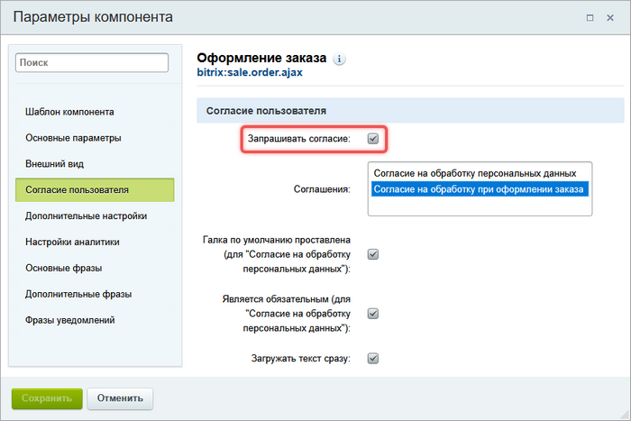

# Согласие на обработку персональных данных

**Навигация**
- [← Оглавление курса](index.md)
- [← Предыдущий: 12818 — Практические задания](lesson_12818.md)
- [Следующий: 8407 — Согласие в собственных компонентах →](lesson_8407.md)

Официальная страница урока: https://dev.1c-bitrix.ru/learning/course/index.php?COURSE_ID=35&LESSON_ID=6636

Выполнение требований закона ФЗ-152 реализуется штатными средствами системы. Для этого достаточно создать соглашение с нужным текстом или ссылкой, и настроить компоненты.

### Поставьте "галочку", если вы согласны...(видеоурок)

В видео показана работа соглашения на примере компонента **Форма оформления заказа**.

### Страница Соглашения

На странице **Соглашения** (Настройки &gt; Настройки продукта &gt; Соглашения) выводятся все созданные и используемые соглашения. С неё же можно перейти к списку полученных согласий от пользователей.

По умолчанию колонка с идентификаторами соглашений скрыта. Поэтому для просмотра **ID** настройте вид списка, нажав на иконку

			шестеренки

                    

		.

### Создание соглашения

Соглашение - текст, который должен прочитать пользователь и согласиться с ним. В дистрибутиве есть стандартный вариант соглашения, который изменить нельзя. Но у администратора всегда есть возможность создать свой текст соглашения. Для этого на странице **Соглашения** воспользуйтесь кнопкой **Добавить** и заполните

			открывшуюся форму

                    

		.

Создание соглашение - несложный процесс. Несколько особенностей:

- Если нужен нестандартный текст соглашения - используйте тип **Собственное**.
  **Примечание**: С версии **20.0.1150** Главного модуля (**main**) в соглашениях типа **Собственное** добавлена поддержка ссылок на текст соглашения при запросе согласия.
  ## Как создать ссылку на текст соглашения
  Указание ссылки на текст соглашения пригодится, когда текст соглашения размещен на странице сайта или в виде файла.
  1. Выберем тип соглашения - **Собственное**;
  2. Поле **Текст соглашения** оставим пустым;
  3. В поле **Подпись галки согласия** (секция **Подпись и поведение**) укажем текст. Ту часть текста, что будет являться ссылкой, заключим в знаки процента: %*текст*%. Если этого не сделать, то весь текст подсветится как ссылка;
  4. Обязательно установим опцию **При клике на ссылку открывать стороннюю ссылку или файл**, после которой укажем непосредственно ссылку на нужную страницу/файл.
  Выбрав наше соглашение в компоненте **Оформление заказа**, увидим такой результат:
  
- Если нужно просто модифицировать стандартное соглашение, то используйте тип **Стандартный**, а в открывшихся полях укажите свои варианты текста. Они подменят собой в соглашении аналогичные стандартные блоки.
- Если компаний в системе несколько, то лучше использовать ручной ввод данных в поле **Источник данных**. По умолчанию система выводит все компании, которые есть.
- Если не заполнено поле **Email-адрес для жалоб** (секция **Подпись и поведение**), то система будет использовать адрес по умолчанию из настроек главного модуля.

### Просмотр списка согласий

Для каждого соглашения можно просмотреть список

			согласий пользователей

                    

		.

Список не допускает удаления согласия. Фильтр поможет найти нужное согласие в общем списке

### Получение согласия пользователя

Для получения согласия пользователя в компоненте включите опцию **Запрашивать согласие** (на примере **sale.order.ajax**) и выберите соглашение:

### Документация по теме

- [Соглашения и список согласий](https://dev.1c-bitrix.ru/user_help/settings/settings/agreement_admin.php)
  [Создание соглашения](https://dev.1c-bitrix.ru/user_help/settings/settings/agreement_edit.php)
